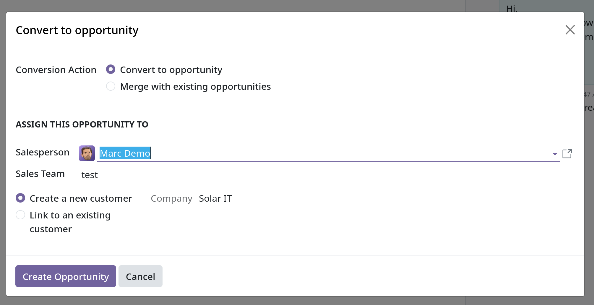

# Convert leads into opportunities

- Leads đóng vai trò như một bước xét duyệt cuối cùng trước khi opportunities được tạo. Điều này giúp bạn có thời gian xem
  xét tiềm năng và đánh giá khả năng tồn tại của nó trước khi gán opportunity đó cho salesperson.

## Configuration

- Để active Leads setting, vào `CRM -> Configuration -> Settings` tick vào checkbox `Leads`. Sau đó `Save`.
- Sau khi active tính năng `Leads`, tại header bar của `CRM` sẽ xuất hiện `Leads` menu.
- Leads cũng sẽ xuất hiện trong config của sales team khi active trong `Settings`. Ta có thể bỏ nó bằng cách bỏ tick chọn vào
  `Leads` trong `Sales team` configuration.

## Convert a lead into an opportunity

- Để chuyển đổi lead thành một opportunity. Vào `CRM -> Leads` để show ra toàn bộ leads, chọn 1 lead bất kỳ muốn chuyển đổi.
  Sau đó click vào button `Convert to Opportunity` bên trên góc trái của view để chuyển đổi. Một popup sẽ hiện ra
  

- Trên popup này ta có thể tùy chỉnh action convert, convert thành 1 opportunity mới hay là gộp chung với opportunity có sẵn.
  Gán salesperson, sales team. Mục `Customer` có thể:
  - `Create a new customer`: Chọn mục này nếu muốn tạo mới 1 customer record (contact) sử dụng thông tin của lead.
  - `Link to an existing customer`: Chọn mục này, sau đó chọn `Customer` muốn link trong danh sách drop-down để link opportunity với customer đó.
