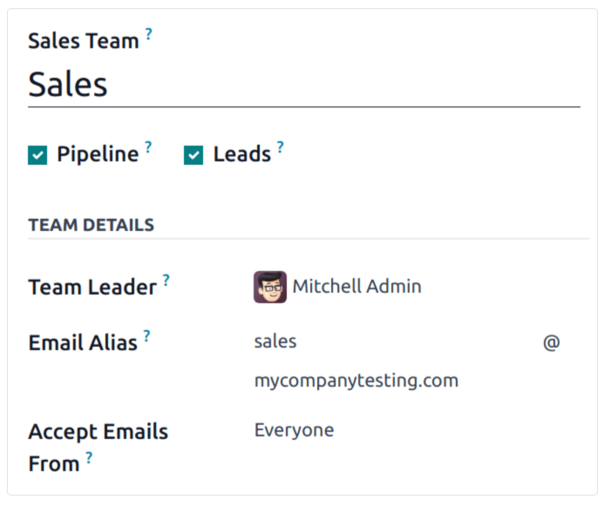
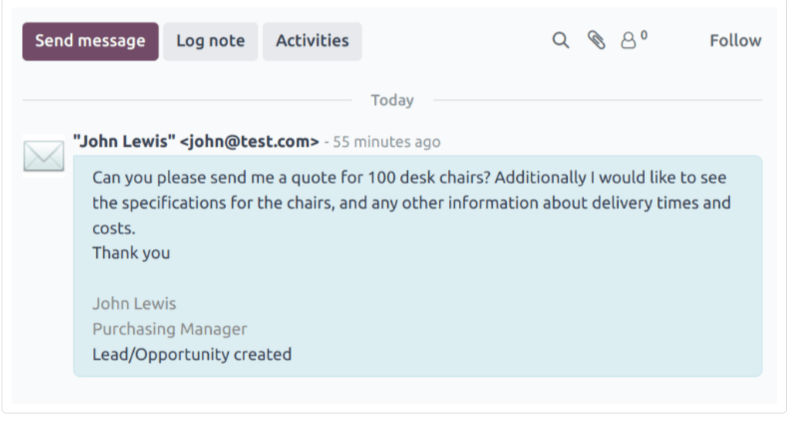
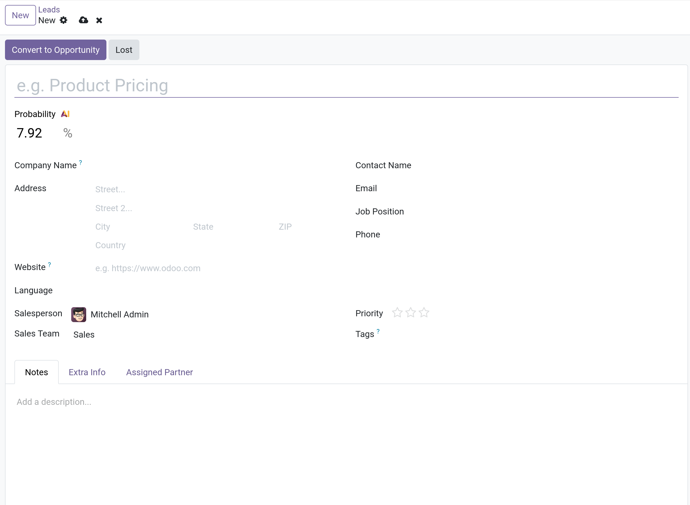

# Create leads (from email or normally)

- Leads có thể được thêm vào `CRM` app từ việc custom `email alias` lúc config `Sales team`, hoặc là tạo thủ công thông qua [website contact form](./create-opportunities-from-web-contact-forms.md)
- Đầu tiên, phải đảm bảo tính năng `Leads` được active trong database bằng cách vào `CRM -> Configuration -> Settings`, tick `Leads` checkbox rồi `Save`.

## Configure email alias

- Mỗi sales team có tùy chọn tạo và sử dụng email alias của riêng team đó. Khi messages được gửi tới địa chỉ email này, một lead hoặc opportunity
  được tạo với thông tin từ message.
- Để tạo hoặc update email alias của Sales team, vào `CRM -> Configuration -> Sales team`, chọn team muốn sửa trong danh sách sẽ show ra form sau.
  
  - Chú ý các tùy chọn:
    - `Everyone`: Nhận email từ tất cả.
    - `Authenticated Partners`: Chỉ nhận các email từ các địa chỉ email được liên kết với một contact record.
    - `Followers only`: Chỉ nhận các email từ những người theo dõi record liên quan đến team, ví dụ leads/opportunities. Messages cũng nhận email từ các team members.
    - `Authenticated Employees`: Chỉ nhận các email từ các địa chỉ email được liên kết với record trong bảng _Employees_.

### Leads được tạo từ email

- Leads được tạo từ email alias mail message có thể được xem trong `CRM -> Leads`, click vào lead để mở chi tiết.
- Email được nhận bởi alias sẽ được thêm vào chatter thread của lead. Subject của message được thêm vào trường tiêu đề. Trường `Email` được update bằng địa chỉ email của contact.
  

- **Lưu ý: nếu `Leads` không được enable, khi email đến alias thì sẽ tạo opportunities**

## Manually create leads

- Leads có thể được tạo trực tiếp trên `CRM` app.
- Vào `CRM -> Leads` để xem danh sách các leads đang tồn tại.
- Trên góc trái, chọn button `New` sẽ hiển thị ra view như sau:
  

  sau đó nhập tiêu đề, nhập `Contact Name`, `Company Name`

- **Lưu ý: Leads có thể được tạo bằng button `Generate Leads`, chúng ta sẽ khám phá tính năng này tại mục [Leads mining](./lead-mining.md)**

## Manually create opportunities

- Để tạo thủ công một opportunity, vào `CRM -> Sales -> My pipeline`. Trên góc trái, click `New` tạo mới một Opportunity kanban card.
- Có thể đánh dấu priority của opportunity thông qua số stars trong kanban card.
