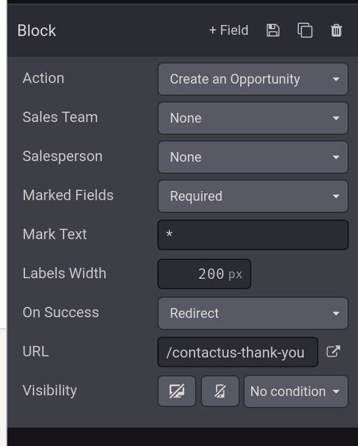
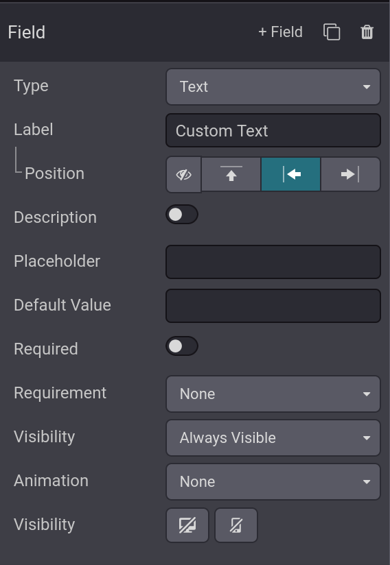

# Create opportunities from web contact forms

- Thêm contact form vào một website giúp dễ dàng chuyển đổi khách ghé thăm web thành leads và opportunities. Sau khi khách
  để lại thông tin của họ, một opportunity có thể được tạo một cách tự động, và được gán tự động cho salesperson và sales team được thiết lập sẵn.

## Customize contact form

- Mặc định, trang `Contact Us` trong Odoo website hiển thị một form được cấu hình trước. Form này có thể customized được.
- Để customize, ta vào `Website -> Contact Us` sau đó click `Edit` trên góc phải màn hình, thao tác này sẽ mở _web editor_
  Nhấp vào khối form building trong body của website để mở form configuration settings trên bên phải màn hình.

  
  - `Action`: Mặc định là `Send an Email`, Chọn `Create an Opportunity` để giữ lại thông tin trong `CRM`
  - `Sales team`: Chọn `Sales team` sẽ được gán khi opportunity được tạo. Option này chỉ hiển thị khi `Action` là `Create an Opportunity`
  - `Salesperson`: Chỉ định salesperson nào sẽ được gán cho opportunity này. Nếu không có salesperson nào được gán, Odoo sẽ tự assign theo rule assignment của sales team.
  - `Marked field`: Tùy chọn này cho phép cách form xử lý các fields được đánh dấu. Mặc định là `Required`, có thể thay đổi sang `None` hoặc `Optional`
  - `Marked text`: Chọn cách xác định các fields được đánh dấu, mặc định là dấu **(\*)**
  - `Labels width`: Thay đổi độ rộng của labels - đơn vị pixel.
  - `On Success`: Chọn cách web phản ứng sau khi khách submit form thành công. `Nothing` giữ khách ở lại cùng màn hình với form,
    `Redirect` chuyển hướng khách về 1 web mới dựa trên field `URL` ở dưới. `Show message` thay thế form với một message được cấu
    hình trước sẽ thông báo cho khách rằng sẽ có ai đó liên hệ cho họ sớm nhất có thể.
  - `URL`: Nếu `Redirect` được chọn ở field trên thì sau khi submit form, khách sẽ được chuyển trang có url này.
  - `Visibility`: Dropdown menu cho phép chọn điều kiện hiển thị của form này nếu muốn.

  **Lưu ý:** Nếu active `Leads` trong `CRM` thì khi chọn `Action` là `Create an Opportunity` trong form thì sẽ tạo lead mới.

## Customize contact form fields

- Ngoài việc cài đặt cho cả contact form, cài đặt cho cả field cũng có thể được tùy chỉnh bằng cách click vào từng field hoặc click vào button `+ field` bên sidebar
  
  - `Type`: Chọn một custom field hoặc một field type đã có.
  - `Input type`: Xác định loại thông tin mà khách nên nhập vào. Tùy chọn gồm `Text`, `Email`, `Telephone` hoặc `Url`
  - `Label`: Nhập tên của field.
  - `Position`: Xác định cách căn chỉnh của label với phần còn lại của form. Label có thể ẩn, ở bên trên field, ở bên trái field hoặc được điều chỉnh bên phải gần field hơn.
  - `Description`: Slide button để thêm mô tả cho field này.
  - `Placeholder`: Nhập ví dụ để khách biết cách nhập đúng định dạng các thông tin quan trọng như email, số điện thoại.
  - `Default value`: Giá trị mặc định nếu khách không nhập field này. **Chú ý** các field bắt buộc thì không nên để default value.
  - `Required`: Slide button để chuyển đổi đánh dấu field này là bắt buộc hay không.
  - `Visibility`: Tùy chọn hiển thị field. Nếu `Always Visible` thì chọn button bên trái nếu muốn ẩn field này với PC, nút bên phải nếu muốn ẩn field này với Mobile.
    Nếu Visibility là `Visible Only If` thì nhập điều kiện hiển thị mà bạn muốn. `Hidden` là đánh dấu field này là field ẩn.
  - `Animation`: Chọn xem field này có animation gì không.

## View Opportunities

- Sau khi khách submit một contact form, một opportunities được tạo, nó được gán dựa trên phần form setting ở trên. Để xem opportunities
  vào `CRM -> Sales -> My Pipeline`

- **Ghi chú: Nếu `Leads` được active trong settings, thì xem trong menu `CRM -> Leads`**
- Tại `My Pipeline`, click vào opportunity trên kanban view, các thông tin mà khách submit trên form sẽ hiển thị trên form.
