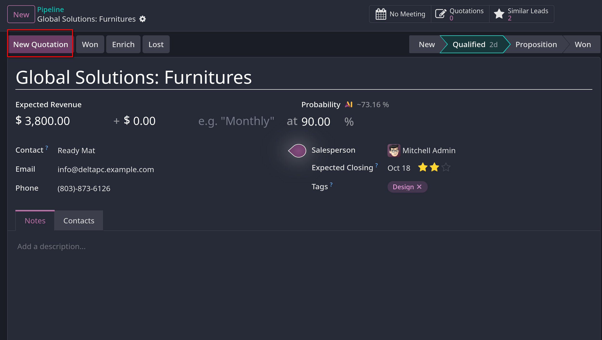
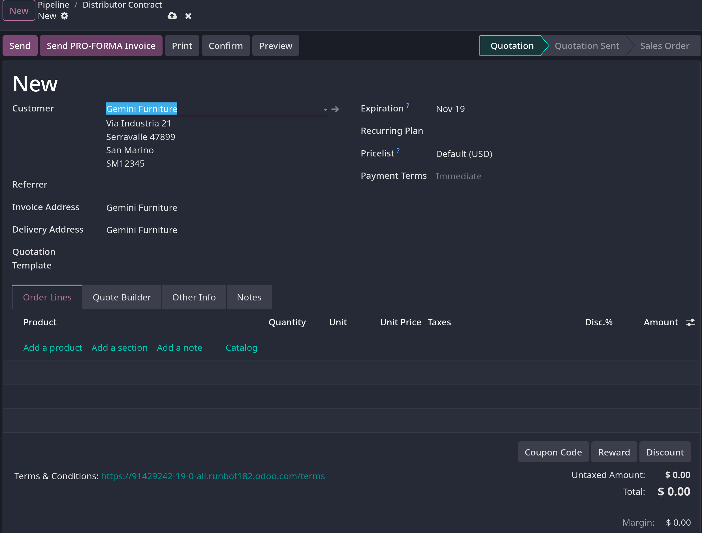
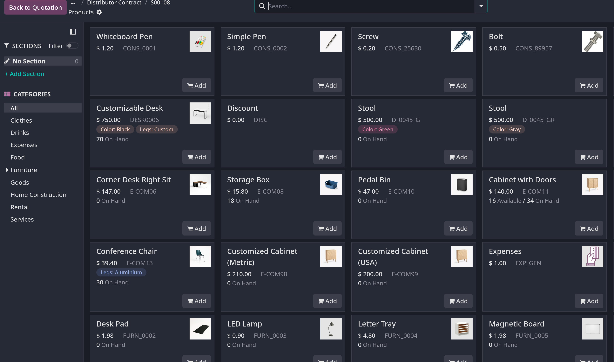
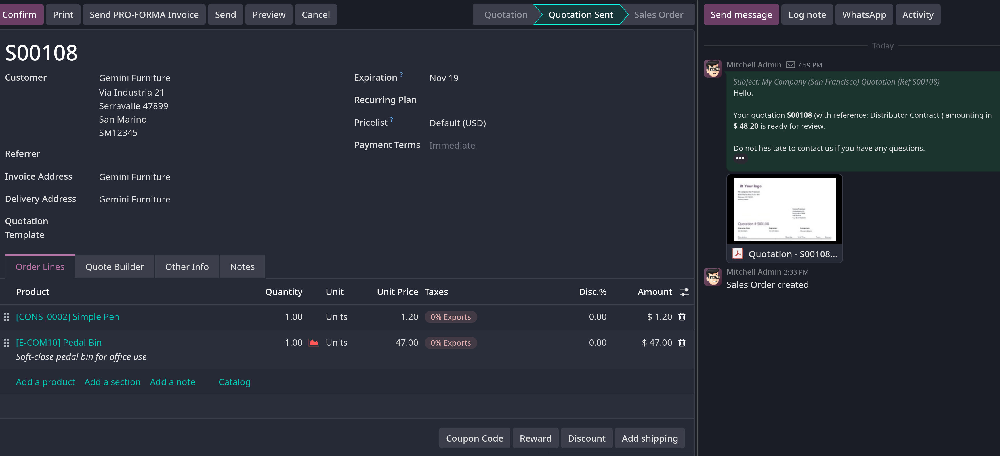

# Create and send quotations

- Một qualified lead đã được convert thành opportunity, bước tiếp theo sẽ là tạo quotation, tiến trình này được xử lý trong app `CRM` của Odoo

## Create a new quotation

- Để tạo mới quotation, mở `CRM`, hiệ ra `Pipeline` trên dashboard CRM
- Chọn một opportunity mà bạn muốn gửi báo giá.
- Trong form view của opportunity chọn `New Quotation` button.
  

- **Lưu ý quan trọng**: `Sales` app phải được cài đặt trước mới có thể sử dụng tính năng tạo `Quotation` trong CRM
- **Lưu ý quan trọng 2**: field `Customer` không được yêu cầu trong opportunity form, tuy nhiên `Customer` information phải được thêm vào hoặc
  link tới `Customer` đã tồn tại trước khi quotation được gửi. Nếu `Customer` field trên opportunity để trống, khi click `New Quotation` sẽ mở
  popup window với các option sau:
  - `Create a new customer`: tạo mới một contact với thông tin hiện tại của opportunity
  - `Link to existing customer`: mở một dropdown list các contact, bạn phải chọn một contact tương ứng với opportunity hiện tại.
  - `Do not link to a customer`: quotation sẽ không link tới customer

- Chi tiết form tạo quotation từ `CRM` sẽ như sau:
  

  trong đó, lưu ý các mục sau:
  - `Customer`: contact được tạo báo giá này
  - `Referrer`: khách hàng hoặc contact nào đó đã giới thiệu khách hàng hiện tại của quotation.
  - `Invoice Address`: địa chỉ để gửi hóa đơn
  - `Delivery Address`: địa chỉ dùng để gửi hàng hóa đến khách hàng
  - `Quotation Template`: nếu có quotation template sẵn, hãy chọn một template từ danh sách dropdown
  - `Expiration`: Ngày hết hạn của báo giá
  - `Quotation Date`: Ngày tạo của draft/sent orders, ngày xác nhận của đơn đặt hàng đã xác nhận. **Lưu ý**: chỉ hiển thị trong
    Developer mode (Debug mode).
  - `Recurring Plan`: gói gia hạn định kỳ nếu báo giá này dành cho sản phẩm định kỳ hoặc có gói đăng ký. **Lưu ý**: chỉ có ở bản enterprise
  - `Pricelist`: chọn một bảng giá để áp dụng cho đơn hàng này
  - `Payment Term`: Thời hạn thanh toán

  - **Tip**: `Expiration` field sẽ được tự động điền dựa trên ngày tạo quotation khung thời hạn mặc định được config trong
    `Sales -> Configuration -> Settings -> Quotations & Orders -> Default Quotation Validity`, để bỏ tự động expiration, set 0 vào field này.

  - **Tip**: Khi dùng quotation template, expiration date sẽ dựa vào `Quotation Validity` trong template, để thay đổi validity date
    vào `Sales -> Configuration -> Sales Orders -> Quotation Templates`, sau khi mở templates, update field `Quotation Validity`

### Order lines

- Sau khi update customer, payment, và deadline của quotation, ở dưới Order Lines tab của quotation có thể thêm chi tiết product bằng cách
  click `Add a Product` hoặc click `Catalog`.
- Nếu click `Add a Product` phải nhập từng sản phẩm một từ danh sách dropdown hoặc có thể tạo mới hoặc tạo mới và sửa.
  - Sau khi chọn product, nhập tiếp số lượng vào cột `Quantity`
  - Để xóa sản phẩm khỏi danh sách, click vào biểu tượng thùng rác cuối hàng.
  - Để tổ chức các sản phẩm, có thể click `Add a section` ở `Order Lines`, nhập tên, sau đó kéo thả tới hàng bạn muốn tổ chức.

- Nếu click `Catalog`, Odoo sẽ show ra product page, trong đó các product sẽ được tổ chức theo category, như hình.
  

  Bạn phải chọn product, số lượng, sau đó click vào `Back to quotation` để quay trở lại giao diện quotation.

## Preview and send quotation

- Để xem preview quotation, click vào `Preview` button, Odoo sẽ chuyển hướng tới trang portal mà khách hàng sẽ xem quotation
- Để quay lại, click `Return to edit mode` để quay lại giao diện chỉnh sửa quotation backend.
- Khi quotation đã sẵn sàng để gửi, click `Send` button để gửi email kèm quotation này tới khách hàng.
- Sau khi gửi, lịch sử sẽ lưu lại chatter, trạng thái báo giá sẽ `Quotation Sent`
  

- Sau khi được `Confirm`, báo giá sẽ trở thành đơn hàng

## Mark an opportunity won or lost

- Để cho pipeline sạch sẽ và đúng đắn, opportunities cần được xác định là _won_ hoặc _lost_ một khi khách hàng phản hồi về báo giá.
- Để mark một opportunity là won hay lost thì trong giao diện form view của opportunity, click vào `Won` hoặc `Lost` button.
- Một banner màu xanh sẽ xuất hiện ở góc phải form view nếu opportunity đó được mark là `Won` stage.
- Một banner màu đỏ sẽ xuất hiện ở góc phải form view nếu opportunity đó được mark là `Lost` stage.
- Khi mark opportunity là `Lost` bạn cần phải điền lý do tại popup window, `Lost Reason` có thể được chọn từ dropdown list hoặc `Create` mới
- **Tip**: "Best practice" là cấu hình trước các `Lost Reason` tại `CRM -> Configuration -> Lost Reasons`
- Ghi chú bổ sung có thể được thêm tại `Closing Note` field
- Để view `Lost` opportunities thì tại giao diện `My Pipeline` tại icon mũi tên xuống tại search bar, tick chọn vào `Lost`

- **Ghi chú quan trọng**: mặc dù opportunites có thể dùng thao tác `Archive` để mark `Lost`, tuy nhiên cần phân biệt rõ là
  các opportunities bị mark là `Archive` sẽ không xuất hiện trong các Reports. Nên một khi xác định opportunity đó là `Lost`
  thì cần phải xác định rõ `Lost Reason`
