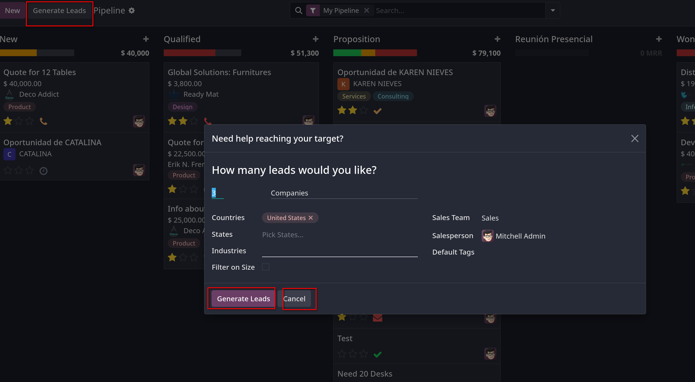

# Lead mining

- _Lead mining_ là tính năng cho phép `CRM` users sinh ra leads trực tiếp vào trong Odoo database
- Để đảm bảo chất lượng của lead được sinh ra, đầu ra của _lead mining_ được xác định bởi các điều kiện lọc khác nhau như _country_, _company size_ và _industry_ (ngành nghề kinh doanh)

## Configuration

- Vào `CRM -> Configuration -> Settings`, tick vào `Lead Mining` để active tính năng này, sau đó `Save`.

## Generate Leads

- Tại kanban view của `My Pipeline`, click chọn `Generate Leads` sẽ show 1 popup
  

  Cần để ý các filter sau:
  - `Countries`: filter dựa trên quốc gia nơi leads sinh sống.
  - `States`: filter theo thông tin tiểu bang nơi leads sinh sống.
  - `Industries`: filter dựa vào ngành nghề kinh doanh của leads.
  - `Filter on Size`: filter dựa trên quy mô của công ty, quy mô ở đây là số lượng nhân viên đang làm việc của công ty mà leads đang công tác.
  - `Sales Team`: chọn sales team sẽ được gán leads
  - `Salesperson`: chọn salesperson trong sales team sẽ được gán leads
  - `Default Tag`: chọn thẻ nào sẽ áp dụng cho leads sau khi tìm thấy.

## View leads

- Sau khi leads được sinh ra, xem chi tiết leads bằng cách click vào từng lead cụ thể.
- Trong chatter của lead, thông tin bổ sung được cung cấp

- **Ghi chú**: Nếu `Leads` không được enabled trong `Settings` thì opportunities sẽ được sinh ra khi dùng tính năng generate leads.

## Pricing

- Về giá của `Generate Leads`: đây là tính năng đòi credits của Odoo, phải mua **Odoo In-App Purchase** tại `CRM -> Configuration -> Settings`, trong
  `Lead Generation` dưới `Lead Mining`, chọn `Buy Credits`
