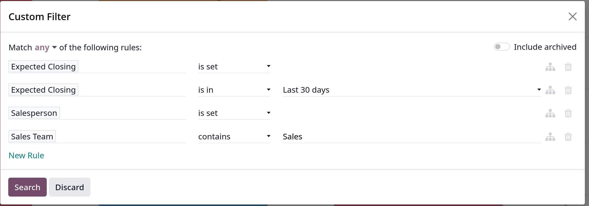

# Expected revenue report

- _Expected Revenue_ là tổng giá trị tiền mặt của leads dự kiến sẽ kết thúc vào một ngày nhất định

- Một _expected revenue report_ tổng hợp tất cả các leads đang hoạt động trong pipeline có ngày kết thúc dự kiến và so sánh
  hiệu quả hoạt động của các sales teams trong một khung thời gian nhất định

- Với việc lấy _expected revenue report_ hàng tháng, sales manager có thể biết được thành viên nào trong team đạt được mục tiêu của họ
  và ai có thể cần hỗ trợ thêm để chốt được các giao dịch có giá trị

## Create an expected revenue report

- Cũng lại vào `CRM -> Reporting -> Pipeline` tại **Pipeline Analysis** dashboard.

- Trên góc trên bên trái, click vào **Measure**, chọn **Expected Revenue** từ menu dropdown.

- Có thể customize lại filters, groups bằng cách click vào mũi tên xuống trên thanh **Search**

### Add custom filters

- Cần quan tâm tới các filter sau:
  - **Expected closing date**: giới hạn kết quả báo cáo chỉ bao gồm các leads dự kiến sẽ được đóng trong một khung thời gian nhất định
  - **Exclude unassigned leads**: loại trừ các leads không được gán cho salesperson nào
  - **Specific sales teams**: giới hạn kết quả report chỉ gồm các leads được gán cho một hoặc nhiều sales teams,

#### Add filter for expected closing date

- Chọn **Custom Filter** ở dropdown menu trên **Search** bar. Gõ _Expected Closing_ , field thứ hai chọn operator **is set**
- Click vào icon plus (+) để duplicate
- Ở field operator sau khi duplicate, chọn **is in**. Làm thế này để chọn một khung thời gian nhất định cho báo cáo.

#### Exclude unassigned leads

- Sau các filters ở _expected closing date_, click chọn **New Rule** để thêm filter mới.
- Gõ _Salesperson_, operator chọn **is set** -> sẽ loại các leads không có salesperson

#### Add a filter for sales teams

- Click **New Rule** sau các filter trên
- Gõ _Sales Team_, operator phải chọn **contains**, field thứ ba gõ các cụm từ mà sales teams của hệ thống đang dùng để đặt tên,..

- Như hình sau:
  

### View Result

- Tại top của **Custom filter**, có thể thay đổi điều kiện match là **all** hoặc **any**

#### View options

- Expected revenue report sử dụng nhiều chế độ xem khác nhau gồm:
  - Graph view
  - List view
  - Pivot view
