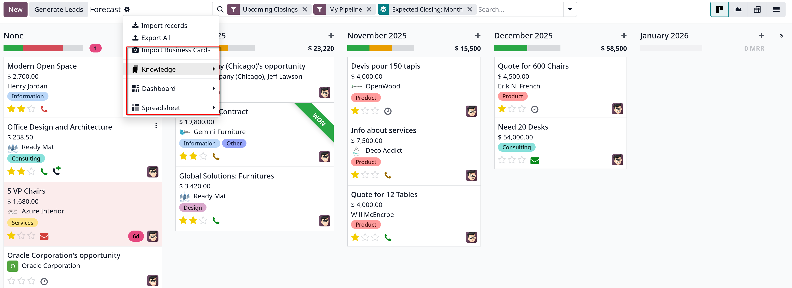
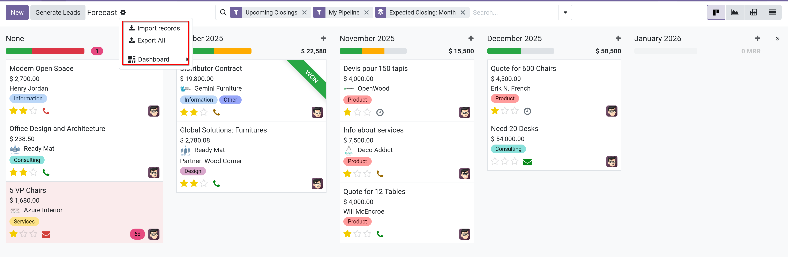

# Forecase report

- Cho phép người dùng `CRM` xem các opportunities sắp tới và xây dựng dự báo về doanh số bán hàng tiềm năng.
- Opportunities được group theo tháng kể từ ngày kết thúc dự kiến và có thể kéo thả để điều chỉnh thời hạn.

- Truy cập `CRM -> Reporting -> Forecast` để xem

## Nagivate the forecast report

- Mặc định _Forecast_ report bao gồm các opportunities được gán cho pipeline của user hiện tại và dự kiến sẽ đóng trong vòng 4 tháng.
- Nó cũng show các opportunities không có ngày kết thúc dự kiến. Các opportunities được group theo tháng trong kanban view

- Có một tí khác biệt trong bản enterprise và community:
  - Enterpise:
    
  - Community:
    

### Expected closing date

- Opportunities được group theo ngày được gán trong field _Expected closing date_ của opportunity form. Có thể thay đổi thủ công field này trong
  form view của opportunity

- **Ghi chú**: Khung thời gian mặc định cho forecast là tháng
- Sau khi opportunity được thêm vào tháng mới, _Expected closing date_ field trong opportunity form được update là ngày cuối cùng của tháng mới.

### Prorated revenue

- Ở đầu mỗi cột cho mỗi tháng trong trang **Forecast** reporting, bên phải progress bar là tổng doanh thu được chia theo tỷ lệ cho khung thời gian đó
- Doanh thu theo tỉ lệ được tính bằng công thức:

  $$
  Expected Revenue \times Probability = Prorated Revenue
  $$

- Khi opportunity được chuyển từ cột này sang cột khác, doanh thu của cột sẽ được tự động tính tương ứng.

## View result

- Có thể xem kết quả **Forecast** reporting bằng nhiều view khác nhau như graph view, pivot view, list view.
