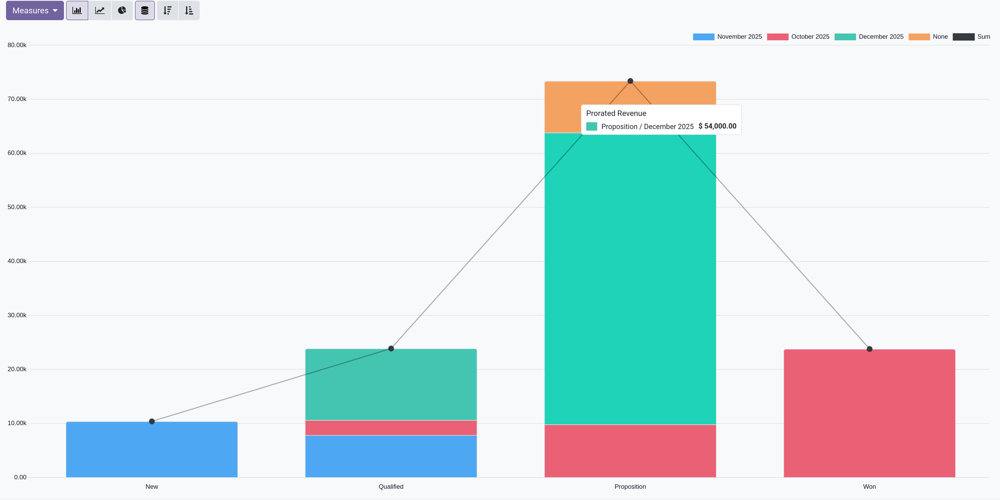
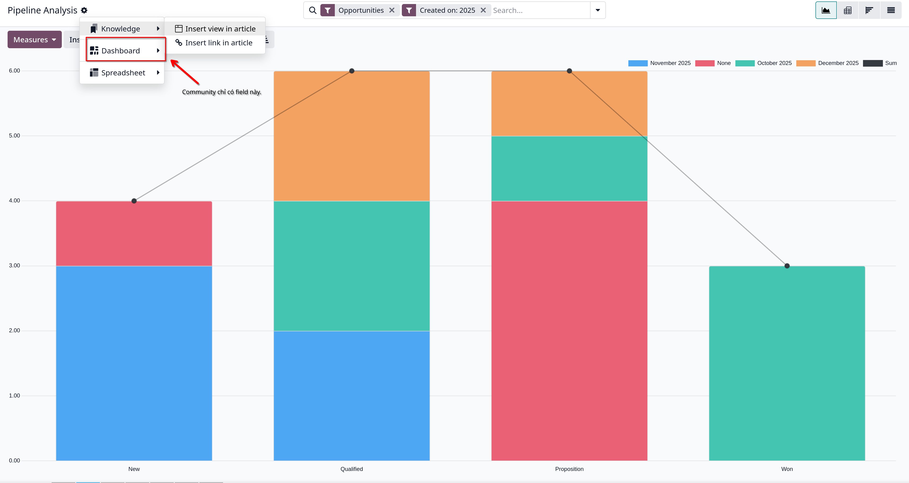
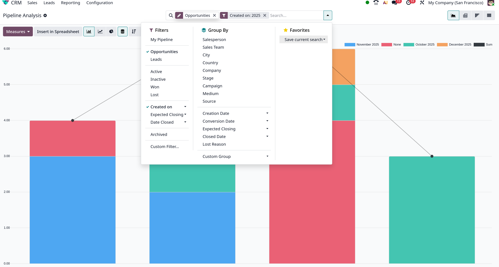

# Pipeline Analysis

- `CRM` app quản lý sales pipeline khi leads/opportunities chuyển từ _stage_ này sang _stage_ khác, từ bắt đầu đến bán được hàng (_Won_) hay lưu trữ (_Lost_)

- Sau khi tổ chức pipeline, sử dụng các tùy chọn tìm kiếm và báo cáo sẵn có trên **Pipeline Analysis** để đạt được cái nhìn về tính hiệu quả của pipeline và người dùng nó.

- Để truy cập, vào `CRM -> Reporting -> Pipeline`

## Navigate the pipeline analysis page.

- Khi truy cập trang `Pipeline Analysis`, biểu đồ biểu diễn các leads trong năm qua sẽ tự động xuất hiện. Trong biểu đồ:
  - Các thanh biểu thị cho số leads của từng _stage_ trong sales pipeline
  - Màu hiển thị tháng mà leads đạt đến _stage_ đó.
    

  - Để tương tác với các thành phần của biểu đồ, ta cần làm rõ:
    - **Actions**: được biểu diễn bởi **gear icon**, nằm bên cạnh **Pipeline Analysis** title, khi click vào sẽ show ra:
      - **Dashboard**
      - **Knowledge**: chỉ bản enterprise
      - **Spreadsheet**: chỉ bản enterprise
        

    - **Search**: hiển thị filters, groupings hiện tại được áp dụng cho biểu đồ này. Có thể thêm mới hoặc chỉnh sửa bằng cách click vào mũi tên xuống ở thanh **Search**

  - Góc phải có các thành phần được biểu diễn bằng các icons khác nhau:
    - **Graph**: hiển thị data ở dạng đồ thị (mặc định)
    - **Pivot**: hiển tị data ở bảng số liệu có thể tùy chỉnh và phân loại
    - **Cohort**: biểu diễn và tổ chức dữ liệu dựa trên _Created on_ và _Closed Date_ theo tuần, ngày, tháng hay năm (_chỉ ở bản enterprise_)
    - **List**: hiển thị dữ liệu dạng danh sách.

  - Góc trái bên dưới **Pipeline Analysis** có:
    - **Measures**: một dropdown menu gồm các tùy chọn đo lường khác nhau có thể xem với graph, pivot và cohort view. Không available với list view.
    - **Insert in Spreadsheet**: mở ra một popup với các tùy chọn thêm một graph hay pivot table vào trong spreadsheet trong _Documents_ app hoặc
      trong _Dashboard_ app. Không available cho list và cohort view.

  - Nếu _Graph_ view được chọn, các tùy chọn sau sẽ hiển thị các dạng biểu đồ khác nhau:
    - _Bar chart_
    - _Line chart_
    - _Pie chart_
    - _Stacked_
    - _Descending_: sắp xếp lại các _stage_ trong biểu đồ theo thứ tự giảm dần, từ trái sang phải
    - _Ascending_: tương tự _Descending_
  - Nếu _Pivot_ view được chọn, các tùy chọn sau có thể dùng để customize view:
    - _Flip Axis_: lật trục X và Y cho toàn bộ bảng
    - _Expand All_: khi các groups bổ sung được chọn bằng biểu tượng dấu cộng, nút này sẽ mở các nhóm đó dưới mỗi hàng
    - _Download xlsx_: download bảng với file xlsx.

### Search options

- **Pipeline Analysis** có thể được tùy chỉnh với nhiều tùy chọn filters và groupings
- Để thêm tiêu chí tìm kiếm mới,nhập tiêu chí mong muốn tại thanh tìm kiếm hoặc click vào mũi tên xuống. Chọn **Custom Filter** hoặc **Custom Group**

- Đây là toàn bộ thành phần của **Filters**, **Group** và **Favorites** mà Odoo support.
  

- Cần lưu ý các mục **Custom Filter** và **Custom Group**

- **Custom Filter**:
  - Thêm các điều kiện bằng click vào **New Rule**
  - Để xóa 1 Rule thì click vào trash icon cuối hàng
  - Để duplicate một Rule click vào + button ở cuối hàng
  - Để tạo một điều kiện lọc phức tạp, click vào branch icon cuối hàng (_Add nested rule_). Tùy vào điều kiện mà bạn muốn,chọn **all** hoặc **any** tương ứng.

- **Custom Group**
  - Chọn **Custom Group** tại dropdown menu show ở bước click mũi tên xuống tại thanh **Search**.
  - Để xóa, click x icon bên cạnh custom group trên thanh **Search**

### Measurement options

- Mặc định **Pipeline Analysis** đo total **Count** các leads thỏa điều kiện lọc, nhưng có thể đổi sang cách đo khác:
  - _Days to Assign_: đo số ngày leads được gán kể từ sau khi tạo
  - _Days to Close_: đo số ngày leads được đóng (_Won_)
  - _Days to Convert_: đo số ngày leads được chuyển đổi thành một opportunity
  - _Exceeded Closing Days_: đo số ngày leads vượt quá số _Expected Closing_ date.
  - _Expected MRR_: đo doanh thu định kỳ dự kiến của leads
  - _Expected Revenue_: đo doanh thu dự kiến của leads
  - _Prorated MRR_: đo doanh thu định kỳ hàng tháng chia theo tỉ lệ của leads
  - _Prorated Recurring Revenues_: đo doanh thu định kỳ theo tỷ lệ của leads
  - _Prorated Revenue_: đo doanh thu theo tỉ lệ của leads
  - _Recurring Revenue_: đo doanh thu định kỳ của leads
  - _Count_: đo tổng leads phù hợp với điều kiện tìm kiếm.

### View options

- Như đã nói ở trên, Odoo support 4 loại views cho **Pipeline Analysis**, ngoại trừ _cohort_ view chỉ có ở bản enterprise

#### Create reports

- Sau khi đã hiểu các để xem một _pipeline analysis_, _Pipeline Analysis_ có thể được dùng để tạo và chia sẻ nhiều reports khác nhau.
  Giữa các tùy chọn được tạo sẵn, các custom filters và groups có thể dùng kết hợp với nhau được.

- Một khi tạo xong reports, reports có thể được lưu vào **Favorites**, chia sẻ với user khác hoặc thêm vào dashboard/spreadsheets.

- Một số reports phổ biến có thể được tạo ở tragn **Pipeline Analysis** sau:

##### Win/Loss reports

- Win/Loss là một phép tính của các active leads trong pipeline được đánh dấu là _Won_ hay _Loss_ trên một khoảng thời gian cụ thể.
  Bằng cách tính toán opportunites _won_ so với các opportunities _loss_, các teams sẽ làm rõ được KPI (key performance indicators) đang chuyển
  đổi leads thành doanh số bán hàng, ví dụ như các nhóm hoặc thành viên nhóm cụ thể, một số phương thức và chiến dịch marketing nhất định.

  $$
  Win/Loss = \frac{OpportunitiesWon}{OpportunitiesLoss}
  $$

- Win/Loss report lọc các leads trong năm qua, dù won hay lost và nhóm các kết quả của các _stage_ trong pipeline.
  Tạo report yêu cầu custom filter, grouping results theo _stage_
- Có thể custom filter và custom group by như cách đã thực hiện ở các mục trước.

##### Custom win/loss reports

- Có thể thêm các tùy chỉnh filters, groups tại **Custom Filter** và **Custom Group**
- **Pivot** view mặc định group theo _Stage_ và đo _Expected Revenue_
- **List** view có thể remove tất cả các Groups trên thanh tìm kiếm

#### Save and share reports

- Có thể lưu report tại **Favorites** filter trong **Pipeline Analysis** để có thể truy cập lại sau
- Bản enterprise có tính năng **Insert in Spreadsheet** hoặc `Spreadsheet -> Link menu in spreadsheet` để thêm vào `Documents` app.
- Bản enterprise cũng có tính năng **Insert view in article** hay **Insert link in article** trong app `Knowledge`
- Có thể thêm vào app `Dashboard` tại `My Dashboard` bằng cách chọn **Dashboard** ở dropdown menu sau khi click vào gear icon.
