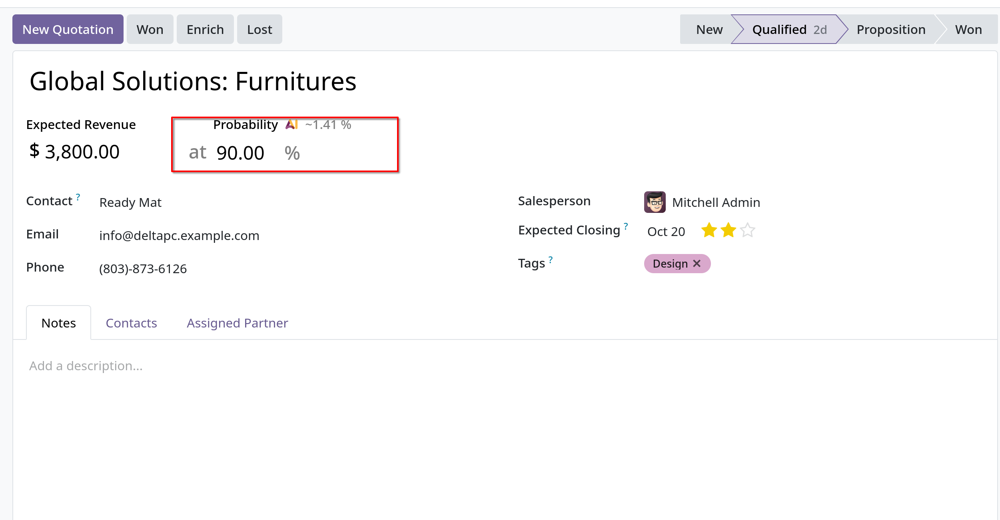
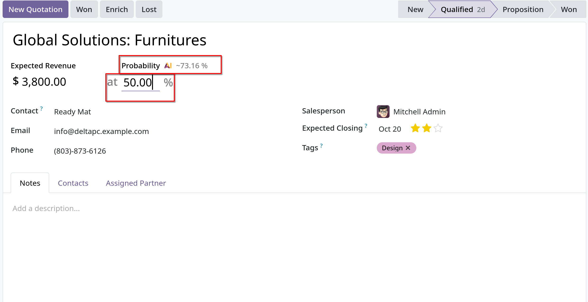
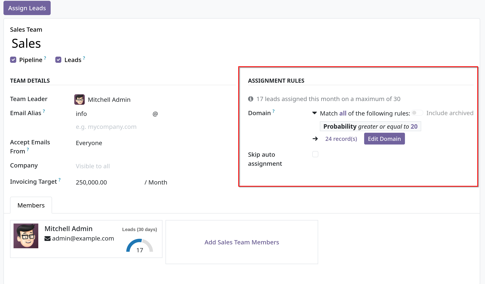
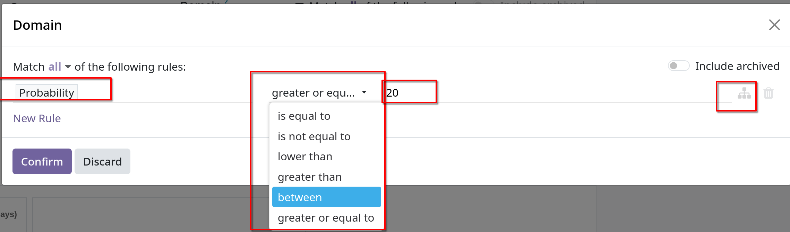
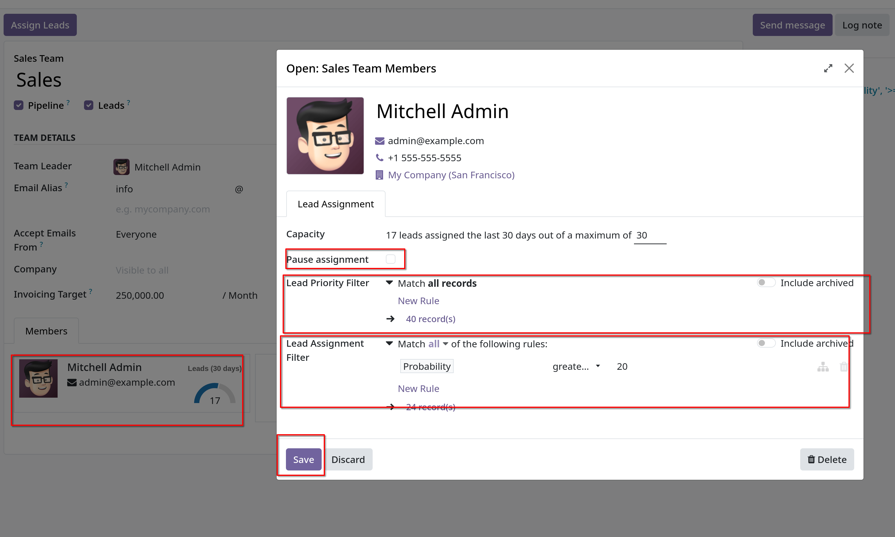
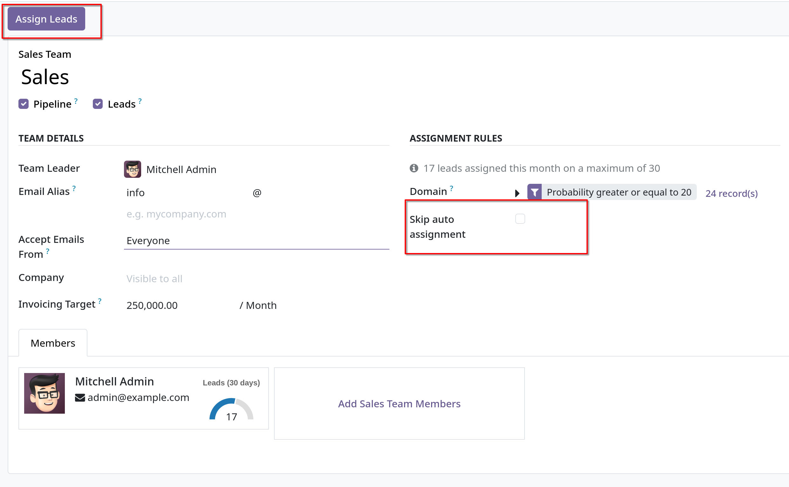

# Assign leads with predictive lead scoring

- Odoo `CRM` có thể tự động assign leads/opportunites cho sales team và salesperson. Một thực tiễn điển hình là gán leads dựa trên
  xác xuất _wining_ của mỗi lead.
- Các công ty có thể ưu tiên các leads mà có khả năng dẫn tới giao dịch thành công bằng cách nhanh chóng gán các leads này cho salesperson phù hợp.

- Odoo có chức năng tự động tính toán xác xuất _wining_ của mỗi lead bằng phương pháp được gọi là **predictive lead scoring**

## Predictive lead scoring

- Đây là một mô hình học máy (machine-learning) sử dụng dữ liệu lịch sử từ Odoo `CRM` để chấm điểm mở ra leads/opportunities

- Khi xử lý các opportunities thông qua `CRM` pipeline, Odoo sẽ thu thập dữ liệu về opportunities nào won/lost. **Predictive lead scoring**
  dùng dữ liệu này để dự đoán xác xuất _wining_ của mỗi lead/opportunity mới.

- Càng nhiều opportunities được gửi thông qua `CRM` pipeline thì Odoo càng thu được nhiều data hơn -> xác suất sẽ chính xác hơn.
- Odoo dùng mô hình **_naive Bayes_** để dự đoán, công thức toán học là:

  $$
  P(A \mid B) = \frac{P(A) \times P(B \mid A)}{P(B)}
  $$

  Giải thích công thức một chút:
  - $$ P(A \mid B) $$: là xác xuất hậu nghiệm (posterior) - xác suất để A đúng sau khi biết B đã xảy ra
  - $$ P(A) $$: là xác suất tiên nghiệm (prior) - xác xuất ban đầu để A xảy ra, trước khi chưa biết gì về B
  - $$ P(B \mid A) $$: là xác suất điều kiện (likelihood) - khả năng quan sát được B nếu A đúng
  - $$ P(B) $$: là xác xuất chuẩn hóa (evidence) - xác suất tổng thể để B xảy ra - dùng để chuẩn hóa

  - Trong ngữ cảnh của Odoo, có thể giải thích: A là lead được chuyển sang stage _won_, B là các đặc trưng của lead (salesperson, source, language, country,...)
    thì:
    - $$ P(A \mid B) $$: xác xuất lead thành công - hiển thị trên form
    - $$ P(B) $$: xác suất xuất hiện các đặc trưng ở trên
    - $$ P(A) $$: xác suất lead thành công trung bình dựa trên toàn bộ dữ liệu lịch sử
    - $$ P(B \mid A) $$: xác suất xuất hiện đặc trưng ở trên nếu lead thành công, ví dụ 70% các leads thành công có source là Website, 80% các leads thành công nếu salesperson là D.

- Thuật ngữ trường hợp này (_in this case_) đề cập đến các biến số có thể ảnh hưởng đến sự thành công của leads trong Odoo.
- Các biến này có thể được xác định như: salesperson được gán, nguồn của leads, ngôn ngữ mà leads sử dụng và các dữ liệu lịch sử, nhân khẩu học của leads

- Xác suất 1 leads sẽ success xuất hiện trong view form của form chi tiết thông tin leads/opportunity trong `CRM` Pipeline
  
  - Odoo 19 có thêm tính năng AI, khi click vào button `AI` này, xác xuất thành công của lead sẽ được tính toán lại cho chính xác hơn
    căn cứ vào các thông tin hiện có của lead.

## Configuration

- _Predictive lead scoring_ là tính năng luôn active trong Odoo, để customize các biến số được sử dụng trong mô hình dự đoán, vào
  `CRM -> Configuration -> Settings`, ở dưới `Predictive Lead Scoring`, click chọn `Update Probabilities`. Sau đó click vào dropdown menu, chọn biến cụ thể.

- Các biến đang activated: `State`, `Country`, `Phone Quality`, `Email Quality`, `Source`, `Language`, `Tags`
- **Lưu ý**: các biến `Stage`, `Team` cũng tác động tới kết quả predicting,2 biến này luôn ảnh hưởng đến kết quả, bất kể có tùy chọn thêm bao nhiêu biến.

- Chọn xong thì `Confirm`.

## Change the probability manually

- **Lưu ý**: Các opportunities, có thể thay đổi thủ công xác xuất thành công trong _predictive lead scoring_ tại form chi tiết.
- Để kích hoạt lại số của Odoo tính, chỉ cần click lại **AI icon** bên cạnh probability.
  

## Assign leads based on probability

- Odoo `CRM` có thể gán leads/opportunities cho sales team và salesperson dựa vào các rules xác định. Tạo assignment rules dựa trên
  xác suất thành công của leads để ưu tiên những quy tắc có nhiều khả năng dẫn tới giao dịch hơn.

### Configure rule-based assignment

- Để active _rule-based assignment_, vào `CRM -> Configuration -> Settings`, active `Rule-Based Assignment`

- _rule-based assignment_ có thể set để chạy **Manually** -> Odoo users phải trigger việc gán này. Hoặc Odoo sẽ tự phân công theo khoảng thời gian đã chọn.
- Để setup assign leads tự động, chọn `Repeatedly` cho `Running` field. Sau đó tùy chỉnh cách Odoo trigger auto assigment trong field
  `Repeat every`.

### Configure Assignment Rule

- Để configu _assignment rule_ cho sales team hay salesperson. Vào `CRM -> Configuration -> Sales Team`, chọn một sales team muốn config.
- Tại `Assignment Rules` field, click chọn `Edit Domain` để cấu hình rules để Odoo sử dụng để xác định và gán leads cho sales team này.
  
- `Add Filter` để bắt đầu tạo _assignment rules_ . Rules có thể bao gồm mọi thứ liên quan với công ty hay team (_all_) hoặc bất cứ
  rule nào được added vào (_any_)

- Để tạo _assignment rules_ dựa vào _probability_ thì click chọn **Probability** tại dropdown menu của dòng assigment rule, nhập số mong muốn và chọn operator.
  

- Tại Tab `Members` của `Sales Team`, bạn có thể gán _assignment rules_ cho từng members bằng việc click vào member, sau đó edit `Domain`, `Save`
  

  Cần lưu ý các field:
  - `Pause assignment`:
  - `Lead Priority Filter`:
  - `Lead Assignment Filter`:

- Nếu _automatic lead assignment_ được cấu hình trong settings, cả sales team và từng thành viên riêng lẻ của sales team có tùy chọn `Skip auto assignment`
  Check vào field này để một sales team cụ thể bỏ qua việc được gán leads tự động bởi _rule-based assignment_ của Odoo.
  Nếu `Skip auto assignment` được actived, sales team và salesperson có thể được gán leads thủ công.
- Để gán leads thủ công, click `Assign Leads` button tại top của trang config `Sales Team`. Gán thủ công sẽ gán bất cứ leads nào hiện tại chưa được gán và thỏa điều kiện team's specific domain.
  
