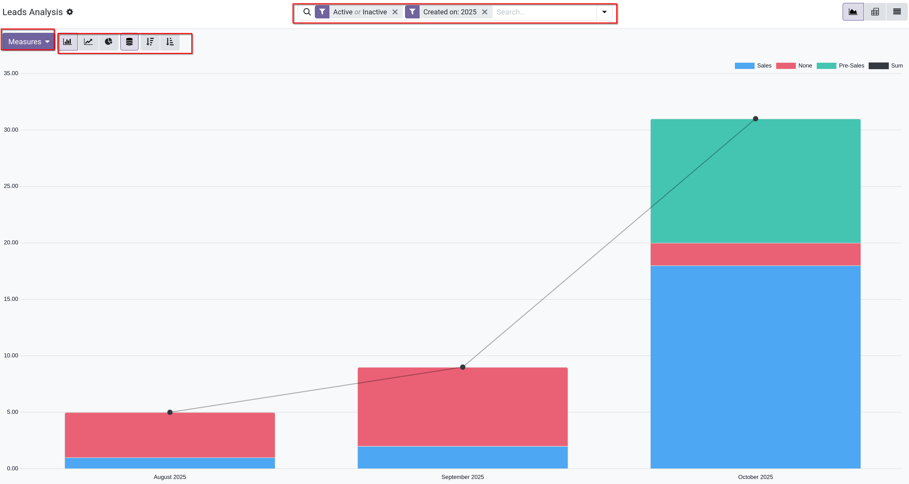
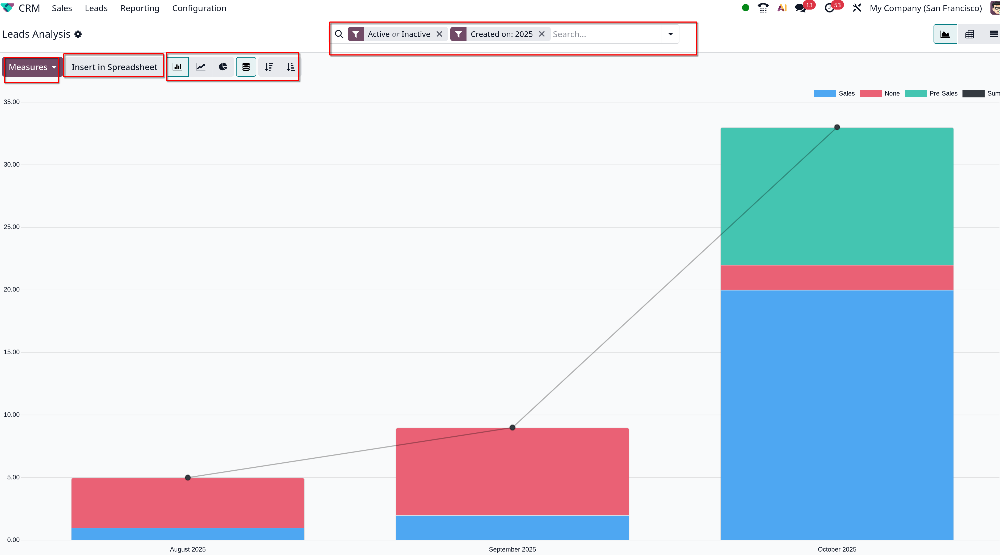
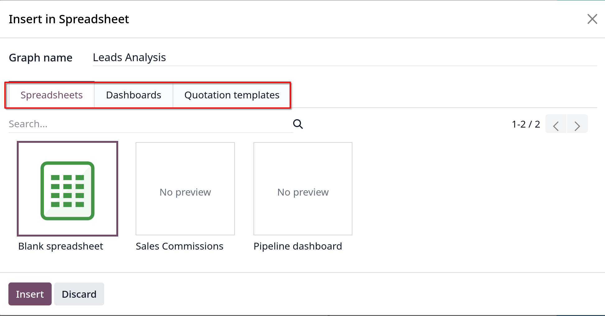
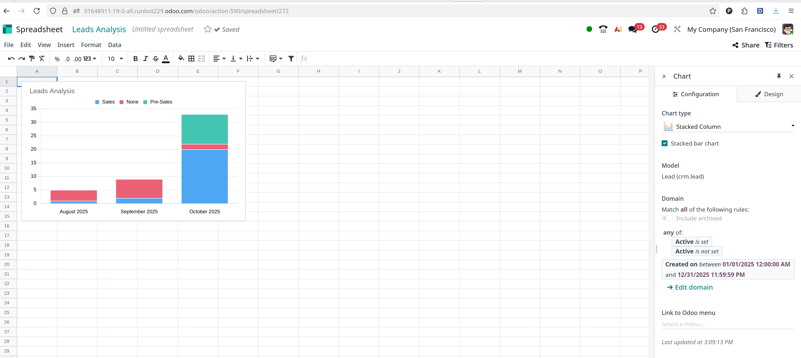
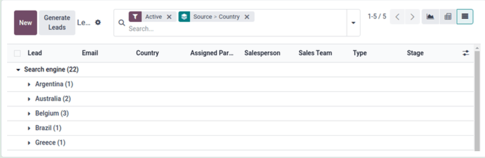
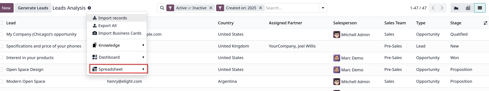

# Marketing attribution reports

- Odoo `CRM` app có thể biên soạn một báo cáo phân bổ marketing (marketing attributino report),phân tích nguồn (source) của leads
  và group chúng để tính toán tác động tổng thể của hoạt động marketing đối với việc tạo leads, phân bổ, tỉ lệ _won_,...

## Leads Analysis dashboard

- Vào `CRM -> Reporting -> Leads`
- **Tip**: report cũng có thể được tạo tại `CRM -> Leads` (Cần active `Leads` trong `Settings` trước).

- Nếu view ở `CRM -> Reporting -> Leads` thì trên thanh `Search` sẽ mặc định 2 filter được áp vào `Active or Inactive` và `Create On`

- Dưới đây là sự khác nhau giữa giao diện report leads của bản community và enterprise
  

  

- **Lưu ý**: bản enterprise có tính năng `Insert in Spreadsheet` giúp chèn report này vào file spreadsheet, khi chọn sẽ ra giao diện tùy chọn như hình
  

  Sau đó, giao diện spreadsheet (Odoo host) sẽ như sau:
  

## Add UTM parameters

- _Urchin Tracking Modules (UTM)_ là các đoạn văn bản được nhúng trong URLs dùng để theo dõi dữ liệu của khách truy cập.
  Gồm các tham số liên quan tới cách khách truy cập tiếp cận link, như là loại trang web đã truy cập, hay chiến dịch tiếp thị nào đó.

- Odoo dùng các tham số UTM này trong _marketing attribution report_ để theo dõi số liệu và hiệu suất của các chiến dịch tiếp thị.

### Create UTMs

- `link tracker` trong Odoo có thể được tạo và configure UTMs
- UTM cũng được sinh ra tự động từ `Email Marketing` hoặc `Marketing Automation` apps
- Các tham số UTMs được dùng trong report là `Campaign`, `Medium` và `Source`

### Create report

- Bắt đầu tạo báo cáo, click nút mũi tên xuống tại thanh `Search`, có 3 cột:
  - `Filter`: chọn các tiêu chí lọc cụ thể để show lên report
  - `Group By`: tổ chức lại report thành các groups
  - `Favorites`: Lưu các filters và group by hiện tại để sử dụng cho lần lấy report sau.

  - **Tip**: chọn nhiều `Group By` options tạo các nhóm lồng nhau tùy theo options nào được chọn trước, ví dụ:
    **Medium** theo sau bởi **Source**, **Campaign**.

  - Ví dụ:
    

### Export report

- Để đặt các thước đo (_Measure_) cho report, click vào **Pivot** view, chọn _Measure_ mong muốn
- Để xuất file **.xlsx** thì click vào nút **Export All**
- Ngoài ra Odoo còn cho phép chèn list view vào trong _Odoo Documents_ app bằng cách click vào **gear icon** chọn **Spreadsheet**, **Insert list in spreadsheet**
  (_chỉ có ở bản enterprise_)
  
