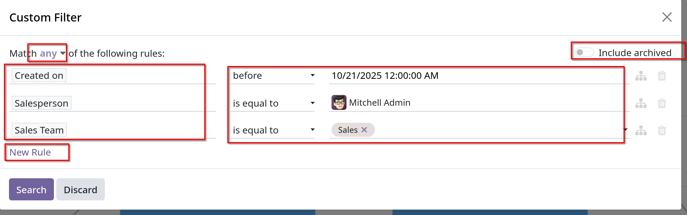

# Quality leads report

- Một _quality lead_ là một lead có tiềm năng dẫn tới bán hàng. Nó phải phù hợp với các đặc điểm thường được cho là giúp nhân viên bán hàng chốt giao dịch,
  bên cạnh các tiêu chí chính xác hơn dành riêng cho từng tổ chức.

- Một quality leads report so sánh bao nhiêu leads trên mỗi salesperson đã nhận trên một lượng xác định của thời gian, ví dụ trong 30 ngày.

## Create a quality leads report

- Vào `CRM -> Reporting -> Pipeline` để mở `Pipeline Analysis` dashboard, click vào `Search` bar xong xóa các filter cũ đi.

- Chọn `Custom Filter` để mở tạo filter tùy chỉnh cho báo cáo.

### Add custom filters

- `Starting date`: giới hạn thời gian tạo báo cáo trong 1 khung thời gian xác định
- `Specific sales teams`: giới hạn kết quả chỉ bao gồm khách hàng tiềm năng cho một hoặc nhiều nhóm hàng. Bộ lọc này là tùy chọn
- `Exclude unassigned leads`: loại trừ các leads không có salesperson
- `Include archive leads`: đảm bảo cả active và inactive leads đều nằm trong báo cáo.
- `Add rules for quality leads`: bao gồm hoặc loại trừ kết quả báo cáo dựa trên tiêu chí dành riêng cho công ty hoặc sales team.

  

- **Lưu ý**: Tùy vào các thông số bạn muốn xem trong báo cáo mà có thể chọn để thêm vào filters

- **Lưu ý**: khi thêm các filters tùy chỉnh, phải để ý xem tiêu chí filter có phải khớp với tất cả các rules đặt ra hay chỉ cần bất kỳ rules nào cũng được.

### View report

- Sau khi đã thêm các filters vào, click `Search` để hiển thị report các qualify leads thỏa điều kiện đưa ra.
- Để nhóm kết quả theo salesperson, click _mũi tên xuống_ tại thanh `Search` bar, rồi chọn `Salesperson` tại mục `Group By`. Hoặc
  có thể `Custom Group` tương tự như `Custom Filter` ở trên.
- **Qualify leads** được định nghĩa ở trên, là các leads có khả năng cao dẫn đến giao dịch thành công. Phụ thuộc vào nhiều tiêu chí khác nhau,
  Ngoài các filter cơ bản ở trên như `Create On`, `Sales Team`, `Salesperson`, cần cân nhắc xem các bộ lọc sau:
  - `Email` hoặc `Phone`
  - `Source`: field này liên kết trực tiếp tới nguồn sinh ra lead ở các app khác như `Live Chat`, `Social Marketing` hoặc `Email Marketing`
  - `Stage`
  - `Medium`: phần nào đó có thể nói lên chất lượng của leads vì các kênh khác nhau có tỷ lệ _wining_ và doanh thu dự kiến khác nhau.
  - `Campaign`: Giúp theo dõi sự thành công của các chiến dịch marketing khác nhau nhằm thu hút leads chất lượng cao
  - `Lost Reason`: Loại trừ các leads có vẻ là có chất lượng tốt nhưng đã được đánh dấu _lost_ vì nguyên nhân nào đó.
  - `Tags`: bao gồm hoặc loại trừ các leads dựa theo các thẻ tùy chỉnh.

- **Tip**: để lưu report sau khi đã thêm `Custom Filter` hoặc `Custom Group`, có thể chọn vào `Favorites` để lưu lại kết quả tìm kiếm này.
