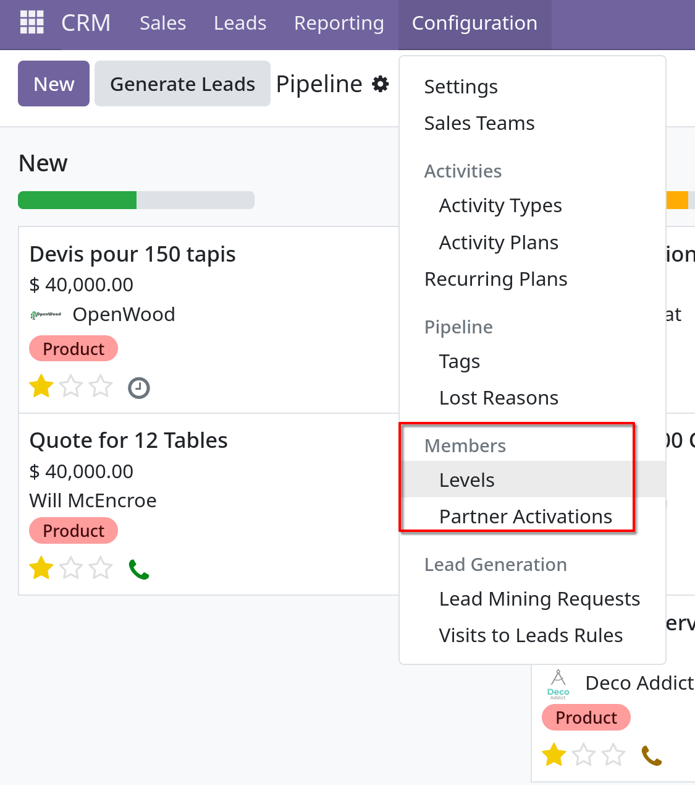
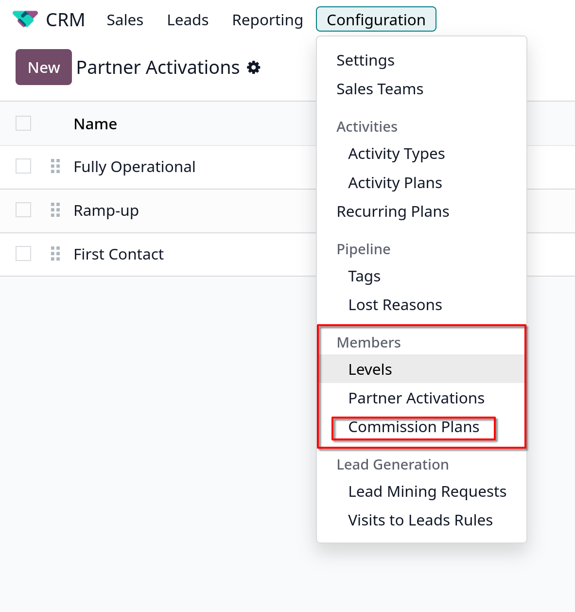
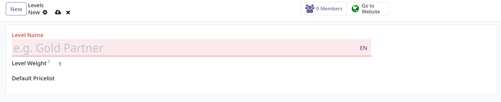
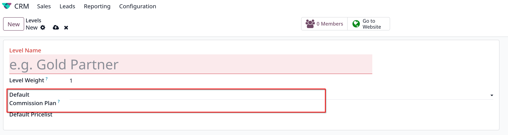
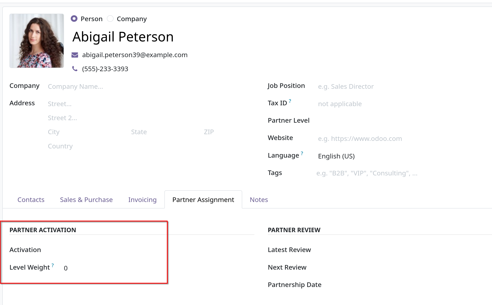
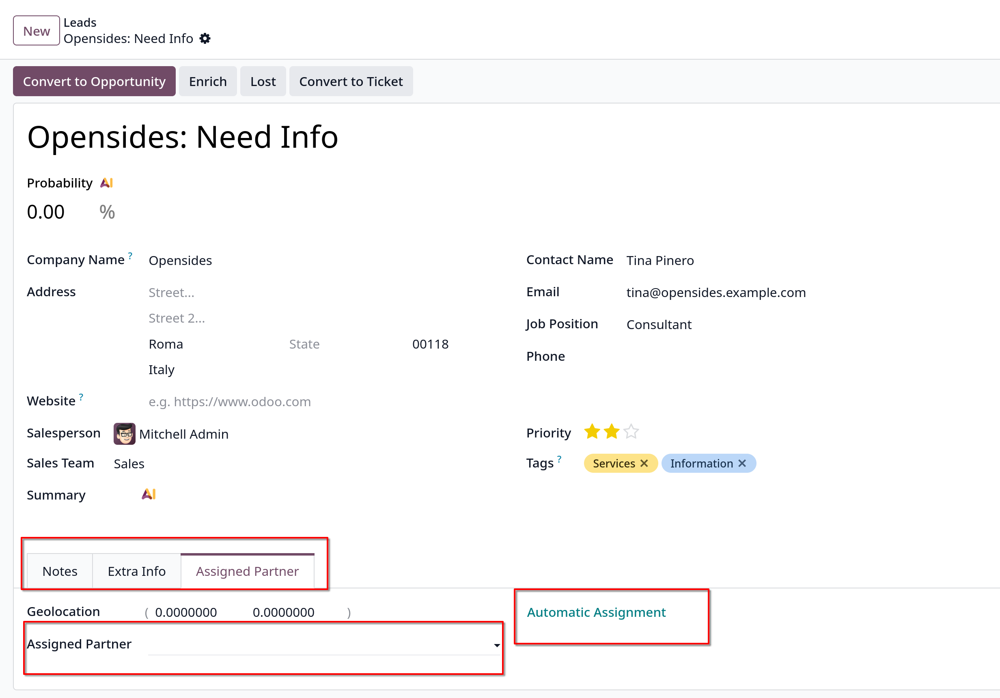
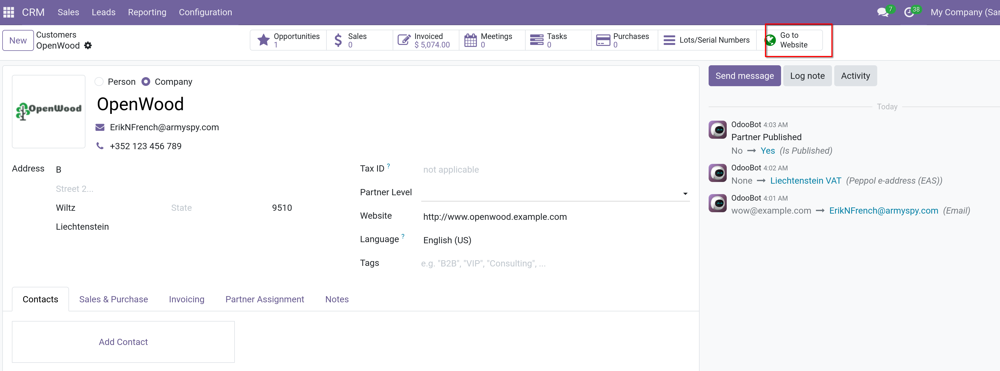
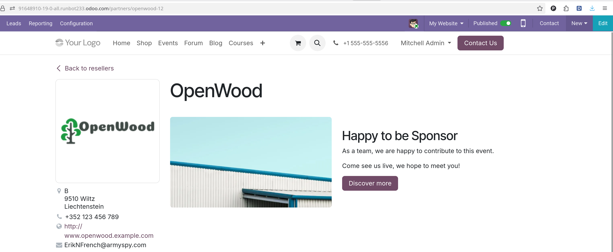
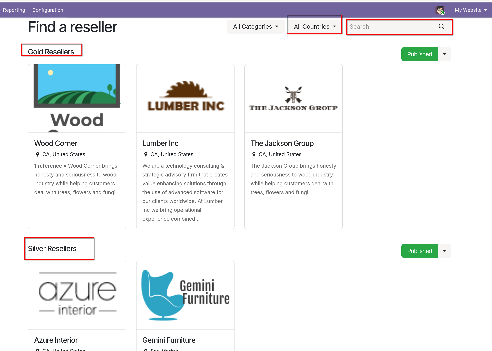

# Resellers

- Trong Odoo `CRM`, leads có thể được chuyển tiếp cho resellers một cách tự động hoặc thủ công dựa trên vị trí và cấp bậc của resellers

## Configuration

- Để sử dụng các tính năng của `Resellers`, cần active app `Resellers` trong Odoo `Apps`

- Sau khi cài đặt xong, vào `CRM -> Configuration -> Member`
  - Bản community, không có menu `Commision Plans`
    

  - Bản enterprise có menu `Commission Plans`
    

### Partner levels

- Dùng để phân biệt cấp độ giữa các resellers khác nhau, tại `CRM -> Configuration -> Member -> Levels`, mặc định gồm 3 cấp:
  - **Gold**
  - **Silver**
  - **Bronze**

  - Có thể tạo mới bằng cách click `New`
  - Các levels hiện có cũng có thể được `Edit`
  - Level weight được sử dụng để quyết định khả năng một partner được gán một lead/opportunity, chỉ cần gán 1 số vào field
    `Level Weight` trong form tạo mới hoặc edit.
  - Giao diện `New/Edit` của Level giữa 2 bản community và enterprise sẽ khác nhau ở field `Commission Default Plan`
    

    

- **Tip**: Level weight còn có thể được gán trong app `Contacts` đối với contact là `Person`, thông số này sẽ ghi đè lên thông số trong
  `CRM -> Configuration -> Level`
  

### Partner Activations

- Được sử dụng để xác định trạng thái của partner. Activations được gán trên một `Person` contact record, và có thể được sử dụng
  để group hoặc filter `Partnership Analysis` report (`CRM -> Reporting -> Partnerships`)

- Vào `CRM -> Configuration -> Partner Activations`, có 3 kiểu activations mặc định:
  - `Fully Operational`
  - `Ramp-up`
  - `First Contact`

  - Tạo mới activation bằng click vào `New`
  - Có thể đánh dấu activation là active/inactive bằng cách click vào button ở cột `Active`

### Partner Assignments

- Sau khi config `Level` và `Partner Activations`. Vào `CRM` kanban view, chọn 1 lead muốn gán partner, tại tab `Assigned Partner`
  

### Publish partners

- Vào `CRM -> Sales -> Customer` để xem danh sách các partners. Vào chi tiết trong một partner bất kỳ
  sau đó click vào `Go to website` smart button
  
  - Ngay sau đó sẽ dẫn tới giao diện `Website` hiển thị thông tin của partner
    

  - Muốn chỉnh sửa lại building block của website thì click vào `Edit`, sau khi đã xong, click `Save` và kéo button `Unpublished` qua `Publish`

  - Click vào `Back to resellers` để xem toàn bộ danh sách các resellers
    

  - Có thể lọc để xem danh sách các resellers.
