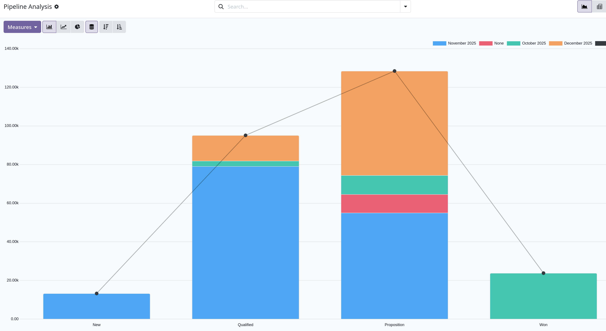
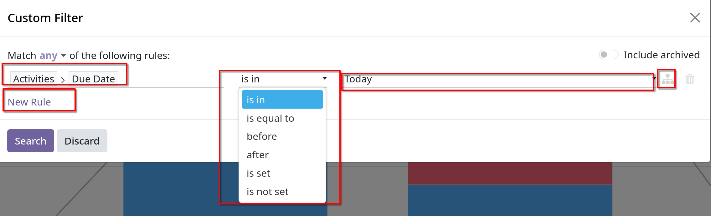
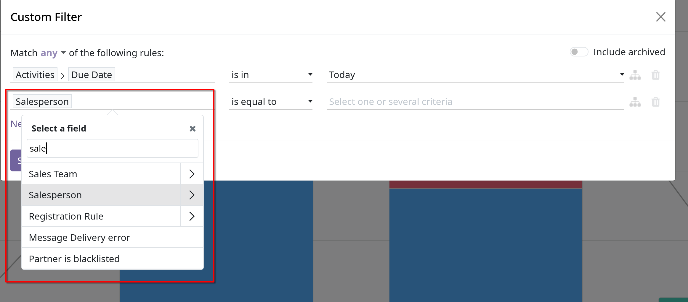

# Unattended leads report

- _Unattended leads_ là các leads có các hoạt động được lên lịch đến hạn hoặc quá hạn. Bất cứ khi nào một activity được lên lịch, Odoo sẽ
  theo dõi ngày đến hạn và gửi lời nhắc qua email tới users được chỉ định cho activity đó.

- Một _unattended leads report_ biên dịch các leads đang hoạt động trong pipeline với các activty tới hạn hoặc quá hạn. Cho phép sales manager
  xác định được opportunities nào cần được để ý ngay lập tức.

- Việc lấy báo cáo về _unattended leads report_ hàng ngày giúp sales manager có thể nhắc nhở cả team giải quyết các activity còn tồn đọng trước khi quá hạn.
  Giúp tránh các khách hàng tiềm năng bị bỏ quên và củng cố các hành vi chủ động của salesperson của team đó.

## Ví dụ

- **Lưu ý**: để lấy được *unattended leads report\*\*, sales team phải thường xuyên sử dụng `CRM` pipeline cho việc quản lý leads/opportunities
  Không thể tạo báo cáo đầy đủ nếu salesperson không sử dụng tính năng *Activities\* trong chatter.

## Create an attended leads report

- Để lấy _unattended leads report_, cần vào `CRM -> Reporting -> Pipeline` để mở `Pipeline Analysis` dashboard. Click vào `Search` bar, xóa các filters mặc định đi.
  

- Để thêm filter tùy ý, click vào `Search` bar, dropdown menu có chưa `Filter`, `Group By`, `Favorites` columns, bên dưới còn có `Add Custom Filter`.

### Add Custom Filter

- Để sinh ra _unattened leads report_, cần tạo các điều kiện lọc sau:
  - `Past due activities`: giới hạn kết quả chỉ gồm các leads có hoạt động được chỉ định đã qua ngày đến hạn. Có thể thay đổi để bao gồm các hoạt động sẽ xảy ra trong ngày báo cáo được tạo.
  - `Unassigned leads`: loại trừ những leads không có salesperson
  - `Specific sales teams`: giới hạn kết quả chỉ bao gồm các leads được chỉ định cho một hoặc nhiều sales teams

#### Add filter for past due activities

- Tại dropdown menu từ `Search` bar, click chọn `Custom Filter`, chọn `Activity -> Due Date`, operator là `<=`, field còn lại để là `Today`
  để lọc các leads có _Activitties_ có ngày đến hạn là hôm nay.
  

#### Exclude unassigned leads

- Sau khi chọn `Actitity` `Due Date`, click `New Rule`, chọn tiếp `Salesperson` rồi tùy chọn salesperson như hình
  

#### Add a Sales team

- Tương tự, thêm `Sales Team` bằng việc click `New Rule`

### View result

- Trên `Add Custom Filter`, có các tùy chọn là match `any` hoặc `all`. Sau khi filter được cấu hình xong, click `Search`.
  Kết quả báo cáo hiển thị tất cả các leads được gán cho salesperson được chỉ định mà có các _activities_ bị quá hạn hoặc đến hạn vào ngày hôm nay.
  Biểu đồ mặc định là _bar graph_
