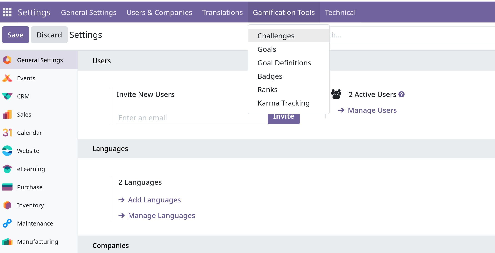
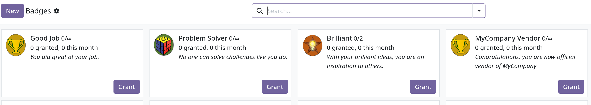
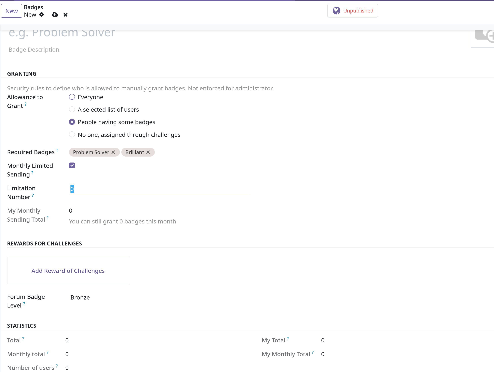
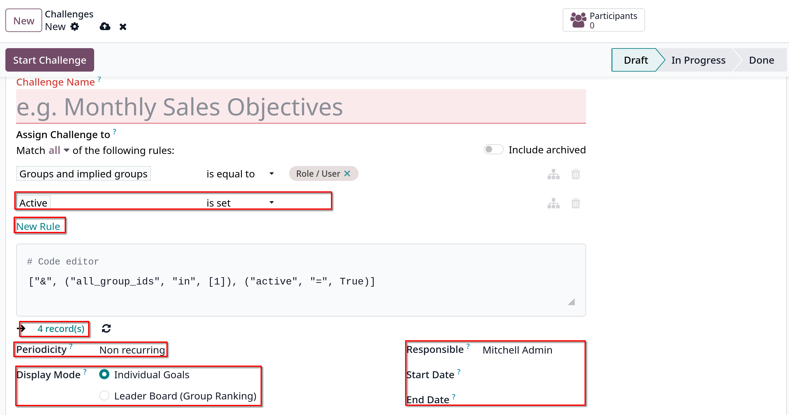
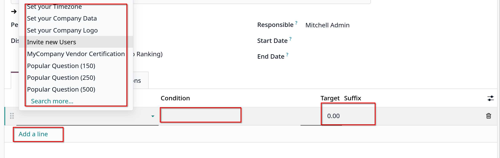
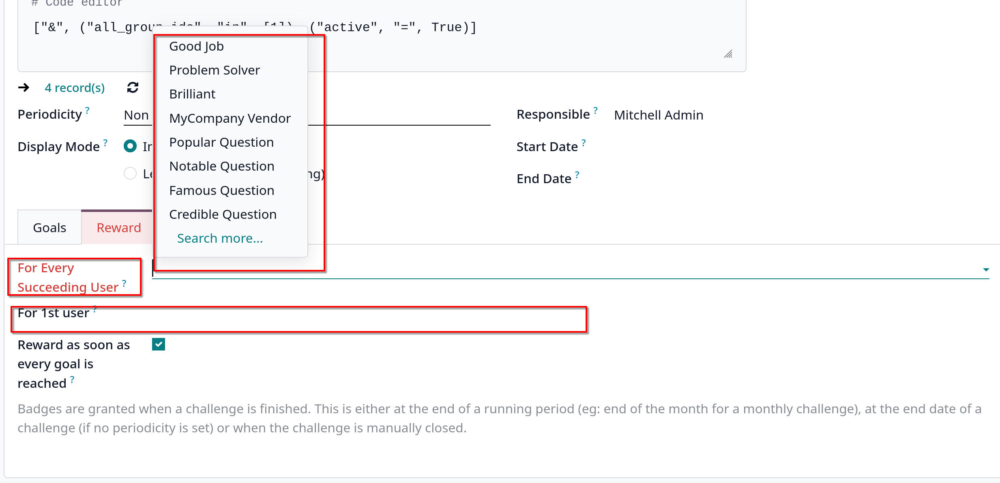

# CRM gamification

- _Gamification_ mang đến cơ hội đánh giá và động viên người dùng thông qua các thử thách, mục tiêu, phần thưởng
- Các mục tiêu được tạo ra có thể theo dõi và tự động khen thưởng cho các sales team tham gia

## Configuration

- Vào `Apps` và tìm `CRM Gamification` và chọn **Install**
- Để truy cập _Gamification_ menu, phải active Debug mode, sau đó vào `Settings -> Gamification tools`
  

## Create Badges

- Các Huy hiệu được trao cho users khi họ hoàn thành các thử thách, các huy hiệu khác nhau có thể được trao dựa trên loại task đã
  hoàn thành, có thể cấp cho một hoặc nhiều users tùy thuộc thời gian họ hoàn thành các mục tiêu

- Xem các huy hiệu đã có sẵn, vào `Settings -> Gamification tools -> Badges`
  

- **Ghi chú**: Có thể cấp huy hiệu cho một user nào đó bằng cách click vào **Grant** button trên kanban card của huy hiệu đó
  chọn người muốn cấp huy hiệu, nhập mô tả và click button `Grant Badge`

- Để tạo mới, chọn `New`, tại field **Allowance to Grant** - xác định thời điểm có thể cập huy hiệu và bởi ai:
  - **Everyone**: huy hiệu này có thể được cấp thủ công bởi bất kỳ user nào
  - **A selected list of users**: huy hiệu này chỉ có thể được cấp bởi một nhóm users. Nếu field này được chọn, nó sẽ show ra
    một field mới **Authorized Users**, chọn users thích hợp từ danh sách dropdown này.
  - **People having some badges**: huy hiệu này chỉ có thể được cấp bởi những users đã được trao huy hiệu nào đó. Nếu field này được chọn
    sẽ có field mới, **Required Badges**. Chọn các huy hiệu từ danh sách dropdown mà người dùng phải có để đủ quyền cấp
  - **No one, assigned through challenges**: huy hiệu này chỉ có thể được trao nếu user hoàn thành thử thách.

- Có thể giới hạn số lượng huy hiệu mà người dùng có thể gửi, tick vào **Monthly Limited Spending** checkbox. Giúp đặt giới hạn
  số lần người dùng có thể đạt huy hiệu này. Trong field **Limitation Number**, nhập số lần tối đa huy hiệu này có thể được gửi mỗi tháng
  cho mỗi người.
  

## Create challenges

- Để tạo thử thách, vào `Settings -> Gamification tools -> Challenges`, chọn `New`

### Create assignment rules

- Để gán thử thách cho users cụ thể, một hay nhiều assignment rules phải được sử dụng
- Chọn vào **Assign Challenge to** và chọn 1 option từ dropdown list để định nghĩa rule. Sau đó click vào field kế tiếp để định nghĩa
  operator của rule. Nếu cần thì nhập thêm tham số ở field thứ 3
- Có thể thêm nhiều rule bằng cách click **New rule**

- Tại **Periodicity** field, chọn một khung thời gian để các mục tiêu được đánh giá tự động.
  

### Add goals

- Các thử thách có thể dựa trên một hoặc nhiều mục tiêu (goals), để thêm mục tiêu vào challenge, click **Add a line** để thêm
  goals cho challenge tại `Goals tab`.
- Tại **Goal Definition** field, chọn một từ danh sách dropdown. **Condition** field tự đọng update để phản ánh điều kiện được đặt trên goal definition
- Thêm **Target** và **Suffix**
- **Tip**: CRM gamification module có một số goals đã được config trước hướng đến sales team
  

### Add reward

- Click vào **Reward** tab, chọn huy hiệu sẽ được thưởng cho user đầu tiên **For 1st User** và mọi người dùng hoàn thành challenge **For Every Succeeding User**
- **Ghi chú**: Huy hiệu được cấp khi challenge kết thúc, kết thúc thời gian chạy, kết thúc thử thách hoặc được đóng thủ công.
  

- Sau khi mọi thứ đã xong, click vào **Start Challenge** ở góc trái để bắt đầu chạy thử thách.
