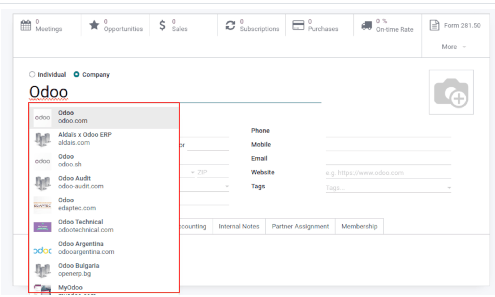

# Enrich contacts with partner autocomplete

- Đây là một tính năng trả phí của Odoo, giúp làm phong phú thêm cơ sở dữ liệu bằng dữ liệu của công ty. Trong bất cứ module nào
  nhập tên công ty trong _Customer_ field, chọn một trong các options được gợi ý ra trong dropdown menu, nhận ngay thông tin công ty
  có giá trị với đầy đủ dữ liệu mong muốn
- **Chú ý**: không thể nhập một cách thủ công thông tin công ty vào app `Contacts` trước để bổ sung dữ liệu cho công ty

## Configuration

- Vào app `Settings` ở mục `Contacts`, active tính năng **Partner AutoComplete** và **Save**

## Enrich contacts with corporate data

- Khi users nhập tên một contact mới của công ty, Odoo sẽ hiển thị một dropdown menu chứa các đề xuất phù hợp tiềm năng. Nếu
  có mục nào được chọn, contact sẽ được điền dữ liệu công ty liên quan tới lựa chọn đó.

  
