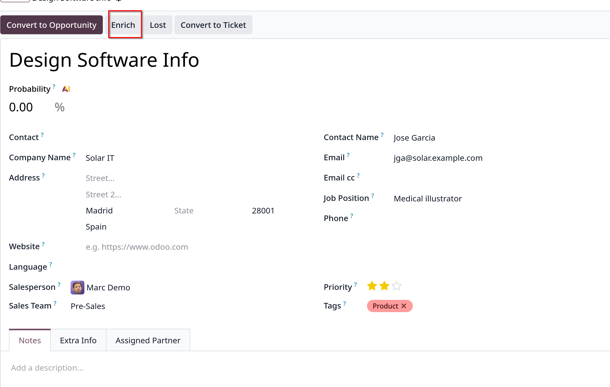

# Lead enrichment

- _Lead enrichment_ là một dịch vụ trả phí của Odoo, cung cấp thông tin doanh nghiệp cho contact gắn với lead. Để sử dụng phải mua credits IAP

- Các thông tin cho việc enrich lead có thể bao gồm các thông tin chung về doanh nghiệp như tên, ngành nghề, mạng xã hội, quy mô, doanh thu, email, số điện thoại,...

- Active bằng cách vào `CRM -> Configuration -> Settings`, chọn **Lead Generation** và tick vào checkbox **Lead Enrichment**.
  chọn **Enrich leads on demand only** hoặc **Enrich all leads automatically**

## Enrich leads

- Enrich leads dựa trên miền địa chỉ email của khách hàng đặt trên leads, có 2 cách để enrich leads, tự động hoặc thủ công

### Automatically enrich leads

- Nếu chọn **Enrich all leads automatically** trong settings thì không cần làm bất cứ gì, sẽ có 1 cron job chạy tự động mỗi 60 phút

### Manually enrich leads

- Nếu **Enrich leads on demand only** được chọn trong settings, user phải thực hiện enrich lead thủ công bằng việc
  click button `Enrich` trong form view của leads
  

## Pricing

- Như đã nói, đây là tinhs năng tính phí của Odoo, cần mua credits để có thể thực hiện tính năng này trong
  `CRM -> Configuration -> Settings`, chọn **Buy Credits**
