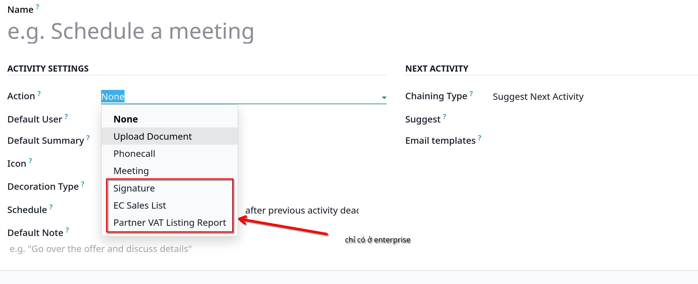
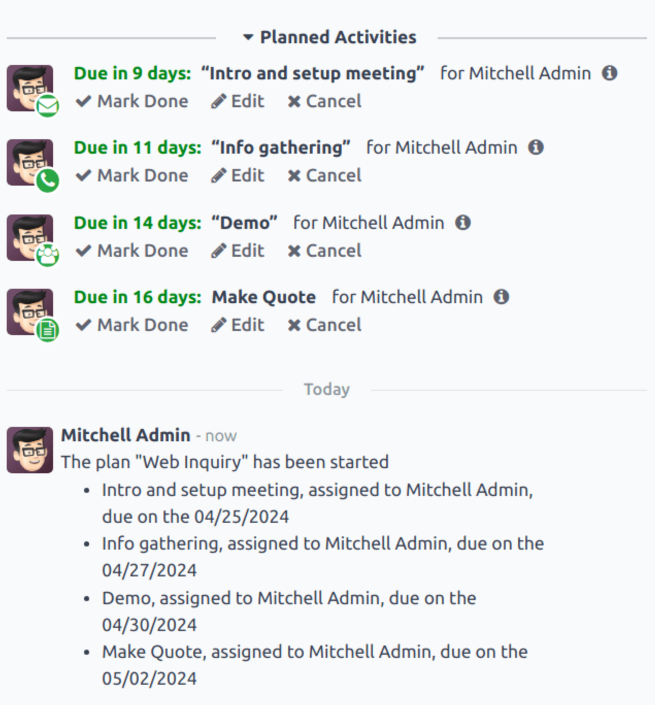

# Utilize activities for sales teams

- Activities là các task tiếp theo được gắn với một record trong cơ sở dữ liệu của Odoo. Các _Activities_ có thể được lên lịch
  tại bất kỳ trang nào chứa chatter thread, kanban view, list view hay activities view của ứng dụng

## Activity type

- Odoo có sẵn 1 tập các _Activity Type_ trong `CRM -> Configuration -> Activity Types`:
  - **Email**: thêm lời nhắc vào chatter để nhắc salesperson gửi email
  - **Call**: mở một liên kết qua calendar nơi mà salesperson có thể sắp xếp thời gian để gọi cho contact
  - **Meeting**: mở một liên kết qua calendar, nơi salesperson có thể sắp xếp thời gian để tổ chức cuộc họp với contact
  - **To Do**: thêm một task nhắc nhở chung vào chatter
  - **Upload Document**: thêm một liên kết trên activity nơi các tài liệu bên ngoài có thể tải lên

### Create a new activity type

- Chọn `New`,nhập **Name** cho activity type

#### Activity settings

##### Action

- **Action** field xác định mục đích của activity. Một số actions kích hoạt các hành vi cụ thể sau khi một activity được lên lịch
  - **Upload Document**: liên kết tới tài liệu tải lên sẽ trực tiếp được thêm vào activity đã lên kế hoạch ở chatter
  - **Phonecall** hay **Meeting**: users có tùy chọn mở calendar để sắp xếp thời gian cho hoạt động gọi hoặc tổ chức họp
  - **Request Signature**: một liên kết tới cửa sổ yêu cầu chữ ký sẽ được thêm vào activity đã được lên kế hoạch trong chatter.

    

##### Default user

- Tự động gán activity này cho user cụ thể khi activity được scheduled. Nếu field này để trống, activity sẽ được gán cho người tạo nó

##### Default summary

- Các ghi chú cho activity type này

##### Next activity

- Tự động đề xuất, kích hoạt một activity mới sau khi một activity được đánh dấu là hoàn thành, phải set field **Chaining Type**
  - **Suggest Next Activity**: khi chọn loại này, field **Suggest** bên dưới phải được chọn từ danh sách dropdown để chọn bất cứ
    activities nào được đề xuất làm nhiệm vụ tiếp theo cho loại activity này.
    - Chọn thời hạn mặc định tại **Schedule** field cho các activities này, có thể chọn số ngày/tuần hay tháng

  - **Trigger Next Activity**: khi chọn loại này, field **Trigger** bên dưới sẽ phải chọn từ danh sách để chọn activity được trigger sau khi activity này hoàn tất
    - Chọn thời hạn tại **Schedule**

### Activity tracking

- Để luôn cập nhật pipeline với cái nhìn đúng đắn nhất về trạng thái của các activities, ngay sau khi tương tác với một leads, một activity
  liên quan cũng phải được mark là _Done_. Điều này đảm bảo các activity tiếp theo có thể được scheduled, nó cũng ngăn chặn pipeline trở nên
  lộn xộn hoặc các activities bị quá hạn

#### Activity plans

- Vào `CRM -> Configuration -> Activity Plan`, chọn `New` để tạo mới một **Lead Plan** form

- Tại tab **Activities to Create**, chọn **Add a line** để thêm mới activity.
- Chọn **Activity Type** từ dropdown menu, click **Search More** để xem các activities đang available, hoặc có thể tạo mới một Activity Type

- Tại **Summary** field, nhập mô tả chi tiết của activity, gồm hướng dẫn dành cho salesperson hay thông tin cần có khi hoàn thành activity.
- Tại **Assignment** field, chọn các tùy chọn sau:
  - **Ask at launch**: activities được gán cho user khi plan được lên lịch
  - **Default user**: activities luôn được gán cho user xác định. Nếu option này được chọn, chọn user trong field **Assigned to**

- Nhập **Interval** và **Units** cho activity
- Cuối cùng, tại **Trigger** field, chọn _Before plan date_ hoặc _After plan date_ để quyết định activity sẽ diễn ra trước hay sau ngày lên plan

#### Launch activity plan

- Để chạy một activity plan trên `CRM` opportunities, vào `CRM` chọn opportunity từ kanban view
- Từ góc phải, chọn **Activities** để mở **Scheduled Activity** popup
- Trong **Plan** field, chọn activity plan mong muốn. Việc này sẽ sinh ra **Plan summary**, list ra các activities trong plan.
- Chọn **Plan Date**
- Chọn một user trong field **Assigned to**
- Click **Schedule**, chatter sẽ trông như thế này
  
