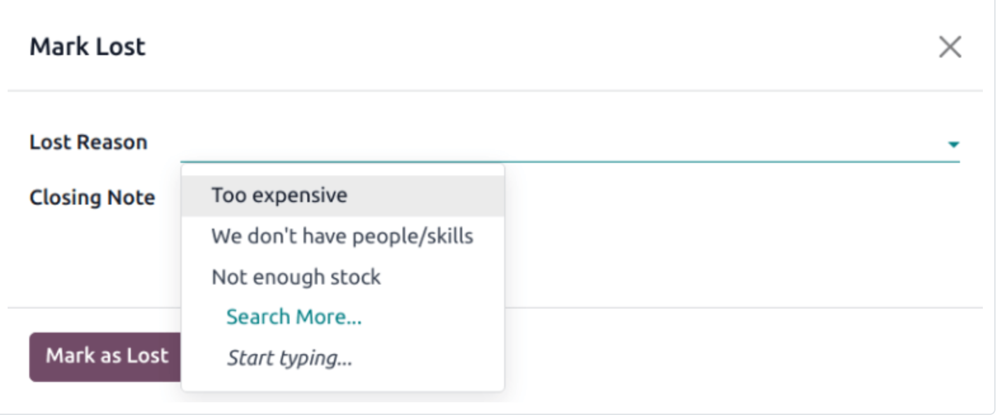
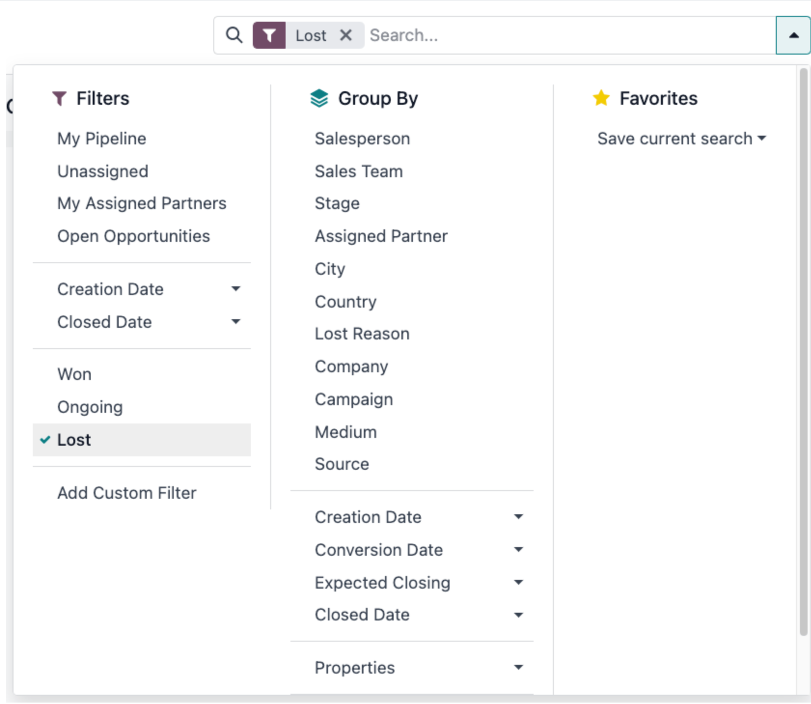
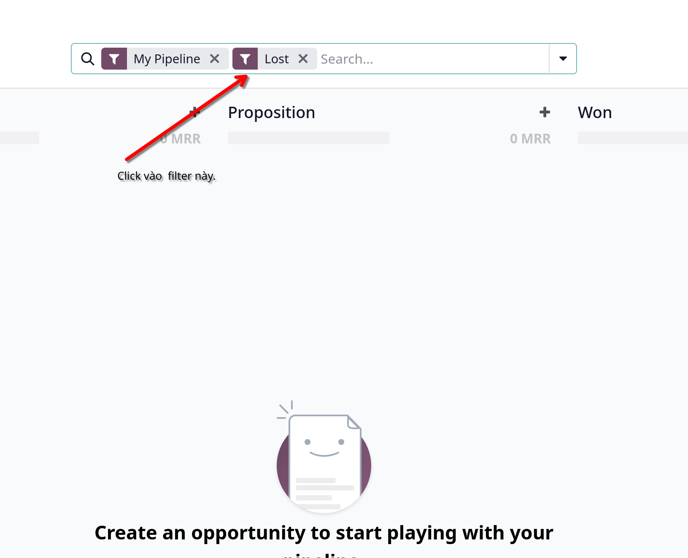
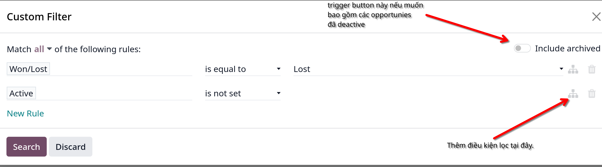
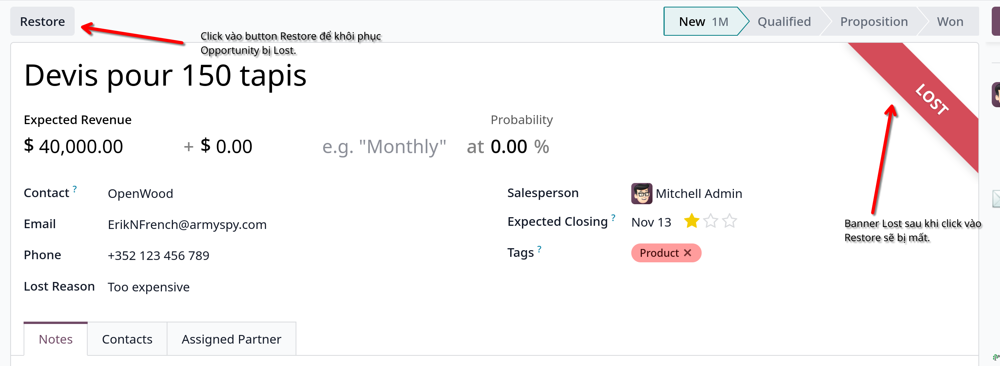
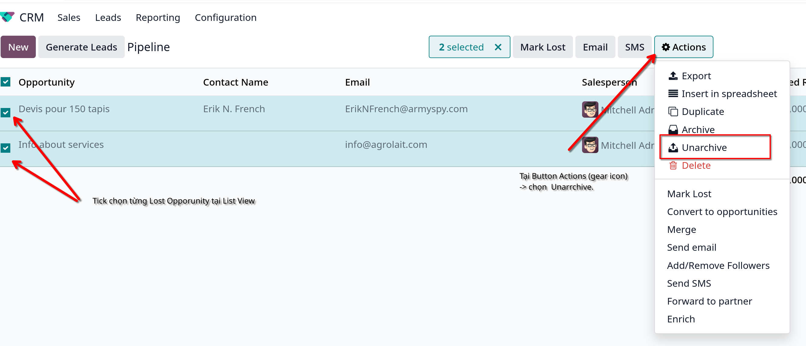

# Lost leads và opportunities

- Xác định 1 opportunity là lost giúp xác định các vấn đề tái diễn nhiều lần làm mất opportunities và đồng thời cũng thể hiện các cơ hội nhằm cải thiện các chiến lược sales cụ thể.

## Đánh dấu 1 opportunity là lost.

- Click vào Lost button trong giao diện chi tiết opportunity.
- Có thể chọn Lost reason hoặc tạo mới 1 lost reason 
- **Lưu ý:** không bắt buộc nhập Lost reason nhưng nên set lost reason để có thống kê sau này hoặc cải thiện cách tiếp cận opportunity.
- Tạo thêm 1 Lost reason bằng cách vào `CRM -> Configuration -> Lost Reason -> New`

## View Lost Opportunities

- Từ giao diện CRM. Xem các Lost opportunity bằng cách `Sales -> My pipeline -> Filters -> Lost` 

## Sort opportunities bởi Lost reason.

- Từ giao diện `My Pipeline`, click vào icon 
- Custom lại filter hoặc thêm filter mới vào điều kiện lọc tại 

## Khôi phục Lost opportunity.

- Từ giao diện `CRM -> My Pipeline`, click vào **drop-down** button. Trong `Filter` hãy chọn Lost để lấy ra các opportunities bị marked là lost.
  .

- Có thể chọn nhiều `Lost Opportunites` sau đó tick chọn vào ô vuông đầu mỗi hàng. Sau khi click vào `gear icon` -> chọn `Unarchive`
  .

## Quản lý Lost Leads.

- Nếu Leads là hợp lệ trên cơ sở dữ liệu, chúng có thể được marked là Lost tương tự như với Opportunity.
- `CRM -> Configuration -> Settings` và check `Leads` checkbox. Thao tác này sẽ add Leads vào menu của CRM.

### 1. Đánh dấu một Lead là lost.

- Vào `CRM -> Leads` và chọn lead từ list. Sau đó sẽ hiển thị form chi tiết thông tin của Lead -> click **Lost** tại dàn button trên top.
- Tương tự sẽ show ra 1 pop-up menu, chọn lý do Lost. Tạo mới `Lost reason` bằng cách chọn `Create`.

### 2. Khôi phục lost leads.

- Vào `CRM -> Leads` click vào dropdown icon bên phải thanh tìm kiếm, sau đó chọn filter **Lost** để show ra các lost leads.
  Vào chi tiết Lost leads, sau đó click **Restore** button trên góc trái.

- Hoặc là chọn nhiều **Lost leads** trong giao diện `CRM -> Leads` filter Lost, mở **List view**. Sau khi chọn thì bấm vào
  `Action` button, chọn `Unarchive`
