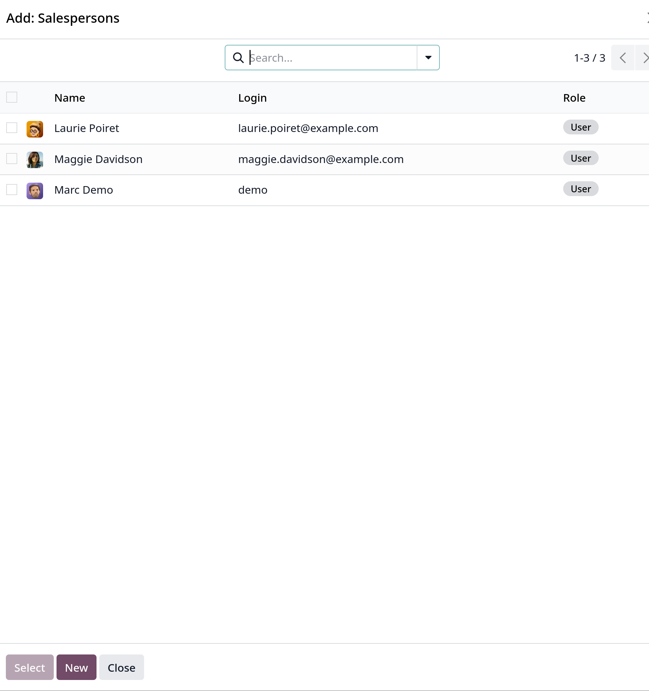
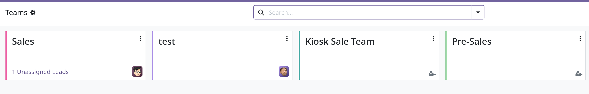

# Quản lý Sales Team

- Tính năng Sales Team trong `CRM` cho phép tạo và quản lý nhiều sales team, mỗi team sẽ có assignment rules, mục tiêu invoice và phân công salesperson riêng.

## Tạo mới Sales team.

- Vào `CRM -> Configuration -> Sales Team` sau đó click `New`.
- Nhập thông tin các field như name, Team leader, Email alias (duy nhất).
- Email alias để tự động tạo lead/opportunity cho team khi có bất cứ message nào được gửi tới email đó. Chọn chấp nhận email
  từ `Everyone`, `Authenticated Partners`, `Followers Only` hoặc `Authenticated Employees`.
- Chọn `Company` cho team.
- `Invoice target` field là doanh thu kỳ vọng theo tháng. Số nhập vào field này sẽ được sử dụng để điền vào thanh tiến trình
  lập hóa đơn trên dashboard của sales team.

## Thêm sales team member.

- Click `Add Saleperson` trong mục `Members` sẽ hiển thị ra 1 popup
  
- Chọn salesperson trong danh sách hoặc có thể tạo mới bằng `New` button.

## Multi teams.

- Tính năng này cho phép một salesperson có thể được gán chon một hoặc nhiều teams. Active tính năng bằng cách vào
  `Configuration -> Settings -> Multi Teams` sau đó tick vào checkbox và `Save`.

## Sales team dashboard.

- Để xem dashboard của team, vào `CRM -> Sales -> Teams`. View này sẽ show ra dashboard số liệu của từng team mà salesperson
  này được gán vào.
  
- Mỗi kanban view của 1 sales team sẽ hiển thị thông tin quotations, sales orders, doanh thu kỳ vọng, cũng như bar graph của
  opportunities mới mỗi tuần và tính trình lập hóa đơn (invoice).
- Click `Pipeline` để đi vào chi tiết `CRM` pipeline của team đó. Có thể chỉnh sửa chi tiết cấu hình của sales team bằng cách
  click vào icon ` (vertical ellipsis)` ở kanban view và click `Configuration`.
