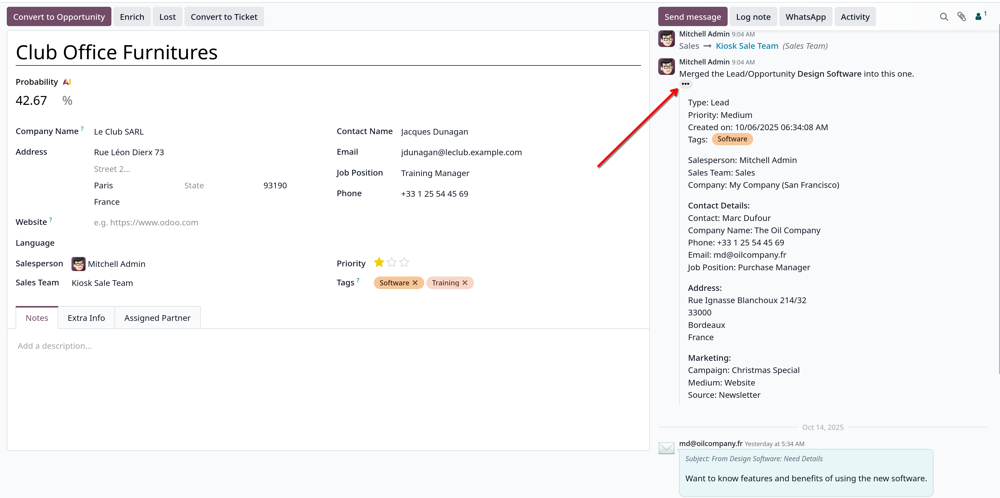

# Merge các Leads và Opportunities tương tự

- Odoo có khả năng tự xác định các leads và opportunities gần giống nhau. Cho phép chúng được merged mà không làm mất thông
  tin của tiến trình sales. Điều này không chỉ làm pipeline được tổ chức chặt chẽ, mà còn tránh được việc nhiều salesperson cùng
  liên hệ một khách hàng.

- **Lưu ý:** việc merge opportunities, không có thông tin nào bị mất. Dữ liệu từ các opportunities khác sẽ được log ra chatter
  hoặc là information fields.

## Xác định các leads/opportunities tương tự nhau.

- Các leads/opportunities tương tự nhau được Odoo xác định bằng cách so sánh phone hoặc email của contact liên quan.
- Trong chi tiết của leads/opportunities, nếu có các leads/opportunities tương tự khác thì sẽ hiển thị ở `Similar Leads` button.
  

- Sau khi click vào `Similar Leads` button, sẽ show ra 1 kanvan view .
- Chọn **List view** -> Tick chọn những leads muốn merge, sau đó sẽ show ra 1 pop-up .
- Ta phải chọn salesperson, sales team, sau đó click merge. Sau khi merge, chi tiết merge sẽ hiển thị ở chatter. 

- **Lưu ý: merge là quá trình không thể đảo ngược, vì vậy tuyệt đối không merge các leads/opportunities nếu không chắc có nên kết hợp lại hay không.**

## Khi nào các leads/opportunities không nên merged.

### Lost leads.

- Nếu một lead/opportunity được marked là lost, nó vẫn có thể được merged với active lead/opportunity. Kết quả merge
  sẽ được marked là active, và được thêm lại vào pipeline.

### Contact khác nhau trong cùng một organization.

- Leads/Opportunities trong cùng 1 tổ chức, nhưng khác contact, với cùng salesperson, sales team. Trường hợp này sẽ tốt hơn nếu không merged.

### Tồn tại nhiều hơn một salesperson

- Nếu 1 lead/opportunity có nhiều salesperson cùng được gán, các salesperson này làm việc độc lập với nhau thì không nên merge
  vì sẽ ảnh hưởng tới salesperson khác.

### Thông tin liên hệ tương tự, nhưng không trùng khớp hoàn toàn.

- Nếu leads/opportunities được hệ thống đánh giá là tương đồng, dựa trên email và phone. Tuy nhiên thông tin lại không trùng khớp
  nhau hoàn toàn, trong trường hợp này cũng không nên merge.
- Ví dụ, 3 leads sau tương đồng nhau, nhưng các thông tin không hoàn toàn khớp nhau. Nên không nên merge
  
