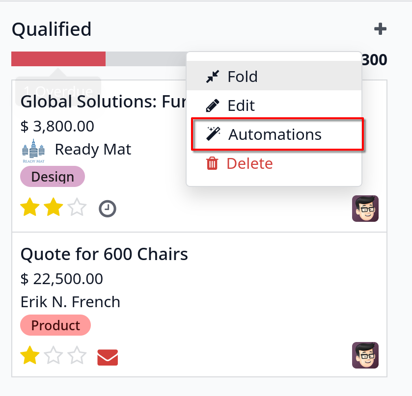
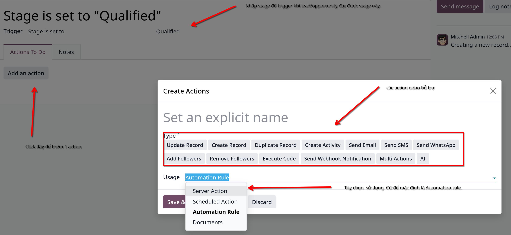
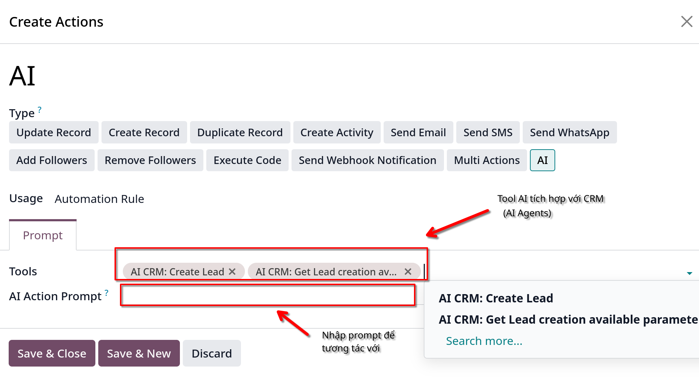
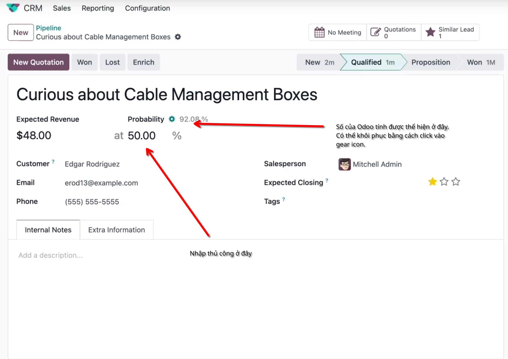
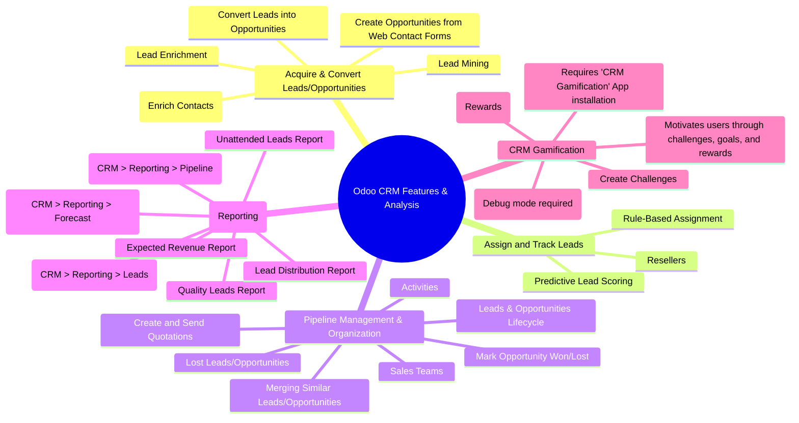

# Tổng quan CRM

- Là nơi tổ chức, quản lý pipeline, tự động hóa các sales activities. Trao quyền tương tác cho teams với khách hàng daily.
- Có thể kéo thả các leads giữa các stage tại kanban view, scheduling task, in-app call, gửi email trực tiếp từ chatter.
- Có thể xem activities chưa hoàn thành

## 1. Pipeline

- Mặc định show pipeline của người đang login trong kanban views.
- Hiển thị các opportunities được gán cho bạn. Phân theo stages. Chuyển stage một Opportunity bằng cách kéo - thả trong kanban view.
- Chỉnh sửa được chi tiết của stage bằng cách click vào `` .
- Thêm `Automation` action cho stage bằng cách click vào gear icon 
- Sau đó click `New` để tạo mới một `Automated action` .
- **Lưu ý:** Bản enterprise sẽ có thêm tính năng AI và SendWhatsApp trong Automation action. Đây là demo AI automation action.
  

## 2. Probabilities

- Mỗi stage khác nhau đều có probability khác nhau. Trong đó Won tương ứng với 100%
- Field probability này được Odoo tự động tính. Ta có thể thay đổi chỉ số này thủ công bằng việc nhập vào
- Số của Odoo tính vẫn hiển thị ở gear icon. . Khôi phục lại số của Odoo bằng
  cách click vào gear icon.

## 3. Sale teams

- Sales team là chức năng quản lý sales
- Có **Rule base assignment** để auto gán leads cho salesperson
- Có thể theo dõi báo cáo về hoạt động của sales team

