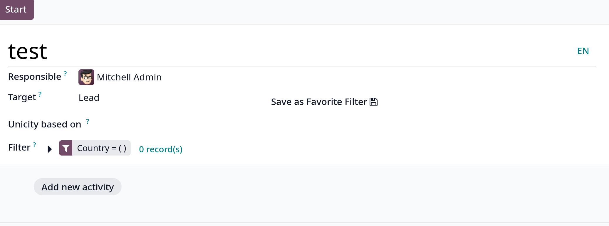

# Audience targeting

**Target** và **Filter** field nhằm giúp users định nghĩa tập các đối tượng mục tiêu của chiến dịch theo các tiêu chí mong muốn, trong đó:

- **Target**: tham chiếu đến các models của Odoo, ví dụ **Lead**, **Contact**, **Event Registration**,...

- **Filter**: giúp users thêm các điều kiện lọc để lấy ra danh sách mong muốn từ **Target**

- **Save as Favorite Filter**: lưu filter hiện tại

- **Unicity based on**: xác định field nào trong target model dùng để tránh trùng lặp, thường dùng field _Email_, nhưng cũng có thể dùng bất kỳ field nào cũng được

- **Include archived**: cho phép hoặc không cho phép include các archived records trong target audience

**Tip**: user có thể được gán cho campaign ở field **Responsible** trong Developer mode

Một ví dụ filter điển hình:

