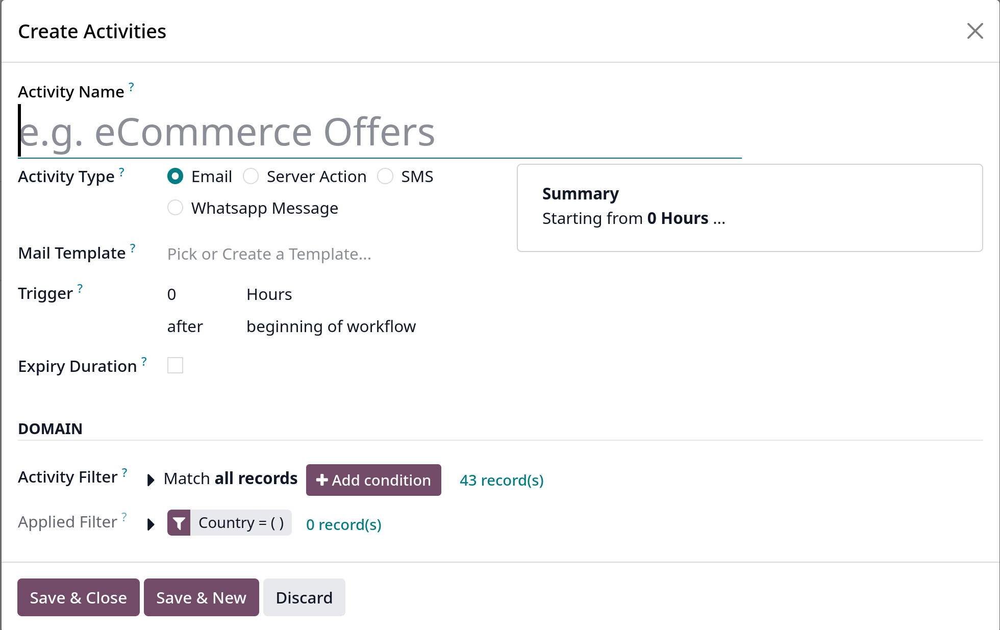
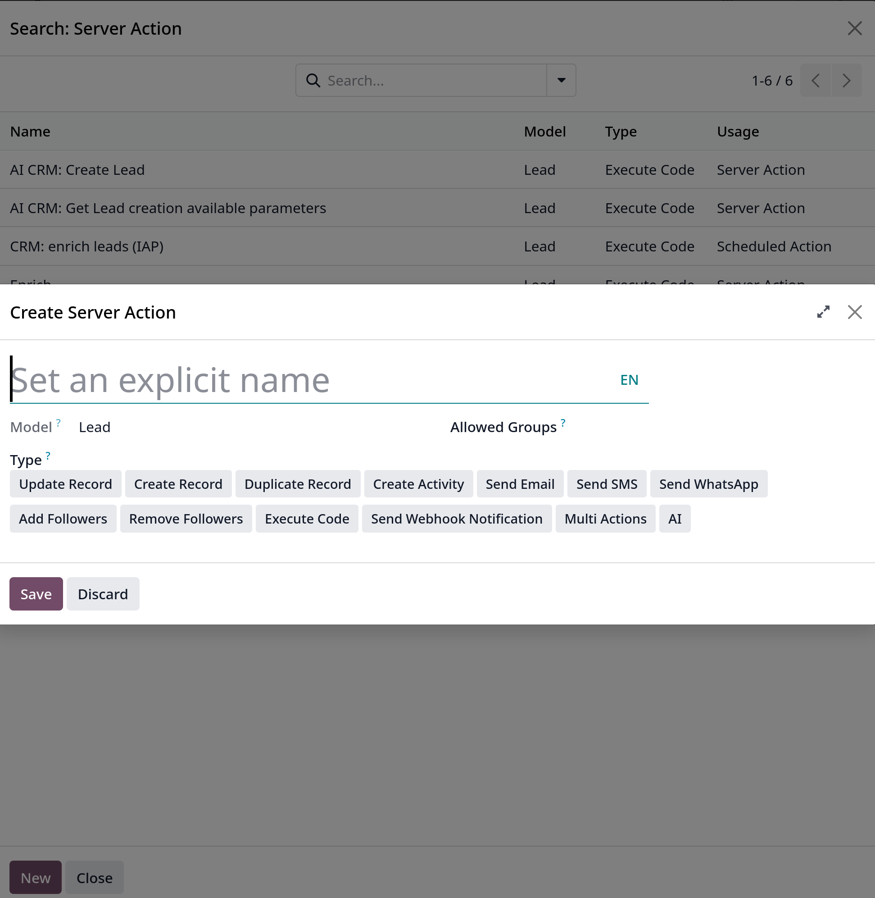
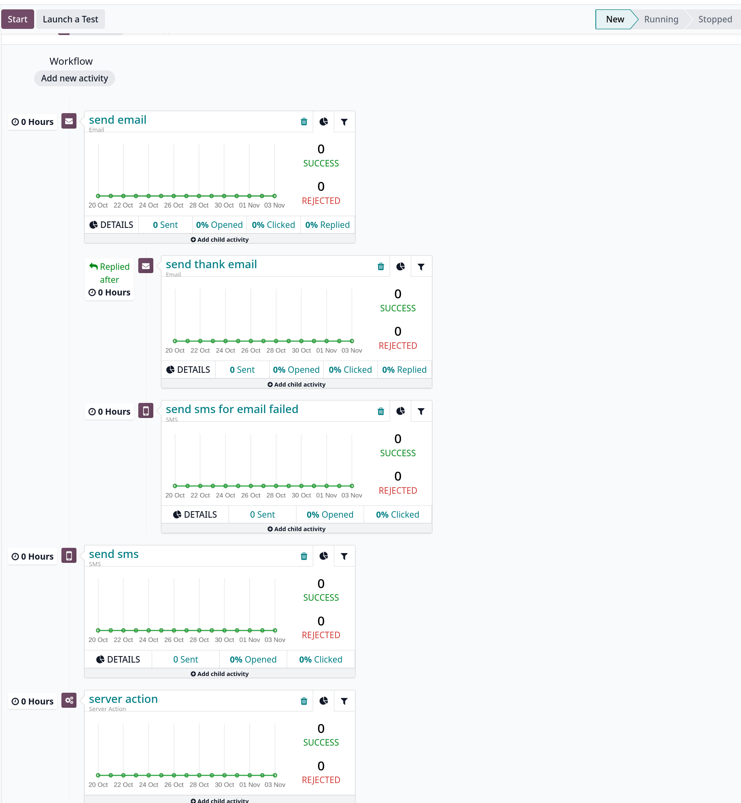

# Campaign workflow activities

Một _workflow_ là một tổng hợp cấu trúc activity của một chiến dịch marketing automation. Chỉ có một workflow trong mỗi campaign. Tuy nhiên
có thể thêm bao nhiêu activites tùy thích

## Activities

Activities là các phương thức liên hệ hoặc các hành động của server được tổ chức trong workflow được thực thi trong chiến dịch, chúng là các khối xây dựng nên quy trình
làm việc của chiến dịch

Trong campaign form, để thêm một activity mới có thể click vào **Add new activity** button, ở form activity hiện lên:

## Activity types

Có 3 options cho loại activity trong `Marketing Automation`

- **Email**: khi chọn option này, option **Pick or Create a Template** trong **Mail Template** được available, chọn một từ danh sách hoặc tạo mới bằng **Create**

- **Server action**: khi chọn option này, phải chọn 1 action từ **Server Action** hoặc click _Search More_ và **New** để tạo mới
  
  Trong đó:
  - _Update Record_: cập nhật giá trị của một record trên database
  - _Create Activity_: tạo một activity với `Discuss` app
  - _Send Email_: gửi một message, note hoặc email với `Discuss` app
  - _Add Followers_ hoặc _Remove Followers_: thêm hoặc remove followers trên một record với `Discuss` app
  - _Create Record_: tạo một record mới với các giá trị
  - _Execute Code_: thực thi một đoạn Python code
  - _Send Webhook Notification_: gửi một POST request tới một hệ thống bên ngoài
  - _Execute Existing Actions_: định nghĩa một action triggers một số hành động khác của server

- **SMS**: khi chọn option này, phải chọn 1 template ở field **SMS Template** hoặc có thể tạo mới bằng cách chọn **Create**

## Trigger

Sau khi đã chọn activity type, cần xác định khi nào activity được thực thi bằng cách chọn field **Trigger**.

Set một số nguyên để định execution delay cho activity này sau một khoảng thời gian, sau đó chọn một _interval type_ là **Hours**, **Days**, **Weeks**, **Months**

### Trigger type

Chọn một trigger type từ danh sách dropdown:

- **begining of workflow**: activity được thực thi ngay khi campaign bắt đầu chạy

- **another activity**: activity được thực thi sau một activity khác
- **Mail: opened**: email của activity đã được người tham gia chiến dịch mở
- **Mail: not opened**: email của activity không được người tham gia mở
- **Mail: replied**: email của activity được người tham gia trả lời
- **Mail: not replied**: email của activity không được người tham gia trả lời
- **Mail: clicked**: người tham gia click vào một link trong email
- **Mail: not clicked**: người tham gia không click vào link trong email
- **Mail: bounced**: email của activity bị bounced
- **SMS: clicked**: người tham gia click vào một link trong SMS
- **SMS: not clicked**: người tham gia không click vào bất cứ link nào trong SMS
- **SMS: bounced**: SMS của activity bị bounced

## Expiry duration

Theo tùy chọn có thể xác định **Expiry Duration** trong cửa sổ **Create Activities** để hủy việc thực thi activity này sau một khoảng thời gian
Phải nhập một số nguyên, đơn vị là _Hours_, _Days_, _Months_ hoặc _Weeks_

## Activity Domain

Có thể lọc ra danh sách đối tượng mục tiêu cho riêng activity này ở phần **DOMAIN**, tùy chọn các **Activity filters** tương ứng

**# record(s)** chỉ ra có bao nhiêu records thỏa điều kiện

## Child activities

Các activities có thể được kết nối và kích hoạt bởi một activity khác được gọi là **child activities**

**Child activities** có thể được thêm từ một activity cha bằng cách click vào **Add child activity** button

Dựa trên activity type mà có các child activities khác nhau

1. **Email** sẽ kích hoạt các activities con theo các điều kiện sau:

- \*Add Another Activity\*\*: được thực thi sau activity cha
- _Opened_: người tham gia mở email
- _Not Opened_: người tham gia không mở email
- _Replied_: người tham gia trả lời email
- _Not Replied_: người tham gia không trả lời email
- _Clicked_: người tham gia click vào một link trong email
- _Not Clicked_: người tham gia không click vào link nào trong email
- _Bounced_: email bị bounced

2. **Server Action** sẽ kích hoạt các activities con theo điều kiện:

- _Add Another Activity_: được thực thi sau activity cha

3. **SMS** sẽ kích hoạt các activities con theo điều kiện:

- _Add Another Activity_: được thực thi sau activity cha
- _Cliked_: một link trong sms được clicked
- _Not Clicked_: không link nào trong sms được clicked
- _Bounced_: sms bị bounced

Ví dụ một workflow sau khi build:

