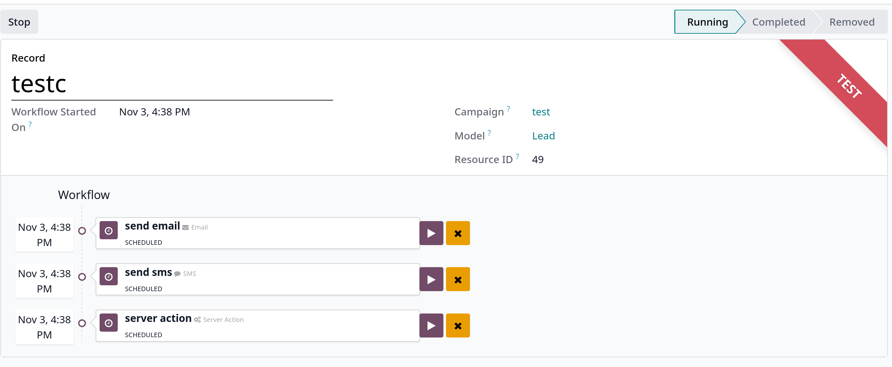

# Testing/running campaigns

`Marketing Automation` cho phép users kiểm thử trước khi chính thức khởi chạy chiến dịch để kiểm tra lỗi và sửa chữa các sai lầm trước khi
thực hiện chiến dịch marketing tới đối tượng mục tiêu

## Test campaigns

Để kiểm thử campaign, vào campaign form, click vào button **Launch a Test**

Sau đó chọn một đối tượng để test ở **Pick or create a/an Lead to generate a Test Participant**, hoặc có thể tạo mới bằng cách click vào _Search more_ -> _New_

Sau khi chọn xong, click vào button **Launch** sẽ hiển thị view sau:

**Lưu ý**: Khi tạo mới record ở giai đoạn chọn đối tượng để test, phải đảm bảo các thông tin cơ bản như email, mobile,..

Bên dưới **Workflow**, ta phải chạy từng activity bằng cách click vào **Run** button ở mỗi activity

Để dừng quá trình test, click vào **Stop** button. Nút **Stop** chỉ có hiệu lực khi test đang ở trạng thái Running.

## Run campaigns

Để chạy campaign, trong campaign form, click **Start** button. Lúc này status bar của campaign chuyển sang _Running_

Trong campaign có các smart buttons: **Templates**, **Clicks**, **Tests**, **Participants**

## Stop campaigns

Để dừng một campaign đang chạy, click vào **Stop** button, trạng thái campaign phải là _Running_ mới có thể chọn vào **Stop**
