# Email marketing

Trong Odoo, `Email Marketing` app cung cấp một công cụ kéo thả để thiết kế email cũng như một số lượng các template được built trước và một số tính
năng khác để tương tác với chiến dịch gửi email.

`Email Marketing` cũng cung cấp các số liệu báo cáo để theo dõi độ hiệu quả của toàn bộ chiến dịch gửi email

Các chức năng chính bao gồm:

- [Mailing list](./mailing-lists.md): chứa các danh sách mailing list được lấy từ mailing contact để gửi email cho từng chiến dịch cụ thể
- [Manage unsubscriptions (Blacklist)](./manage-unsubscriptions.md): cho phép người nhận unsubscribe và chặn các mailings trong tương lai
- [Lost leads reactivation email](./lost-leads-reactivation-email.md): cho phép tập trung chiến dịch gửi email tới các lost leads
- [Analyze metrics](./analyze-metrics.md): phân tích số liệu của chiến dịch email

## Email marketing dashboard

Giao diện chính của app `Email Marketing` là một mailing dashboard, nơi hiển thị toàn bộ các mailing ở dạng:

- List (default view)
  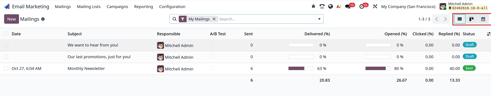
- Kanban
  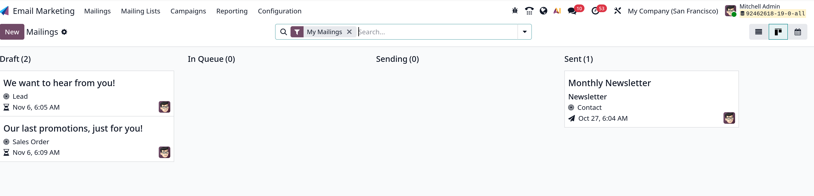
- Calendar
  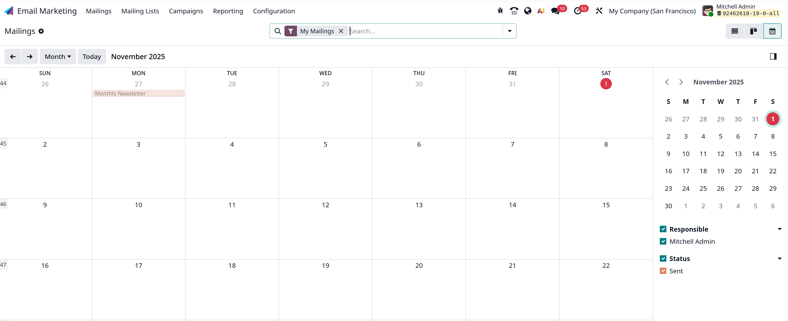

Có thể tùy chỉnh filters, group by và lưu kết quả tìm kiếm vào favorites

## Settings

Vào `Email Marketing -> Configuratin -> Settings` để mở settings:
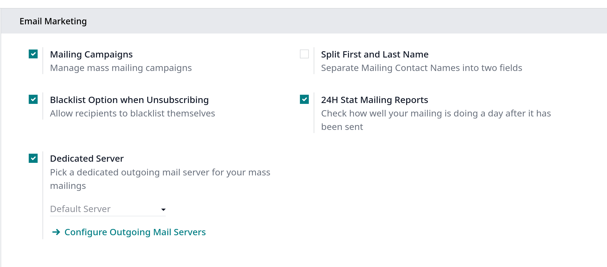

Trong đó:

- **Mailing Campaigns**: cho phép tùy chọn quản lý các chiến dịch gửi email hàng loạt
- **Blacklist Option when Unsubscribing**: cho phép khách hàng tự đưa mình vào danh sách đen khỏi các thư gửi trong tương lai trong quá trình hủy đăng ký
- **Dedicated Server**: cung cấp tùy chọn sử dụng mail server chuyên dụng để gửi thư. Khi được enable, Odoo sẽ hiển thị một field liên kết với một mail server đã được cấu hình trước
- **24H Stat Mailing Reports**: cho phép users kiểm tra xem việc gửi email đã hoạt động tốt như thế nào sau 1 ngày

## Create an email

Để tạo mới một email để gửi hàng loạt, click vào `New` button, khi click sẽ phơi bày một form soạn thảo
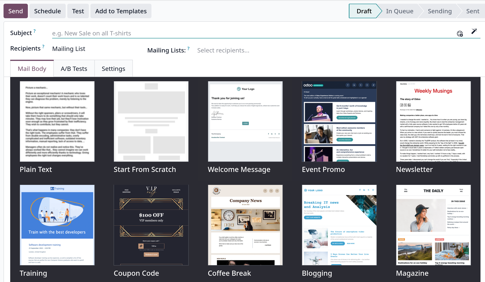

### Subject

Điền **Subject** vào email, bên cạnh **Subject** là emoji icon, click vào để chọn emoji thích hợp thêm vào Subject, bên cạnh là button hình ngôi sao, khi click vào thì
nội dung email ở Body sẽ được lưu lại như một email template để dùng ở các lần sau

### Recipients

Field này để chọn các người nhận email, mặc định thì người nhận được chọn từ **Mailing List**, khi click vào sẽ show danh sách các models mà người nhận email sẽ được chọn,
hoặc click **Search More**
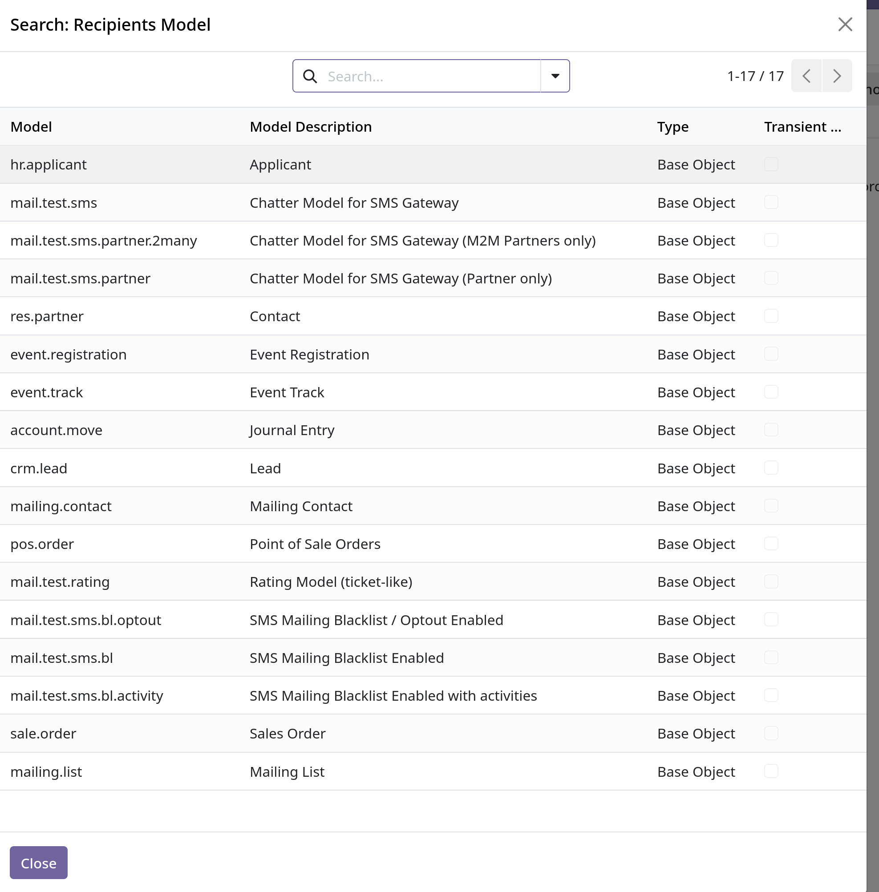

#### Add recipients filter

Để thêm một hoặc nhiều recipients filter, click vào icon mũi tên, chọn **New rule** để thêm các điều kiện lọc. Ở mục **Match**,
tùy vào mong muốn của users mà có thể chọn toán tử **all** hoặc **any**. Ở mỗi rule, có thể thêm các điều kiện con ở button
**Add nested rule**, hoặc xóa bằng cách click vào button thùng rác kế bên.
Kết quả kết hợp các filters sẽ hiển thị ở mục **records**, bạn có thể click vào để kiểm tra
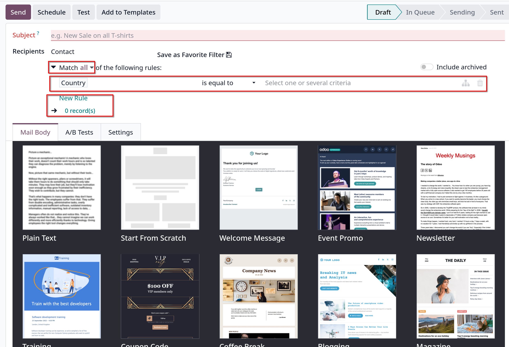

### Mail Body tab

Trong **Mail Body** tab, có một danh sách các template email được build sẵn. Có thể chọn **Plain Text** hoặc các templates khác và thực hiện thao tác
kéo thả để thiết kế nội dung email.

**Tip**: đối với **Plain Text**, Odoo cung cấp sẵn một frontend rich editor để soạn nội dung, Bạn có thể thêm các building block vào trong nội dung
bằng cách gõ _/_ rồi chọn trong danh sách dropdown các elements mong muốn
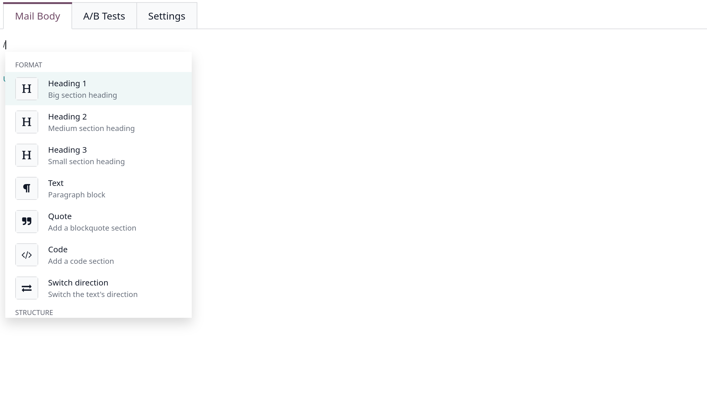

### A/B Tests tab

Tính năng **A/B Tests** cho phép gửi nhiều phiên bản khác nhau của cùng một email tới những người nhận được chọn ngẫu nhiên từ danh sách gửi đã chọn trước đó. Nhằm
đánh giá tính hiệu quả và thu hút của nội dung email mà không gửi bất cứ email trùng lặp nào tới danh sách người nhận
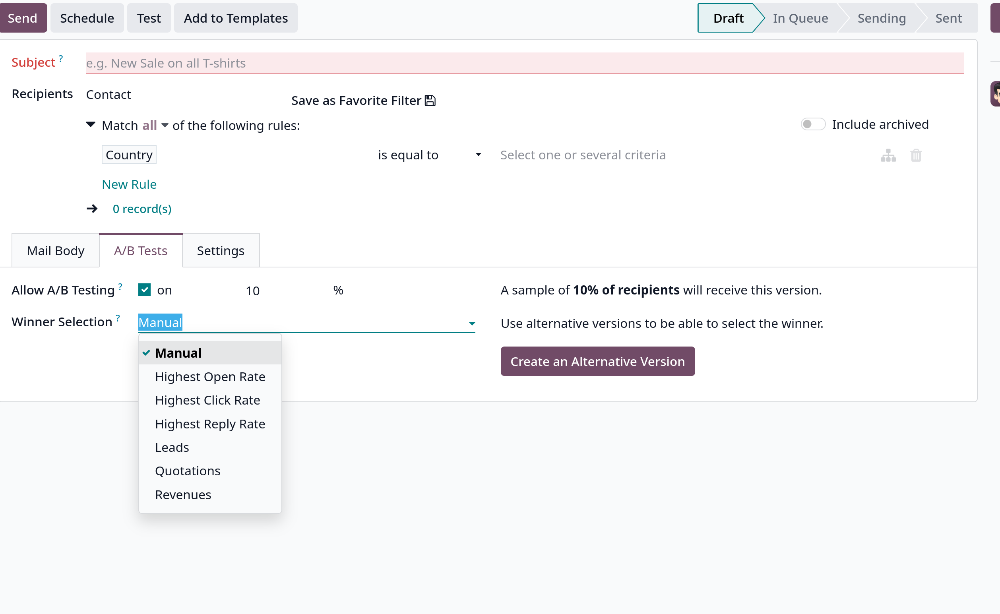

Khi checkbox bên cạnh **A/B testing** field được chọn, % sẽ hiển thị ngay bên cạnh, trong đó người dùng sẽ xác định tỷ lệ % người nhận được cấu hình trước
sẽ được gửi phiên bản email hiện tại này - mặc định sẽ là 10%. Bên dưới đó, 2 fields bổ sung sẽ xuất hiện:

- **Winner Selection**: cung cấp một danh sách dropdown, trong đó người dùng quyết định chọn tiêu chí nào sẽ được dùng để xác định phiên bản chiến thắng của các email tests được gửi
  - _Manual_: cho phép xác định phiên bản chiến thắng của gửi email, tùy chọn này sẽ bỏ field **Send Final On**
  - _Highest Open Rate_ (default): mailing với tỉ lệ mở cao nhất sẽ được chọn làm phiên bản chiến thắng
  - _Highest Click Rate_: mailing với tỉ lệ click cao nhất sẽ được chọn làm phiên bản chiến thắng
  - _Highest Reply Rate_: mailing với tỉ lệ trả lời cao nhất sẽ được chọn làm phiên bản chiến thắng
  - _Leads_: mailing sinh ra nhiều leads nhất sẽ được chọn làm phiên bản chiến thắng
  - _Quotations_: mailing sinh ra nhiều quotations nhất sẽ được chọn làm phiên bản chiến thắng
  - _Revenues_: mailing sinh ra doanh thu cao nhất sẽ được định làm phiên bản chiến thắng

- **Send Final On** field: chọn ngày mà Odoo sẽ xác định và gửi phiên bản email chiến thắng tới danh sách người nhận còn lại

- Bên canh có button **Create Alternative Version**, Odoo sẽ hiển thị tab Mail Body mới để người dùng tạo phiên bản thay thế

### Settings tab

**Settings** tab có hai sections là **Email Content** và **Tracking**
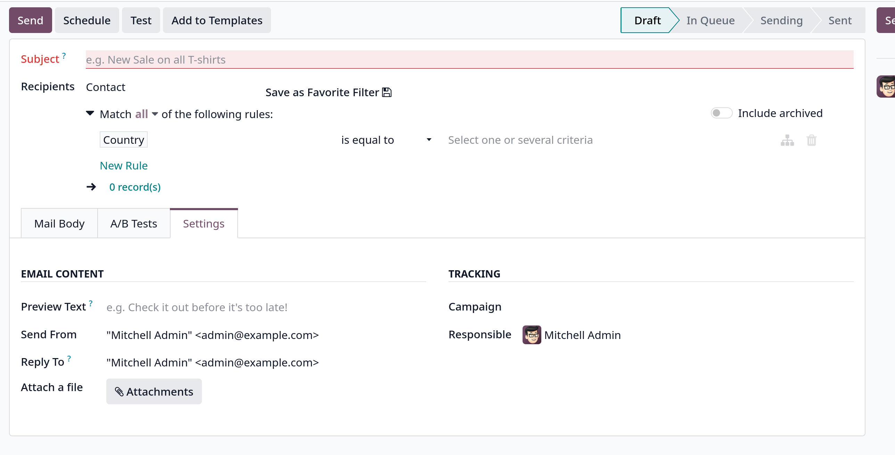

#### Email Content

- **Preview Text**: cho phép users nhập nội dung xem trước nhằm khuyến khích người nhận mở email. Trong hầu hêt hộp thư, thông tin này được hiển thị kế bên subject
- **Send From**: thiết kế một email alias hiển thị như sender của email cụ thể này
- **Reply To**: chỉ định một email alias mà khi người nhận reply email này sẽ được gửi về
- **Attach File**: nếu có các file nào cần gửi trong email này, click **Attachments** button để upload tài liệu lên

#### Tracking

- **Reponsible**: chỉ định người chịu trách nhiệm cho email này trong database
- **Campaign**: cho phép user gán email này vào một campaign cụ thể. Nếu như mailing được tạo từ một campaign thì field này sẽ tự được điền vào

### Send, Schedule, Test

- Sau khi đã hoàn thành việc chuẩn bị gửi email, click **Send** button để gửi email, Odoo sẽ show 1 popup **Ready to unleash emails?**
  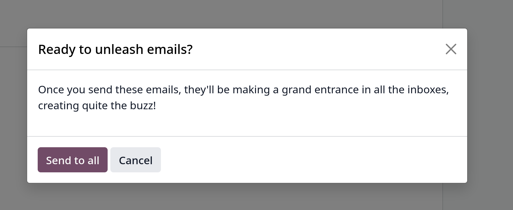

Click **Send** button để gửi email ngay, status sẽ chuyển sang từ **Draft** sang **In Queue**, sang **Sending** và **Sent**

- Hoặc click vào **Schedule**, sẽ hiện một popup **When do you want to send your mailing?**, nhập ngày giờ vào field **Send on**, sau đó click **Schedule** button
  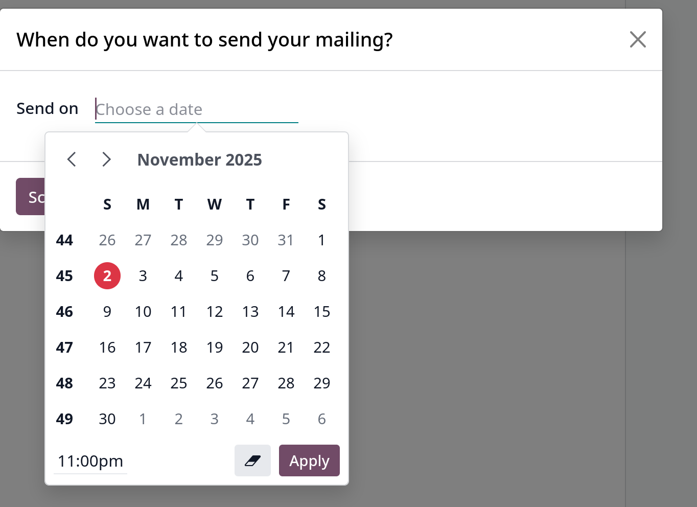

- Hoặc **Test** sẽ hiển thị popup **Test Mailing**, nhập email bạn muốn gửi test ở **Recipients** field để gửi email test rồi click **Send Test**
  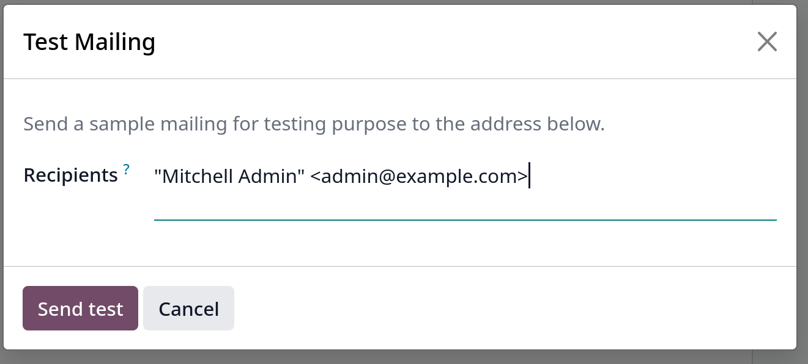

## Mailing campaigns

`Email Marketing` cho phép users khả năng build mailing campaigns, cần phải kích hoạt trước ở `Email Marketing -> Configuration -> Settings`, tick chọn **Mailing Campaigns** checkbox

Sau khi enable tính năng này, trong `Email Marketing` app sẽ xuất hiện menu **Campaigns**, khi click vào sẽ hiển thị danh sách các campaigns ở giao diện kanban view

Để tạo mới một campaign, click vào `New` , nhập tên Campaign, gán Responsible user và gắn Tags cho campaign
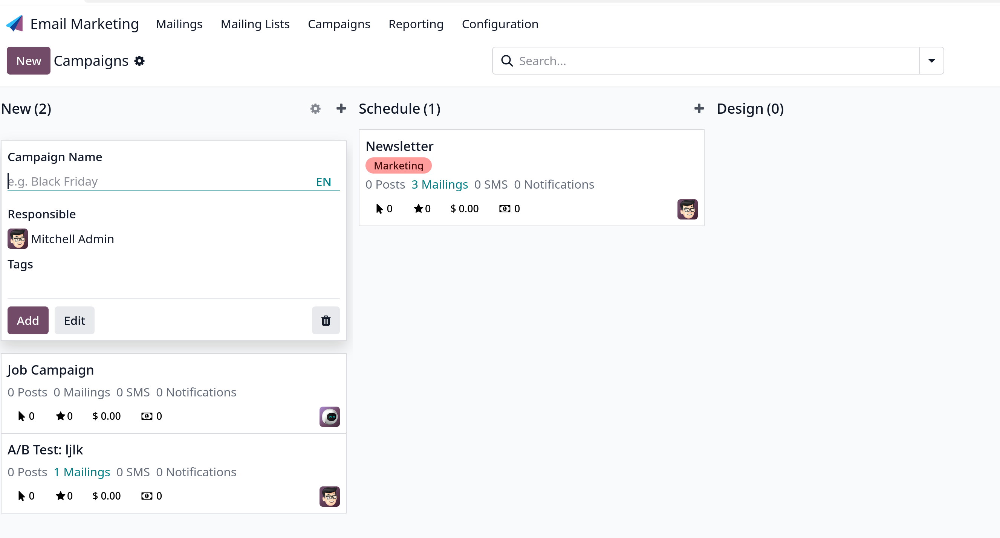

Các _stages_ của campaign, có thể được thêm mới trong `Email Marketing -> Configuration -> Campaign Stages`
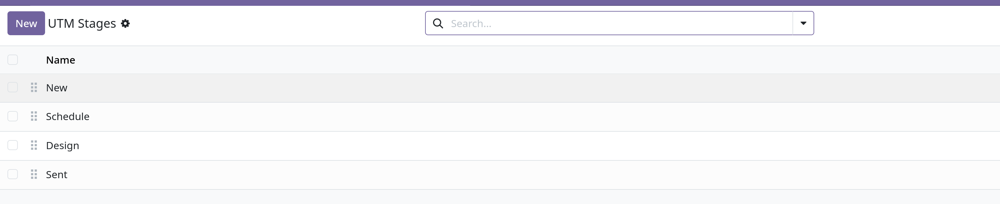

Ở mỗi stage, bạn có thể thiết lập **Automation** actions khi campaign đạt stage đó

Trong campaign form
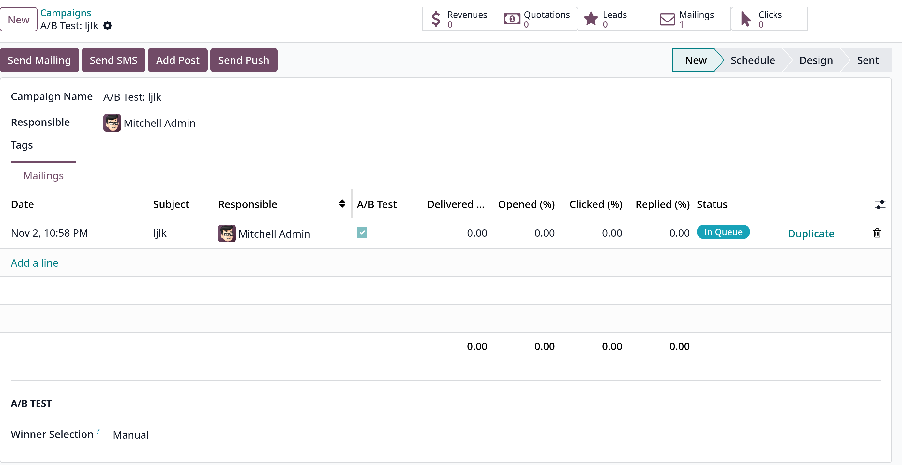

Trên cùng sẽ là hàng nút smart buttons hiển thị **Revenue**, **Quotation**, **Opportunities**, **Clicks**

Bản enterprise sẽ có các button **Send Mailing**, **Send SMS**, **Add Post**, **Add Push** - trong đó, 2 tính năng cuối là bản enterprise, giúp post 1 message hoặc push notification lên các websites available của Odoo

Khi click các button **Send Mailing**, **Send SMS** sẽ tạo mới mailing/sms mailing, quy trình thiết kế như khi tạo mới Mailing.

Dưới tab **Mailings** là danh sách các mailings trong campaign này kèm các thống kế, status của từng mailing
Cũng có thể thêm mới mailing bằng cách click vào **Add a line**

**Campaign Tags** có thể được tạo mới bằng cách vào `Email Marketing -> Configuration -> Campaign Tags`
