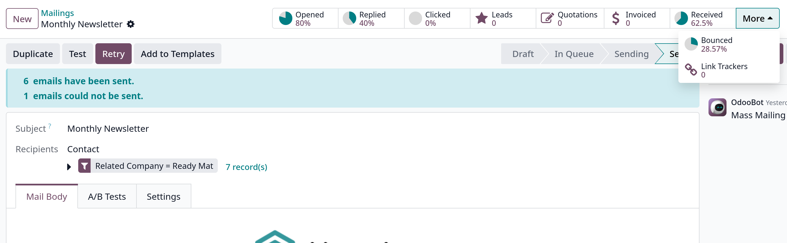

# Lost leads reactivation email

Trong Odoo, lost leads được xóa khỏi CRM pipeline, nhưng cũng có thể là mục tiêu cho các chiến dịch marketing cụ thể, ví dụ active lại lost leads

## Minimum requirements

Trong giao diện tạo mới mailing:

- **Recipients** phải là model **Lead** hay **crm.lead**
- **Blacklist** filter chọn **is set**
- **Created on** nhắm mục tiêu là các lost leads trong một khoảng thời gian cụ thể
- **Stage** không nằm trong các stage cụ thể
- **Lost Reason**
- **Active** filter để chọn cả inactive và active
  

## Add body content

Soạn nội dung cho email

## Send or Schedule

Chọn gửi email ngay hoặc là gửi vào một ngày xác định nào đó

Trong mỗi mailing có các smart buttons

## Email nurturing

_Email nurturing_ thi thoảng còn gọi là nuôi dưỡng leads, là quá trình gửi một loạt các email thúc đẩy kịp thời và phù hợp để kết nối với khách hàng
tiềm năng, xây dựng mối quan hệ sâu sắc hơn với khách hàng nhằm mục đích chuyển đổi lead thành một giao dịch bán hàng.

Có nhiều cách tiếp cận để nuôi dưỡng khách hàng tiềm năng hiệu quả:

- Gửi email ban đầu (như email kích hoạt lại các lost leads)
- Gửi email theo dõi mỗi tuần trong suốt thời gian chiến dịch
- Liên tục phân tích kết quả để tìm hiểu những phương pháp tiếp cận nào mang lại doanh số bán hàng
- Liên tục điều chỉnh cách tiếp cận như thay đổi nội dung email, thiết kết hoặc tiêu đề,..
