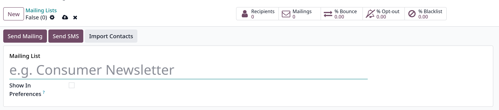
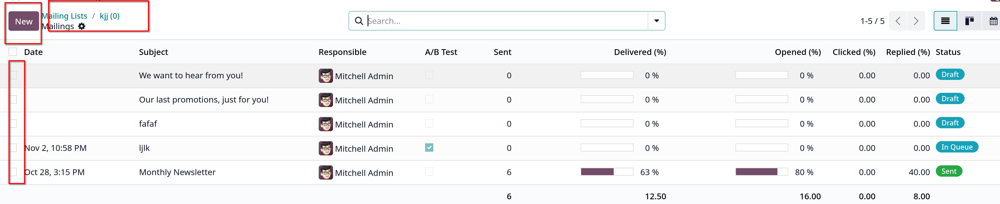
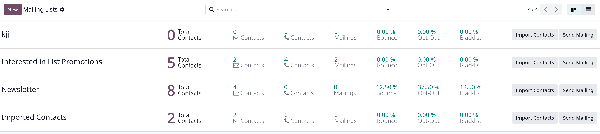
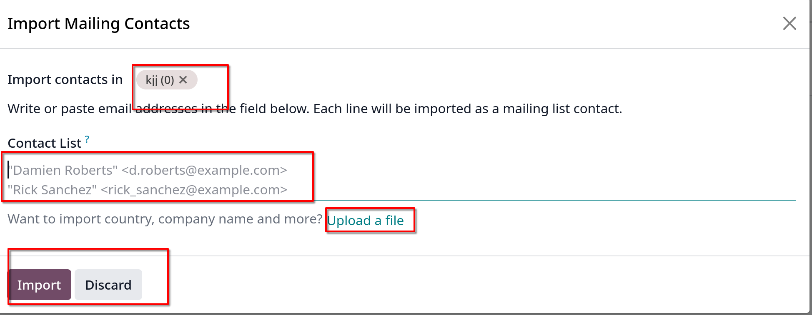
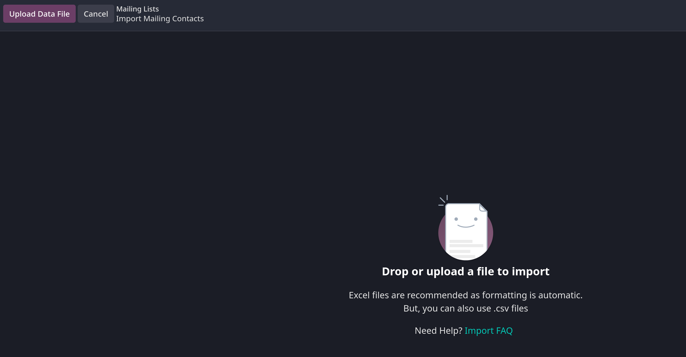
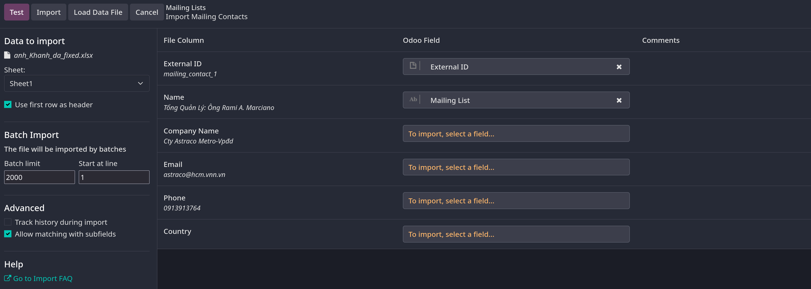
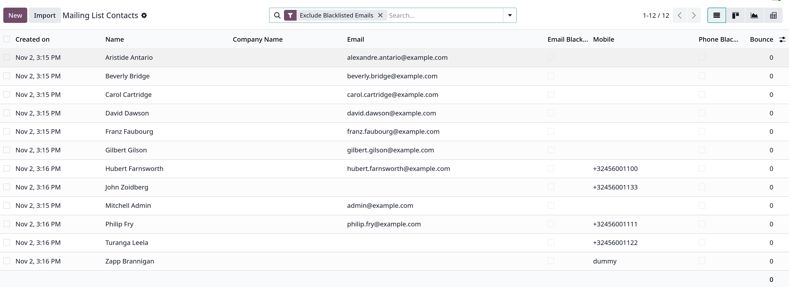
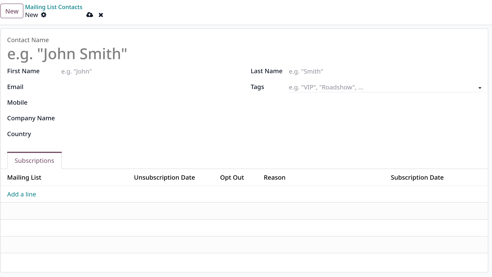

# Mailing lists

Mailing lists là tính năng Odoo cho phép lưu trữ và tổ chức danh sách các địa chỉ email theo các tiêu chí khác nhau

Mailing lists cũng có thể được export ra file excel hoặc các app khác như `Knowledge`, `Dashboards`, `Spreadsheets`

## Create mailing lists

Vào `Email Marketing -> Mailing Lists -> Mailing Lists` chọn `New` sẽ hiển thị form tạo

Hàng smart buttons sẽ hiển thị các thông số

- **Recipients**: số lượng email trong list này
- **Mailings**: số lượng mailings gửi tới list này
- **% Bounce**: tỉ lệ số recipients bị bounced
- **% Opt-out**: tỉ lệ số recipients trong list này không muốn nhận email nữa
- **% Blacklist**: tỉ lệ số recipients trong list này bị chặn không gửi email được tới nữa

Button **Send Mailing** sẽ show ra giao diện mailing được gắn cho mailing list này, có thể click `New` để tạo mới một mailing

Button **Send SMS** cũng có các hành vi tương tự với email

Có thể nhập danh sách recipients cho mailing list này bằng button **Import Contacts**, có thể paste danh sách recipients (emails) hoặc chọn **Upload file** để import danh sách lên từ file .xls hoặc csv

Giao diện Mailing lists mặc định sẽ hiển thị ở kanban view và các thống kê liên quan

Có thể import danh sách recipients bằng cách click vào **Import Contacts** button ở kanban view này, **Send Mailing** button cũng hành xử tương tự như trong form

Khi import contacts

Bạn có thể paste danh sách recipients ở **Contact List** hoặc **Upload file**

Khi chọn **Upload file** sẽ hiển thị giao diện import

Sau đó click vào **Upload Data File** button để tải file lên, giao diện sau khi load file như sau

Có thể tùy chỉnh field để map vào database của Odoo ở cột **Odoo Field**. Nếu file có nhiều sheets, chọn tên sheets ở field **Sheet**
Nếu file lớn, có nhiều dòng, ở mục **Batch Import**, nhập **Batch limit** để giới hạn số dòng để import 1 batch, nhập **Start at line** để chọn dòng bắt đầu cho mỗi batch

**Ví dụ**: Nếu file có 4000 dòng, **Batch limit** 2000 sẽ import 2000 dòng 1 lần, giả sử import thành công 2000 dòng đầu tiên, khi import batch thứ 2 import gặp lỗi. thay vì import từ đầu
ta đặt **Start at line** 2001 để bắt đầu import từ dòng thứ 2001

Trên cùng sẽ có hàng nút, **Test** để kiểm tra tính validate của data, nếu có lỗi sẽ báo ở form, **Import** để nhập danh sách này vào database
**Load Data File** để load file khác và **Cancel** để hủy

## Mailing Lists Contacts

Ta cũng có thể thêm mới 1 recipients vào trong database bằng cách vào `Email Marketing -> Mailing Lists -> Mailing List Contacts` chọn `New`

Trong form chi tiết của tạo mới Contacts

Ở tab **Subscriptions**, thêm contact này vào một mailing list xác định nào đó bằng cách click **Add a line**

**Lưu ý**: một contact có thể được thêm vào nhiều mailing lists khác nhau
