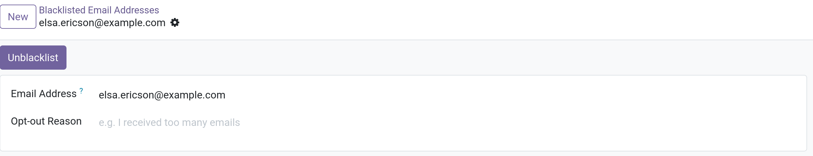

# Manage unsubscriptions (blacklist)

Tính năng này cung cấp cho người nhận quyền hủy đăng ký theo dõi từ danh sách mailing list. Cho phép người nhận hủy đăng ký khỏi danh sách gửi email
sẽ tạo cảm giác tin cậy và kiểm soát đối với người nhận. Nó cũng làm cho công ty về mặt pháp lý sẽ trở nên chân thực hơn, ít spam hơn

## Unsubscribe and blacklist

Ngoài việc unsubscribe khỏi một mailing lists nào đó, người nhận có thể tự đưa mình vào danh sách blacklist trong quá trình hủy đăng ký, họ sẽ không nhận
bất cứ email marketing nào khác từ cơ sở dữ liệu của Odoo

Vào `Email Marketing -> Configuration -> Settings` chọn vào checkbox **Blacklist Option when Unsubscribe**, sau đó **Save**

### Unsubscribe

Mặc định, link _Unsubscribe_ sẽ xuất hiện ở cuối mỗi email (tất cả mailing templates). Ngoại trừ chọn **Plain Text** hoặc **Start From Scratch**, nếu chọn 2 option này trong mailing temlates
phải tự thêm vào bằng cách gõ _/unsubscribe_from_list_

Nếu người nhận click vào _Unsubscribe_, Odoo sẽ hiển thị view sau

**Ghi chú**: opt-out options có thể được cấu hình trước trong `Email Marketing -> Configuration -> Optout Reasons`

### Blacklist

Để người nhận tự xóa họ khỏi tất cả các email marketing trong quá trình hủy đăng ký, trên **Mailing Subscription** page ở trên, click **Exclude Me**
Odoo sẽ thêm địa chỉ email của recipent này vào bảng `mail_blacklist` và hiển thị **Email added to our blocklist** trên giao diện của khách hàng

### Blacklist email addresses

Để xem danh sách các địa chỉ email bị blacklisted, vào `Email Marketing -> Configuration -> Blacklisted Email Addresses`

Chọn 1 địa chỉ cụ thể, trong form này

Để remove email này ra khỏi danh sách blacklisted email bằng cách click vào button **Unblacklist**
