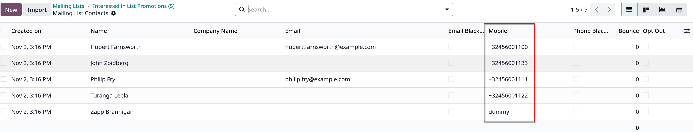
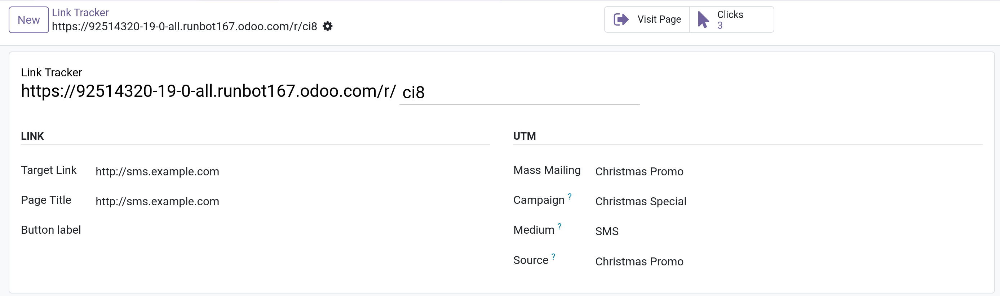

`SMS Marketing` cũng có giao diện tương tự như `Email Marketing`, ngoài một số khác biệt sau

# Mobile

Trong `SMS Marketing -> Mailing List Contacts` hiển thị cột **Mobile**

# Link tracker

`SMS Marketing` không tích hợp in-place link tracker như trong `Email Marketing`, phải tạo link tracker thủ công bằng cách vào

`SMS Marketing -> Configuration -> Link Tracker`, click `New`

- Nhập các field ở 2 section **Link** và **UTM**:
  - _Target Link_: link url muốn tạo một tracker
  - _Page Title_: tiêu đề của trang link tracker
  - _Button label_: label của link hiển thị trong email ở dạng button
  - _Mass Mailing_: chọn mailing muốn gán vào
  - _Campaign_: chọn chiến dịch muốn gán cho link tracker này
  - _Medium_: phương thức marketing cho link tracker này
  - _Source_: nguồn marketing cho link tracker này

Sau khi lưu, Odoo sẽ tạo một link tracker code sau url của link .. /r/ .. code

Trên form link tracker cũng có 2 smart button hiển thị số lượt click vào link này ở **Clicks** button và đi tới target url bằng cách nhấn vào **Visit Page** button
