# Marketing modules

Tài liệu về các module phục vụ cho việc marketing của doanh nghiệp trong Odoo

Module này bao gồm **Email Marketing**, **SMS Marketing**, **ZNS/OA Marketing**, **Marketing Automation**

Sơ đồ mindmap

```mermaid
graph LR
    %% Root Node
    R0["Abenla Odoo Documentation Overview"]

    %% Branch 1: Point of Sale (POS)
    R0 --> A["Point of Sale (POS)"]

    %% POS - Level 2
    A --> A1["Core Functionalities"]
    A1 --> A1a["Start/Close Session"]
    A1 --> A1b["Sell Products (Qty, Price, Disc)"]
    A1 --> A1c["Set Customers (Loyalty, Invoicing)"]
    A1 --> A1d["Customer Notes"]
    A1 --> A1e["Manage Cash Register (In/Out)"]
    A1 --> A1f["Return and Refunds"]
    A1 --> A1g["Analytics/Reporting"]

    A --> A2["Configuration"]
    A2 --> A2a["Access POS Settings (Admin Only)"]
    A2 --> A2b["Product Availability (Tick Point of Sale)"]
    A2 --> A2c["PoS Product Categories"]
    A2c --> A2c1["Create New Category"]
    A2c --> A2c2["Assign to Products"]
    A2c --> A2c3["Restrict Categories Display"]
    A2 --> A2d["Hardware/Devices"]
    A2d --> A2d1["IoT System Connection"]
    A2d --> A2d2["ePOS Printers"]
    A2d2 --> A2d2a["Configuration (IP Address)"]
    A2d2 --> A2d2b["Self-signed certificate (HTTPS)"]
    A2d --> A2d3["Customer Display"]
    A2d3 --> A2d3a["Configuration (USB/HDMI or IoT)"]
    A2d3 --> A2d3b["Opening Display"]
    A2d --> A2d4["Scale (IoT Required)"]
    A2d4 --> A2d4a["Product Configuration (per Kg)"]
    A2d --> A2d5["Secure Connection (Force HTTPS)"]

    A --> A3["Features & Management"]
    A3 --> A3a["Multi-Employee Management"]
    A3a --> A3a1["Login with Employees (Config)"]
    A3a --> A3a2["Access Rights (Minimal, Basic, Advanced)"]
    A3a --> A3a3["Login Methods (Badge ID, PIN Code)"]
    A3 --> A3b["Receipts and Invoices"]
    A3b --> A3b1["Custom Header & Footer"]
    A3b --> A3b2["Automatic Receipt Printing"]
    A3b --> A3b3["Reprint Receipts"]
    A3b --> A3b4["Invoice Customer (must be selected)"]
    A3b --> A3b5["QR Codes to Generate Invoices"]
    A3 --> A3c["Self-Ordering"]
    A3c --> A3c1["Feature Activation (QR menu, Kiosk)"]
    A3c --> A3c2["Additional Settings (Home buttons, Service location)"]
    A3 --> A3d["Product Combos"]
    A3d --> A3d1["Create Combos"]
    A3d --> A3d2["Product Type: Combo (Fixed Price)"]
    A3 --> A3e["Restaurant Features"]
    A3e --> A3e1["Tables/Floor Plan"]
    A3e --> A3e2["Order Management (Set Table/Tab, Transfer/Merge)"]
    A3e --> A3e3["Presets (Dine In, Takeout, Delivery)"]
    A3e --> A3e4["Courses (sequential kitchen orders)"]
    A3e --> A3e5["Bill Splitting"]
    A3e --> A3e6["Tips (Manual/After Payment)"]
    A3e --> A3e7["Booking (Requires Appointments App)"]
    A3 --> A3f["Marketing Features (Email, WhatsApp)"]
    A3 --> A3g["Pricing Features"]
    A3g --> A3g1["Flexible Pricelists"]
    A3g --> A3g2["Manual Discounts (Product/% Global)"]
    A3g --> A3g3["Time-Limited Discounts (using Pricelists)"]
    A3g --> A3g4["Loyalty Programs"]
    A3g --> A3g5["Cash Rounding"]
    A3g --> A3g6["Flexible Taxes (Fiscal Position)"]
    A3g --> A3g7["Electronic Shelf Labels (Pricer setup)"]
    A3g --> A3g8["Discount Tags (Barcode Scanner)"]

    A --> A4["Sales Order Integration (POS)"]
    A4 --> A4a["Select Sales Order/Quotation"]
    A4 --> A4b["Apply Down Payment (Partial)"]
    A4 --> A4c["Settle Order (Complete)"]

    A --> A5["Barcodes & Tracking"]
    A5 --> A5a["Usage (Scan Product/Log Employees)"]
    A5 --> A5b["Configuration (Barcode Scanner in Inventory Settings)"]
    A5 --> A5c["Assign Barcodes (Products, Employees-PIN)"]
    A5 --> A5d["Serial Numbers and Lots (Tracking)"]

    A --> A6["Payment Methods"]
    A6 --> A6a["Customer Account (Deposit, Debt Tracking)"]
    A6 --> A6b["QR Code Payments (Bank App Integration)"]
    A6 --> A6c["Configuration (Integration: None, Terminal, QR, Glory)"]

    %% Branch 2: Sales Quotes & Orders
    R0 --> B["Sales Quotes & Orders"]

    %% Sales - Level 2
    B --> B1["Quotation Creation"]
    B1 --> B1a["Settings (Templates, Signature, Payment, Deadlines)"]
    B1 --> B1b["Use Quotation Templates"]
    B1 --> B1c["Add Products/Sections/Notes (Order Lines)"]
    B1 --> B1d["Optional Products (Cross-selling)"]
    B1 --> B1e["Product Variants (Configurator, Order Grid Entry)"]
    B1 --> B1f["Other Info (Sales, Delivery, Invoicing, Tracking)"]

    B --> B2["Confirmation Methods"]
    B2 --> B2a["Online Signatures"]
    B2 --> B2b["Online Payment (Accept & Pay)"]

    B --> B3["Pricing and Discounts"]
    B3 --> B3a["Pricelists (Rules, Recurring, Rental)"]
    B3 --> B3b["Discounts"]
    B3b --> B3b1["Configuration (Disc.% on lines)"]
    B3b --> B3b2["Discount Button (On All Lines, Global, Fixed Amount)"]
    B3 --> B3c["Foreign Currencies"]
    B3 --> B3d["Discount/Loyalty Programs (Sales/eCommerce/PoS)"]
    B3 --> B3e["eWallets and Gift Cards"]

    B --> B4["Invoicing Policies"]
    B4 --> B4a["Ordered Quantities (Default)"]
    B4 --> B4b["Delivered Quantities"]
    B4 --> B4c["Down Payment"]
    B4c --> B4c1["Percentage"]
    B4c --> B4c2["Fixed Amount"]
    B4c --> B4c3["100% Down Payment Policy"]
    B4 --> B4d["Project Milestones"]
    B4 --> B4e["Time and Materials (Timesheets/Expenses/Purchases)"]
    B4 --> B4f["Pro-forma Invoices"]

    B --> B5["Returns and Refunds"]
    B5 --> B5a["Before Invoicing (Reverse Transfers)"]
    B5 --> B5b["After Invoicing (Reverse Transfer + Credit Notes)"]

    B --> B6["Advanced Features"]
    B6 --> B6a["Deliveries/Invoices to Different Addresses"]
    B6 --> B6b["PDF Quote Builder"]
    B6b --> B6b1["Custom Header/Footer"]
    B6b --> B6b2["Dynamic Text in PDFs"]
    B6b --> B6b3["Add PDF to Products/Variants"]
    B6 --> B6c["Ship Later"]
    B6 --> B6d["Recurring Plans Setup"]
    B6d --> B6d1["Billing Period"]
    B6d --> B6d2["Automatic Closing"]

    %% Branch 3: Subscriptions (Recurring Revenue)
    R0 --> C["Subscriptions (Recurring Revenue)"]

    %% Subscriptions - Level 2
    C --> C1["Life Cycle Management"]
    C1 --> C1a["Renew Subscriptions (Manual Creation)"]
    C1 --> C1b["Upsell Subscriptions (Creates new quotation)"]
    C1 --> C1c["Close Subscriptions (Admin/Customer View)"]
    C1 --> C1d["Product Form Config (Type: Service, Invoice Policy)"]
    C1d --> C1d1["Self-Service Options (Closable, Renew, Upsell)"]
    C1 --> C1e["Sell in eCommerce Shop"]

    C --> C2["Automated Processes"]
    C2 --> C2a["Scheduled Actions"]
    C2a --> C2a1["Generate Recurring Invoices/Payments"]
    C2a --> C2a2["Subscription Expiration Check"]
    C2 --> C2b["Automatic Payments (Requires Tokenization/Provider)"]

    C --> C3["Reporting"]
    C3 --> C3a["Subscriptions Analysis"]
    C3 --> C3b["Retention Analysis"]
    C3 --> C3c["MRR Breakdown (Graph)"]
    C3 --> C3d["MRR Timeline (Graph)"]

    %% Branch 4: Sales Ecosystem & Connectors
    R0 --> D["Sales Ecosystem & Connectors"]

    %% Ecosystem - Level 2
    D --> D1["Commissions (Incentives)"]
    D1 --> D1a["Purpose (Motivate Sales Team)"]
    D1 --> D1b["Plan Structure"]
    D1b --> D1b1["Based On (Targets/Achievements)"]
    D1b --> D1b2["Per (Individual/Team)"]
    D1b --> D1b3["Frequency (Monthly/Quarterly/Yearly)"]
    D1 --> D1c["Plan Types"]
    D1c --> D1c1["Target-based (Percentage of Goal)"]
    D1c --> D1c2["Achievement-based (Percentage of Invoiced Value)"]
    D1 --> D1d["Performance Metrics (Amount/Quantity Sold/Invoiced, Margin, MRR)"]

    D --> D2["Product Management"]
    D2 --> D2a["Import Products (Template, Relation Fields)"]
    D2 --> D2b["Import Attributes and Variants"]
    D2 --> D2c["Product Images with Google Images API"]

    D --> D3["Connectors"]
    D3 --> D3a["Shopee Connector"]
    D3a --> D3a1["Sync Confirmed Orders (Shopee to Odoo)"]
    D3a --> D3a2["Sync Inventory (Odoo to Shopee - FBM)"]
    D3a --> D3a3["Product Catalog Mapping (SKU to Internal Reference)"]
    D3a --> D3a4["Order Synchronization (Automatic/Forced)"]
    D3a --> D3a5["FBM Delivery Management (Shipping Label Fetch)"]
    D3a --> D3a6["Accounting/Payments (Batch Deposit)"]
    D3 --> D3b["Gelato (Print-on-Demand)"]
    D3b --> D3b1["Automate Order Fulfillment"]
    D3b --> D3b2["Configuration (API Keys, Webhooks)"]
    D3b --> D3b3["Product Sync (Template ID)"]
    D3b --> D3b4["Order Placement (Single vendor limit)"]
```

