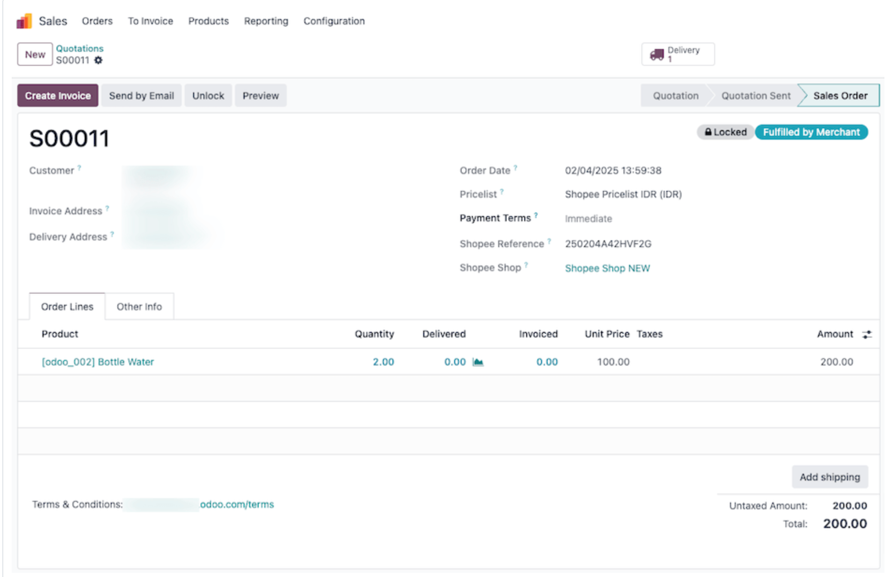
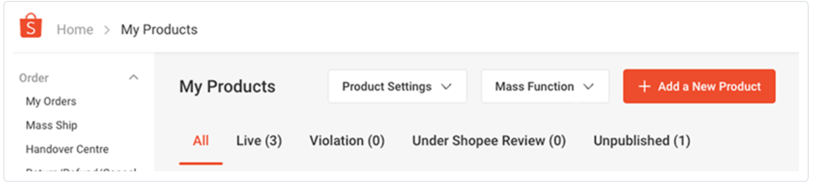
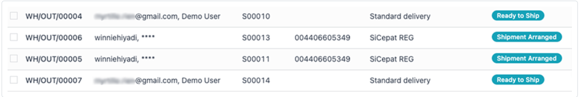
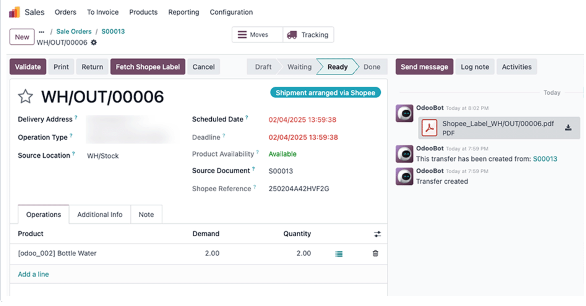

# Shopee Connector

**Shopee Connector** là tính năng trong Odoo 19 được thiết kế để **synchronize orders** (đồng bộ hóa đơn hàng) giữa Shopee và Odoo, giúp giảm đáng kể thời gian dành cho việc **manually entering Shopee orders** (nhập thủ công đơn hàng Shopee) từ **Shopee Seller account** vào Odoo. Nó cũng cho phép người dùng **accurately keep track of Shopee sales in Odoo** (theo dõi chính xác doanh số bán hàng trên Shopee trong Odoo).

---

## I. Vai trò, Tính năng Hỗ trợ (**Supported features**) và Giới hạn

### 1. Đồng bộ Dữ liệu

**Shopee Connector** có khả năng:

- **Synchronize (Shopee to Odoo) all confirmed orders, and their order items** (Đồng bộ hóa - Shopee sang Odoo - tất cả các đơn hàng đã xác nhận, và các mục đơn hàng của chúng), bao gồm **Product name** (Tên sản phẩm), **SKU reference** (Mã SKU), và **Quantity** (Số lượng).
- **Synchronize (Odoo to Shopee) all available quantities of your products** (Đồng bộ hóa - Odoo sang Shopee - tất cả số lượng tồn kho có sẵn của sản phẩm của bạn), áp dụng cho **FBM** (**Fulfilled by Merchant**).
- Hỗ trợ **multiple seller accounts** (nhiều tài khoản người bán).
- Hỗ trợ **multiple Shopee marketplaces (shops) per seller account** (nhiều thị trường/cửa hàng Shopee trên mỗi tài khoản người bán).

### 2. Các Thị trường Hỗ trợ (**Shopee supported marketplaces**)

Connector hỗ trợ các thị trường ở khu vực **APAC region** (Châu Á Thái Bình Dương) (ví dụ: **Shopee.vn**, **Shopee.sg**, **Shopee.co.id**, **Shopee.tw**, **Shopee.co.th**, **Shopee.ph**, **Shopee.com.my**) và **South America region** (Nam Mỹ) (ví dụ: **Shopee.com.br**, **Shopee.cl**, **Shopee.com.co**, **Shopee.com.mx**).

### 3. Giới hạn Vận hành

**Shopee Connector** được thiết kế để **synchronize sales orders data** (đồng bộ hóa dữ liệu đơn hàng bán hàng). Các hành động khác **must** (bắt buộc) phải được quản lý từ **Shopee Seller Central**, bao gồm: **downloading weekly/monthly income/fees reports** (tải xuống báo cáo thu nhập/phí hàng tuần/hàng tháng), **handling disputes** (xử lý tranh chấp), hoặc **issuing refunds** (xử lý hoàn tiền).

## II. Cấu hình Tài khoản (**Shopee Connector configuration**)

### 1. Yêu cầu Tiên quyết (**Pre-requisites**)

- Người dùng **must** (bắt buộc) có **registered Shopee Seller account** (tài khoản Người bán Shopee đã đăng ký) và **Shopee Open account** trước khi hoàn tất cấu hình.
- **Shopee Open Platform access and seller account requirements are regionally specific** (Truy cập Nền tảng Mở Shopee và yêu cầu tài khoản người bán là đặc thù theo khu vực). Điều này có nghĩa là **the rules, qualifications, and processes differ from country to country** (các quy tắc, điều kiện và quy trình khác nhau giữa các quốc gia).
- Cần xem xét: **Shopee Seller Status & Business Type** (Tình trạng Người bán & Loại hình Kinh doanh) và **Order Volume/Seller Tier (If Applicable)** (Số lượng Đơn hàng/Cấp độ Người bán - nếu áp dụng).
  - **Many regions require a minimum number of orders** (Nhiều khu vực yêu cầu số lượng đơn hàng tối thiểu) hoặc một **certain seller tier** (cấp độ người bán nhất định) (ví dụ: **Mall, Preferred, Managed**) để truy cập **Open Platform**.
- Người dùng **must** (bắt buộc) **Ensure your Shopee account meets all the necessary criteria before proceeding with the Odoo Shopee Connector configuration** (Đảm bảo tài khoản Shopee đáp ứng tất cả các tiêu chí cần thiết trước khi tiến hành cấu hình Odoo Shopee Connector).

### 2. Thiết lập Kết nối (**Connect Shopee seller account to Odoo**)

1.  **Cài đặt Connector:** Cài đặt **Shopee Connector** (`sale_shoppe`) bằng cách truy cập **Apps**.
2.  **Tạo Tài khoản:** Điều hướng đến **Sales app ‣ Configuration ‣ Shopee ‣ Accounts**. Nhấp **New** để tạo liên kết tài khoản Shopee mới.
3.  **Chọn API Endpoint:** Việc chọn **appropriate API Endpoint** (API Endpoint phù hợp) là **crucial for successful integration** (rất quan trọng cho việc tích hợp thành công).
    - **Shopee Production Endpoint (Singapore):** **primary endpoint** (endpoint chính) cho người bán ở hầu hết các nước **APAC**.
    - **Shopee Production Endpoint (China):** **exclusively for sellers operating within mainland China** (dành riêng cho người bán hoạt động tại Trung Quốc đại lục).
    - **Shopee Production Endpoint (Brazil):** **dedicated to sellers operating within Brazil** (dành riêng cho người bán hoạt động tại Brazil).
    - **Shopee Testing Endpoint:** **is for development and testing purposes only**. **Do not use this endpoint for production** (Không sử dụng endpoint này cho sản xuất).
4.  **Nhập Thông tin xác thực:** Nhập **Open Shopee Partner ID** và **Partner Key** vào các trường tương ứng trong tab **Credentials**.
    - Các giá trị này được tìm thấy bằng cách: **Log in to the Shopee Open Platform** (Đăng nhập vào **Shopee Open Platform**), điều hướng đến **App Management** (Quản lý Ứng dụng), chọn **App List** (Danh sách Ứng dụng), và chọn ứng dụng cụ thể.
    - **Copy carefully** (Sao chép cẩn thận) và **Keep your key secure** (Giữ khóa của bạn an toàn): **Partner Key** là **sensitive information** (thông tin nhạy cảm).
5.  **Ủy quyền:** Nhấp vào **Save And Authorize**.

### 3. Quy trình Ủy quyền (**Authorization and account registration**)

- **Shopee seller account selection/login:** Sau khi nhấp **Save and Authorize**, Odoo chuyển hướng đến **Shopee seller account selection page** (trang lựa chọn tài khoản người bán Shopee). Nếu chưa đăng nhập, người dùng sẽ được nhắc **enter the credentials** (nhập thông tin đăng nhập).
- **Granting access to Odoo:** Sau khi đăng nhập, người dùng sẽ được chuyển đến **authorization (or consent) page** (trang ủy quyền hoặc chấp thuận) để **confirm that you allow Shopee to grant Odoo access to your account and related data** (xác nhận cho phép Shopee cấp quyền truy cập cho Odoo vào tài khoản và dữ liệu liên quan).

### 4. Cấu hình Sau đồng bộ (**Post-synchronization configuration**)

Sau khi được chuyển hướng trở lại Odoo và tài khoản được đăng ký thành công, người dùng nên thực hiện các bước sau:

1.  **Rename the Shopee Account (Optional):** (Đổi tên Tài khoản Shopee - Tùy chọn) để dễ quản lý.
2.  **Set the Last Order Synchronization Date:** (Đặt Ngày Đồng bộ Đơn hàng Cuối cùng) để xác định **the starting point for fetching orders from Shopee** (điểm bắt đầu để lấy đơn hàng từ Shopee).
3.  **Configure Inventory Synchronization:** (Cấu hình Đồng bộ Tồn kho) bằng cách bật tùy chọn **Synchronize Inventory** để **automatically push stock updates from Odoo to Shopee** (tự động đẩy cập nhật tồn kho từ Odoo sang Shopee).
4.  **Assign a Default Sales Team:** (Gán Đội ngũ Bán hàng Mặc định) để giúp **reporting and order management** (báo cáo và quản lý đơn hàng).

## IV. Quản lý Sản phẩm và Đơn hàng

### 1. Ánh xạ Danh mục Sản phẩm (**Product catalog mapping**)

- **Product catalog synchronization** giữa Odoo và Shopee **is not automatic** (không tự động). Đây là một **manual operation** (thao tác thủ công).
- Liên kết sản phẩm được thực hiện bằng cách khớp **Internal Reference** (Mã tham chiếu nội bộ) của Odoo với **Shopee SKU**.
- Nếu **no database product with a matching internal reference is found** (không tìm thấy sản phẩm cơ sở dữ liệu nào có mã tham chiếu nội bộ khớp), một sản phẩm mặc định là **_Shopee Item_** sẽ được sử dụng.

Quy trình ánh xạ chi tiết:

- **New Odoo customers with no existing products:** (Khách hàng Odoo mới): **Export Shopee catalog** (Xuất danh mục Shopee) (bao gồm **Shopee SKUs**). Khi **Import into Odoo** (Nhập vào Odoo), **map the Shopee SKU to the Internal Reference field in Odoo** (ánh xạ Shopee SKU sang trường _Internal Reference_ trong Odoo).
- **Existing Odoo customers with products already in Odoo:** (Khách hàng Odoo hiện tại): **Export Shopee catalogs** (Xuất danh mục Shopee và Odoo). **Map in a spreadsheet** (Ánh xạ trong bảng tính) để **update the _Internal Reference_ field** (cập nhật trường _Internal Reference_) của các sản phẩm Odoo hiện có với **corresponding Shopee SKU** (Shopee SKU tương ứng).

### 2. Đồng bộ hóa Đơn hàng (**Order synchronization**)

- Đơn hàng được **automatically fetched from Shopee, and synchronized in Odoo, at regular intervals** (tự động lấy từ Shopee, và đồng bộ hóa trong Odoo, theo chu kỳ đều đặn).
- Đồng bộ hóa dựa trên **Shopee orders status**: **only orders whose status has changed** (chỉ những đơn hàng có trạng thái thay đổi) kể từ lần đồng bộ cuối mới được lấy về.
- Nguyên tắc đồng bộ là **to only fetch orders that needs to be shipped** (chỉ lấy về những đơn hàng cần được vận chuyển) (ví dụ: **SHIPPED, CANCEL, UNPAID, COMPLETED**).
- **Hủy đơn hàng:** Khi một đơn hàng bị **canceled on Shopee**, nó sẽ **update the order’s status in Odoo** (cập nhật trạng thái đơn hàng trong Odoo). Ngược lại, **if an order is canceled on Odoo, the change won’t be reflected on Shopee** (nếu đơn hàng bị hủy trên Odoo, thay đổi sẽ không được phản ánh trên Shopee).

### 3. Buộc Đồng bộ (**Force synchronization**)

Để **force the synchronization of an order** (buộc đồng bộ hóa một đơn hàng) mà trạng thái **has not changed** (chưa thay đổi):

- Điều hướng đến tài khoản Shopee trong Odoo: **Sales app ‣ Configuration ‣ Shopee ‣ Account ‣ Shop**.
- **Modify the date for Last Order Sync** (Sửa đổi ngày **Last Order Sync**) dưới **Orders Follow-up**.
- Phải chọn ngày **prior to the last status change** (trước lần thay đổi trạng thái cuối cùng) của đơn hàng.

### 4. Cấu hình Thuế Sản phẩm (**Product tax configuration**)

- Thuế áp dụng là **those set on the product, or determined by the fiscal position** (thuế được đặt trên sản phẩm, hoặc được xác định bởi vị trí tài chính).
- Cần **make sure to have the correct taxes set on your products in Odoo** (đảm bảo đặt thuế chính xác trên sản phẩm của bạn trong Odoo) để tránh **discrepancies in the subtotals** (chênh lệch trong tổng phụ) giữa **Shopee Seller Central** và Odoo.
- **Lưu ý về chênh lệch:** Vì **shopee does not necessarily apply the same taxes** (Shopee không nhất thiết áp dụng cùng mức thuế) như Odoo, **order totals differ by a few cents** (tổng đơn hàng có thể khác nhau vài xu). Những khác biệt này có thể được giải quyết bằng **write-off** (ghi giảm) khi **reconciling the payments in Odoo** (đối chiếu thanh toán trong Odoo).

## V. Quản lý Giao hàng **FBM** (**Manage deliveries in FBM**)

### 1. Quy trình Hoàn tất Đơn hàng Chi tiết (**Order fulfillment process**)

1.  **New order creation:** (Tạo đơn hàng mới) trong Odoo.
2.  **Arrange shipment on Shopee:** (Sắp xếp vận chuyển trên Shopee) **must** (bắt buộc) được thực hiện **through the Shopee platform itself** (thông qua nền tảng Shopee). Odoo **does not handle the physical shipping arrangements** (không xử lý các sắp xếp vận chuyển vật lý).
3.  **Fetch Shopee shipping label (delivery note):** (Lấy về nhãn vận chuyển Shopee) Sau khi vận chuyển được sắp xếp, Odoo **fetches the generated shipping label** (lấy về nhãn vận chuyển được tạo), bao gồm **tracking number** (mã theo dõi).
4.  **Validate stock out in Odoo:** (Xác nhận xuất kho trong Odoo) Người dùng cần **validate the stock movement in Odoo** (xác nhận chuyển kho trong Odoo). Thao tác này sẽ **decrease the stock levels in Odoo** (làm giảm mức tồn kho trong Odoo).
5.  **Inventory update on Shopee:** (Cập nhật tồn kho trên Shopee) Odoo **pushes the updated stock levels back to Shopee** (đẩy mức tồn kho đã cập nhật trở lại Shopee).

### 2. Yêu cầu Vận chuyển

- **Unsupported for Non-Shopee Supported Logistics (NSSL):** (Không được hỗ trợ cho Dịch vụ Logistics không được Shopee hỗ trợ - NSSL). Tính năng này **is not available for NSSL**.
- Shopee **requires users to provide a tracking reference with each delivery** (yêu cầu người dùng cung cấp mã theo dõi với mỗi lần giao hàng). Nếu **the carrier doesn’t automatically provide a tracking reference** (nhà vận chuyển không tự động cung cấp mã theo dõi), **one must be set manually** (một mã phải được đặt thủ công).

## VI. Kế toán và Báo cáo

### 1. Đăng ký Thanh toán (**Register payments**)

- Nên tạo một **dedicated _Bank_ journal** (Sổ nhật ký Ngân hàng chuyên dụng) (ví dụ: tên là **Shopee Payments**), với một tài khoản trung gian **dedicated _Bank and Cash_ intermediary account** (tài khoản trung gian _Bank and Cash_ chuyên dụng).
- **Thanh toán theo Lô (**Batch Deposit**):** Vì Shopee thực hiện **a single weekly or monthly payment** (một khoản thanh toán duy nhất hàng tuần hoặc hàng tháng), cần chọn **Batch Deposit** làm **Payment Method** (Phương thức Thanh toán) để đăng ký thanh toán hàng loạt.
- Thao tác tương tự có thể được thực hiện với **vendor bills from Shopee dedicated to fees/commissions** (hóa đơn nhà cung cấp từ Shopee dành cho phí/hoa hồng).

### 2. Phân tích Bán hàng (**Analyzing Shopee sales with Odoo’s reporting**)

- Để **specifically analyze your Shopee sales** (phân tích cụ thể doanh số bán hàng Shopee), bạn **will need to configure sales teams for your Shopee shops** (cần cấu hình đội ngũ bán hàng cho các cửa hàng Shopee của bạn).
- **Thiết lập Báo cáo:** **Assign a specific sales team** (Gán một đội ngũ bán hàng cụ thể) cho cửa hàng Shopee của bạn để **filter and isolate Shopee sales data within the Odoo dashboard** (lọc và cô lập dữ liệu bán hàng Shopee trong bảng điều khiển Odoo).
- **Lưu ý:** Theo mặc định, **the Shopee account’s sales team is shared across all of your company’s accounts** (đội ngũ bán hàng của tài khoản Shopee được chia sẻ trên tất cả các tài khoản của công ty bạn), nên cần gán riêng để báo cáo chính xác.
