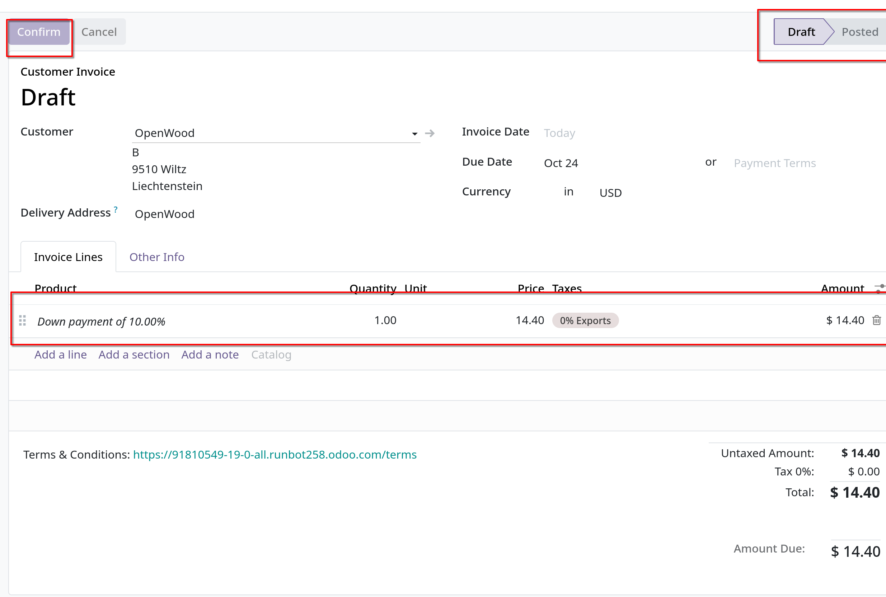
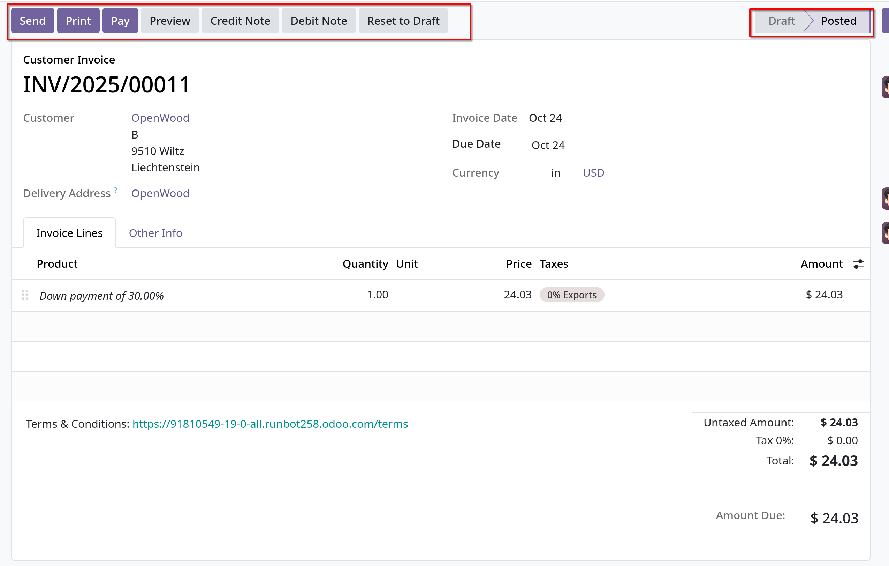
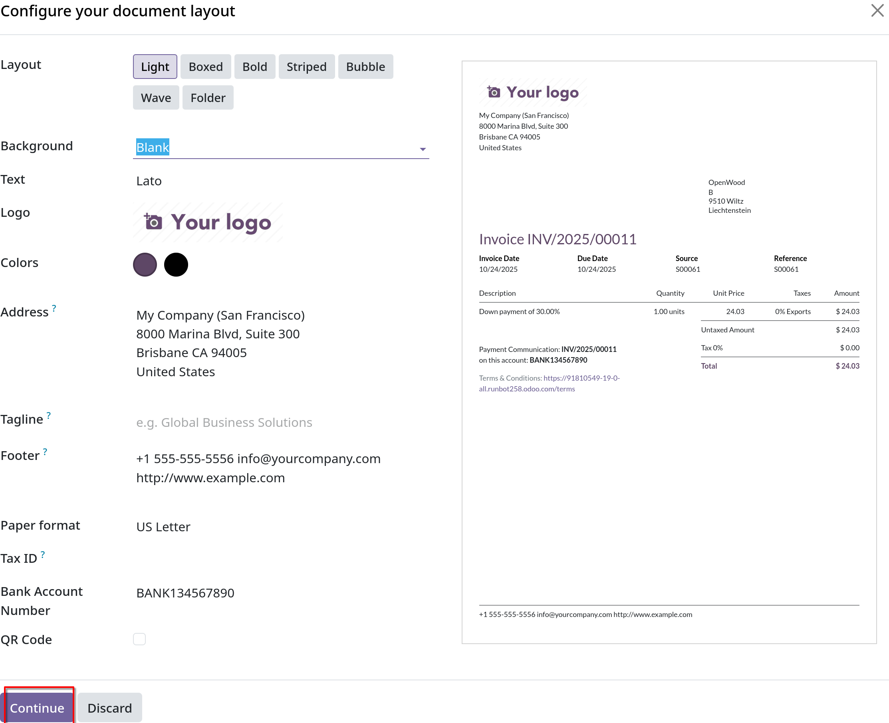
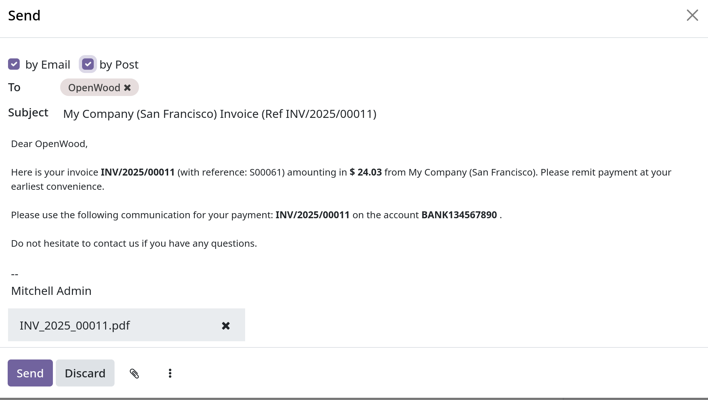
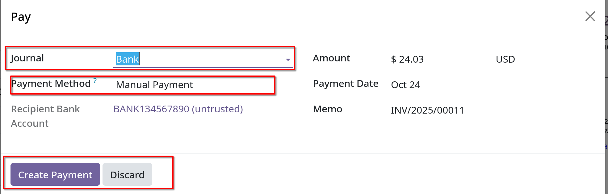
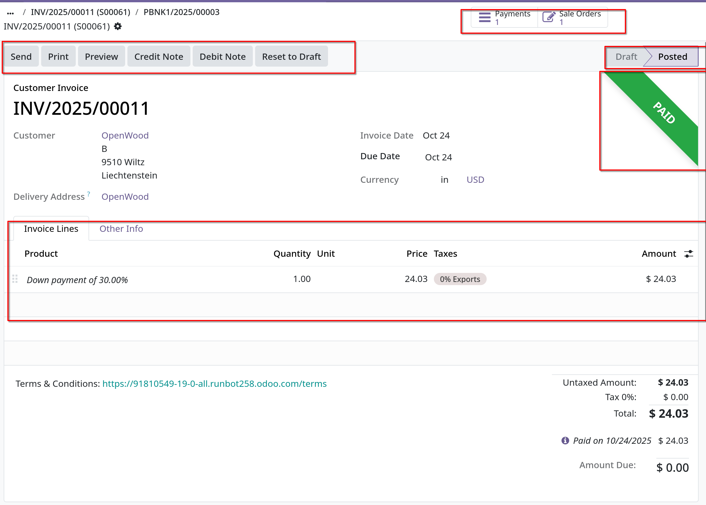

# Down payment

- Một down payment là khoản thanh toán trước ban đầu, trả trước được thực hiện trong quá trình xác nhận bán hàng. Down payments giúp
  giảm rủi ro cho cả 2 bên (mua và bán) vì chúng thể hiện cam kết chung để hoàn tất giao dịch.

- Với down payment, người mua thanh toán một phần trong tổng số tiền còn nợ, đồng thời đồng ý thanh toán số tiền còn lại vào một ngày nào sau đó.
  Đổi lại, người bán sẽ cung cấp hàng hóa/dịch vụ cho người mua sau khi chấp nhận thanh toán trước và tin tưởng rằng số tiền còn lại sẽ được thanh toán sau.

- Trong Odoo, down payment có thể được tùy chỉnh để phù hợp với nhu cầu của từng giao dịch bán hàng.

## Create invoices

- Khi sales order được xác nhận, tùy chọn để tạo invoice sẽ xuất hiện:
  - _Regular invoice_: hóa đơn thông thường
  - _Down payment (percentage)_: hóa đơn trả trước theo %
  - _Down payment (fixed amount)_: hóa đơn trả trước theo một số tiền cố định
  - Nếu chọn Down payment thì nhập số % hoặc số tiền cố định tại field **Down Payment** (%) hoặc **Down Payment Amount** (fixed)
  - Khi tạo xong, trạng thái invoice là `Draft`, sau khi được confirm thông qua button `Confirm`
    
  - Số down payment (%) hoặc (fixed) sẽ hiển thị như _products_ ở **Order Lines**

  - Sau khi click `Confirm`, trạng thái invoice sẽ chuyển sang **Posted**, sau đó click **Pay** button để thanh toán, hoặc thêm **Credit Note**, **Debit Note**, hoặc reset về trạng thái `Draft` bằng **Reset to Draft**
    

  - Các popup sau khi click các buttons:
    - **Send**: Gửi email kèm hóa đơn cho khách hàng
      
      Sau khi confirm ở bước design invoice, có thể chọn cả _by Email_ và _by Post_
      
      Sẽ có banner **Sent** ở góc phải form sau khi gửi mail thành công cho khách hàng.

    - **Pay**: Thanh toán invoice này
      
      Sẽ có banner **Paid** ở góc phải form sau khi thanh toán thành công.

      **Lưu ý**: Khách hàng sẽ xem hóa đơn ở customer portal, thực hiện thanh toán tại đó luôn.

    - **Credit Note**: Ghi chú về tín dụng
    - **Debit Note**: Ghi chú về ghi nợ

  - Sau khi đã thanh toán thì invoice sẽ có trạng thái **PAID** ở góc phải, lưu ý hàng nút smart button sẽ dẫn đến _Payment_ và _Sales order_
    

  - **Quan trọng** về down payment: Chọn downpayment policy phải phù hợp với chính sách lập hóa đơn tổng thể, đặc biệt khi dùng option _Delivered quantities_
    - _Positive total required_: Odoo không cho phép tổng là số âm trong invoices.
    - _Cost Exceeds Down Payment_: Nếu các sản phẩm dùng _Delivered quantities_ policy, đồng thời tổng giá sản phẩm vượt quá down payment (vd, 50% down payment), một regular invoice được tạo
      cho số dư còn lại và quy trình diễn ra như bình thường.
    - _Down Payment Exceed Cost_: Nếu giá các sản phẩm thấp hơn down payment, down payment không thể được khấu trừ khi đến thời điểm lập hóa đơn, vì nếu làm thế sẽ dẫn tới số tổng là âm
      Ví dụ: tổng giá hóa đơn được lập sau khi giao hàng là 200đ, nhưng down payment lại là 500đ, lúc này nếu khấu trừ thì sẽ ra số âm.
    - _Credit Note_: nếu tình huống trên xảy ra, Odoo sẽ tạo _Credit Note_ để hủy draft invoice được sinh ra sau khi được thanh toán trước.

  - **Chính sách trả trước 100%**:
    - Yêu cầu 100% down payment được xử lý khác với yêu cầu thanh toán đầy đủ thông thường của sales order, đặc biệt ảnh hưởng đến các lựa chọn hóa đơn trong tương lai.
    - _Regular Full Payment_: nếu đơn đặt hàng được thanh toán hoàn toàn bằng quy trình lập hóa đơn thông thường, nút **Create Invoice** sẽ không được hiển thị trên sales order
      do đó sẽ không thể tạo hóa đơn bổ sung.
    - _100% Down Payment_: Nếu thực hiện quy trình trả trước 100%, nút **Create Invoice** vẫn hiển thị trên sales order. Vì Odoo vẫn mong đợi hóa đơn tiếp theo được tạo ngay cả khi số tiền được lập trên hóa đơn bằng 0
      để hoàn thành quy trình bán hàng. Quá trình thanh toán trả trước 100% vẫn bao gồm tạo draft invoice với khoản thanh toán trước được liệt kê dưới dạng products, xác nhận và thanh toán, dẫn tới banner **In Payment** màu xanh lá.

## Income account modification on down payments

- Để thay đổi hoặc điều chỉnh tài khoản thu nhập được đính kèm với _Down Payment_ product page, `Accounting` app cần được cài đặt
- Vào `Products` trong `Sales -> Products -> Products`, tìm sản phẩm Down Payment trong thanh tìm kiếm, chọn vào chi tiết

- Khi app `Accounting` được cài, tab **Accounting** sẽ hiển thị trong trang product
- Trong **Accounting** tab, tài khoản thu nhập có thể được thay đổi trong field _Income Account_ ở phần _Receivables_
