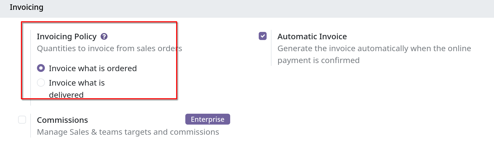
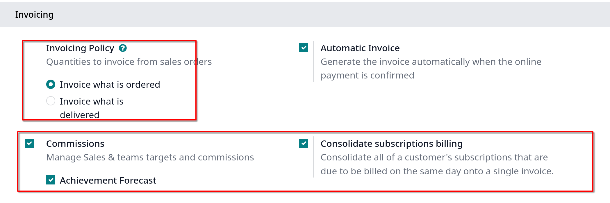
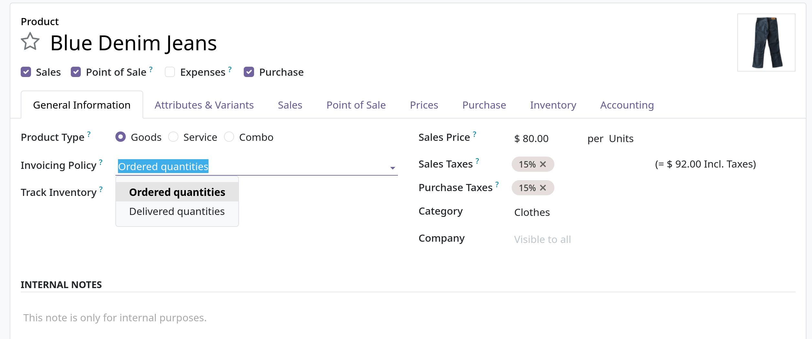
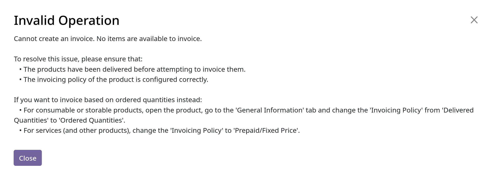

# Invoice based on delivered or ordered quantities

- Các chính sách kinh doanh khác nhau sẽ yêu cầu các tùy chọn hóa đơn khác nhau:
  - _Invoice what is ordered_ rule được dùng làm chế độ mặc định trong Odoo `Sales`, khách hàng sẽ được lập hóa đơn sau khi sales order được xác nhận.

  - _Invoice what is delivered_ rule sẽ lập hóa đơn cho khách hàng sau khi việc giao hàng hoàn tất, rule này thường sử dụng ở
    các doanh nghiệp bán nguyên vật liệu, chất lỏng hoặc thực phẩm với số lượng lớn. Do số lượng đặt hàng có thể khác số lượng được giao
    nên phải lập hóa đơn dựa trên số lượng được giao

## Invoicing policy features

- Để active _invoicing policy features_, vào `Sales -> Configuration -> Settings`, ở **Invoice**, chọn một **Invoicing Policy** rule: _Invoice what is ordered_ hay _Invoice what is delivered_
  
  

  **Lưu ý**: community sẽ không có tính năng **Commissions** và **Consolidate subscriptions billing**

- **Quan trọng**: Nếu _Invoice what is delivered_ rule được chọn, không thể active tính năng _Automatic Invoice_ để tạo hóa đơn tự động sau khi online payment được xác nhận.

## Invoicing policy on product form

- Trong giao diện product form, có thể chọn _Invoicing policy_ tại field _Invoicing policy_
  

## Impact on sales flow

- Trong Odoo `Sales`, luồng bán hàng cơ bản bắt đầu từ việc tạo báo giá (quotation). Sau đó quotation được gửi tới khách hàng.
  Tiếp theo, nó cần được xác nhận để chuyển quotation thành sales order. Lúc này sẽ tạo ra một invoice.
  - _Ordered quantities_: không tác động tới sales flow. Hóa đơn được tạo ngay khi việc bán hàng được xác nhận.
  - _Delivered quantities_: có tác đọng nhỏ tới sales flow. Vì số lượng đã giao cần được nhập thủ công vào sales order. Hoặc có thể
    cài đặt và sử dụng `Inventory` app để xác nhận số lượng đã giao trước khi tạo hóa đơn bằng `Sales` app

- **Cảnh báo**: Nếu người dùng cố gắng tạo hóa đơn mà không xác thực số lượng đã giao, thông báo lỗi này sẽ được xuất hiện
  

- **Ghi chú**: sau khi quotation được confirmed, trạng thái sẽ được chuyển từ _Quotation sent_ sang _Sales order_
  Odoo tự động thêm số lượng vào hóa đơn, cả _Delivered_ và _Invoiced_, kể cả khi nó được giao từng phần, khi báo giá được confirmed

- Tiếp theo, ta sẽ tìm hiểu sự khác nhau giữa các loại invoice khi tạo: _Regular invoice_, _Down payment (percentage)_ và _Down payment (fixed amount)_
