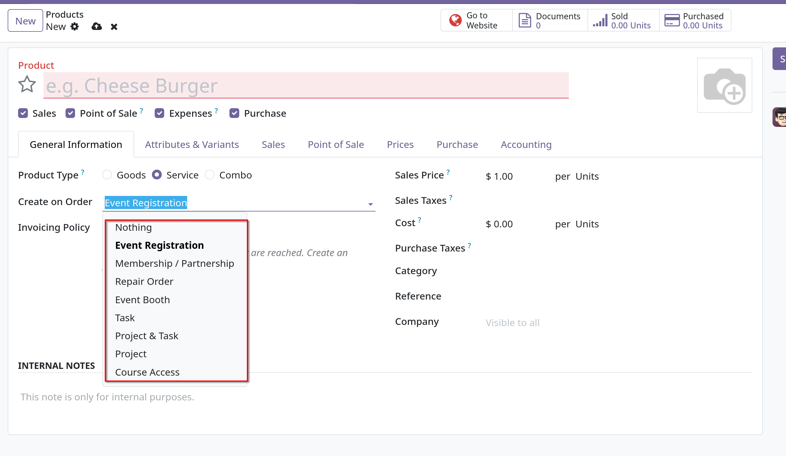
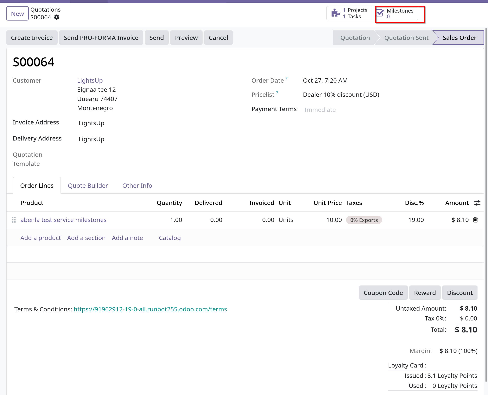
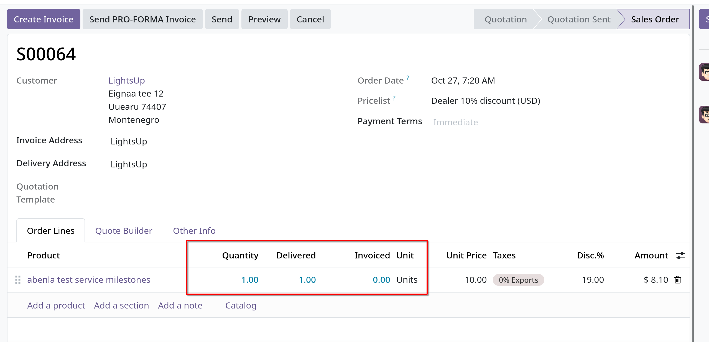
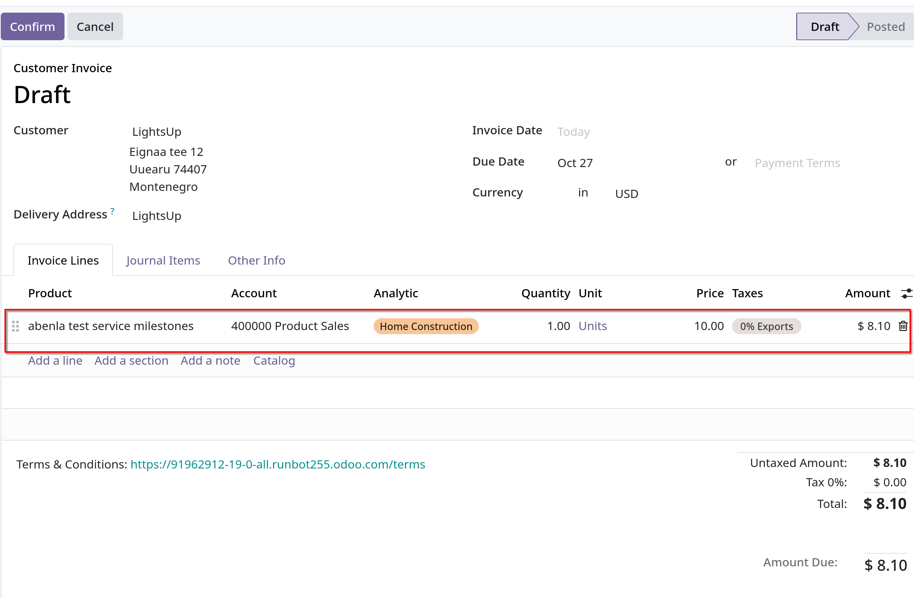

# Invoice project milestones

- Lập hóa đơn dựa trên project milestones có thể được dùng cho các projects đắt tiền hoặc quy mô lớn. Chuỗi các cột mốc quan trọng (milestones) trong một
  project thể hiện một trình tự công việc rõ ràng chắc chắn sẽ dẫn đến việc hoàn thành dự án hoặc hợp đồng.

- Phương pháp lập hóa đơn này đảm bảo công ty có dòng tiền ổn định trong suốt thời gian thực hiện dự án. Khách hàng cũng có thể theo dõi
  chặt chẽ từng giai đoạn phát triển của dự án, ngoài ra còn có thể thanh toán hóa đơn lớn thành nhiều đợt thay vì thanh toán tất cả một lúc.

## Create milestones products

- Trong Odoo, mỗi cột mốc quan trọng của dự án được xem là một products riêng lẻ.

- Để tạo products hoạt động kiểu như này, cần vào `Sales -> Products -> Products`, click `New` để tạo mới hoặc click vào 1 sản phẩm nào đó muốn chỉnh sửa.

- Trong product form, tại tab **General Information**, tại **Product Type** field chọn **Service**, field **Create on Order** cần chọn một trong các options được khoanh đỏ.
  

- Tiếp đến, **Invoice Policy** cần chọn **Base on Milestones**

- Lưu ý ở **Create on Order** các options:
  - **Task**: Odoo tạo một task liên quan tới cột mốc sản phẩm này trong `Project` app khi sản phẩm cụ thể này được đặt hàng.
  - **Project & Task**: Odoo tạo một dự án và task liên quan tới cột mốc sản phẩm này trong app `Project` khi một sản phẩm cụ thể này được đặt hàng.
  - **Project**: Odoo tạo một dự án liên quan tới cột mốc sản phẩm này trong app `Project` khi một sản phẩm cụ thể này được đặt hàng.

  - Khi **Project** hoặc **Project & Task** được chọn, cần phải chọn **Project Template** từ dropdown field
  - Khi **Task** được chọn, cần phải chọn **Project** từ dropdown field.

  - _Project Template_ cung cấp các tùy chọn mẫu để sử dụng cho project sẽ được tạo khi một sản phẩm cụ thể được đặt hàng.

## Invoice milestones

- **Ghi chú**: ở product form, chọn **Product Type** là **Service**, **Create on Order** là **Task**, **Project** là **Rebranching Projects**, **Invoice Policy** là **Based on Milestones**

- Để tạo hóa đơn milestones, vào `Sales -> New` để tạo mới một quotation, click **Add a product** ở **Order Lines** tab, chọn sản phẩm milestone tương ứng

- Khi đơn hàng được tạo, smart buttons **Milestones** được tạo, click vào sẽ dẫn tới trang **Milestones**, chọn **New** để thêm mới milestones
  

- Click vào smart button, tạo mới một milestones, thêm **Name**, chọn **Sales Order Item** tương ứng, cuối cùng gán **Deadline** nếu muốn

- Sau đó trở về sales order, thông qua đường dẫn, từ sales order, click **Task** smart button để hiển thị trang **Tasks** có nhiệm vụ
  cho từng mục trong đơn đặt hàng
- Để gán thủ công milestones đã được config vào một task, chọn 1 task mong muốn, trong form này, cọn milestones thích hợp trong **Milestones** field

- Nếu sản phẩm được cấu hình tạo _Task_, người dùng cần truy cập vào task đó và chọn milestones phù hợp để liên kết.
- Khi task được hoàn thành đồng nghĩa với việc cột mốc đó đã đạt được, lúc này có thể tạo hóa đơn cho milestone đó.

- Để đánh dấu milestones nào đó đã đạt được, vào trong đơn hàng, click vào **Milestones** smart button, check vào box ở cột **Reached**
  

  Sau khi tick **Reached** ở milestones, sales order ở tab **Order Lines**, cột **Delivered** sẽ được điền vào.

- **Create Invoice** để tạo hóa đơn bình thường, chọn **Create Draft** để tạo draft invoice
  

- Sau khi click **Pay** để thanh toán, invoice sẽ có banner **PAID**, click **Sales Order** smart button quay lại sales order, trong **Order Lines** sẽ xuất hiện
  cột **Invoiced**. Đồng thời **Invoices** smart button cũng xuất hiện để link tới hóa đơn

- Mỗi milestones lặp lại quy trình trên để lập hóa đơn và toàn bộ đơn hàng sẽ được thanh toán đầy đủ cho tới khi toàn bộ dự án được hoàn thành.
