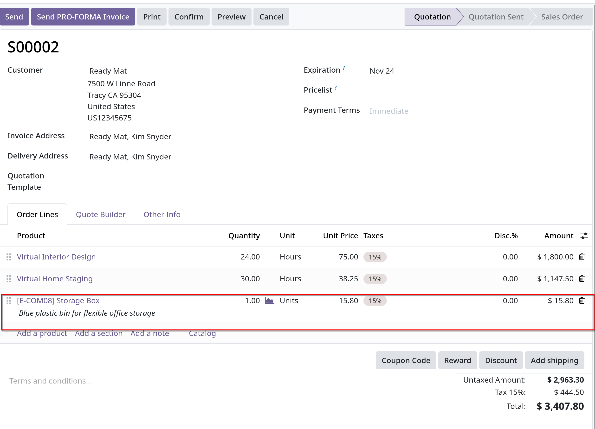

# Invoicing based on time and materials

- _Invoicing based on time and materials_ thường được dùng khi không thể ước tính chính xác quy mô của dự án hoặc khi các yêu
  cầu của dự án có thể thay đổi.

- Điều này khác với các hợp đồng với giá cố định, khi khách hàng đồng ý thanh toán tổng số tiền cụ thể để thực hiện hợp đồng - bất
  kể số tiền cần phải trả cho nhân viên, nhà thầu, nhà cung cấp,...

- Odoo `Sales` app có thể lập hóa đơn về thời gian và nhiều chi phí khác, cũng như các giao dịch mua hàng cần thiết để thực hiện đơn hàng.

## App and settings configuration

- Đầu tiên phải cài đặt `Project` và `Accounting` app

- Sau khi cài đặt, vào `Configuration -> Settings` tick chọn `Analytic Account` trong mục `Analytic`

- Tính năng `Timesheets` của `Project` phải được active trong `Project -> Configuration -> Settings` tick vào `Timesheets` trong **Time Management**

## Service product configuration

- Odoo có thể lập hóa đơn cho thời gian dành cho một project dựa vào tính năng `Timesheets`. **Chú ý**: việc lập hóa đơn cho thời gian
  dành cho 1 project chỉ có thể thực hiện với các products có _Product Type_ là _Service_

- Để tạo, vào `Sales -> Products -> Products`, click `New` hoặc chọn 1 sản phẩm muốn edit, trong product form, mục **General Information**, set **Product Type** là **Service**,
  ở **Invoice Policy** chọn **Based on Timesheets**, ở **Create on Order** chọn **Project & Task**
  

- **Chú ý**: Nếu **Task** được chọn ở **Create on Order** thì field **Project** sẽ xuất hiện, chọn Project tương ứng.
  

## Add time spent to sales order

- Sau khi config xong cho service products, tạo mới quotation, thêm các service products đã config ở trên vào báo giá. Sau khi confirm thành sales order,
  các smart buttons như **Project** và **Tasks** sẽ xuất hiện.
- Thời gian được thêm vào thông qua tab **Timesheets** trên task form
- Nhân viên có thể được gán vào project, thời gian làm việc được thêm vào cột **Hours spent** cùng với **Date** và **Employee**
  
  Sau khi click vào **Project** smart button
  

  Sau khi click vào kanban card, có thể gán employee, _Date_ và time spent working (thời gian thực hiện tasks) _Time spent_ ở tab **Timesheets**
  

## Invoice time spent

- Sau khi config các nhân viên và thời gian thực hiện tasks cụ thể từng nhân viên, có thể quay lại sales order bằng smart button **Sales Order**
  để tạo invoice cho khách hàng về số giờ đó
- Trở về sales order form, ta có thể theo dõi timesheets bằng smart button **Record Hours**
  
- Tạo hóa đơn bằng click **Create Invoice**, chọn **Regular Invoice**, chọn **Create Draft**
  

  **Chú ý**: vào mục **Analytic Distribution** trong hóa đơn, đây là thông tin để đảm bảo các nhiệm vụ lập time/material hóa đơn được hoàn thành đúng đắn và chính xác.

- **Confirm** để tạo hóa đơn và tiếp tục quy trình

## Expense Configuration

- Để theo dõi chi phí hóa đơn liên quan tới đơn đặt hàng, cần cài app `Expenses`.

### Add expenses to sales order

- Để thêm chi phí vào sales order, vào `Expenses` app, từ dashboard chọn **New**, trong expenses form, thêm **Description** của chi phí này, mục **Category**, chọn option thích hợp
  _Meals_, _Mileage_, _Gifts_, _Communication_, _Expenses_, _Travel & Accommodation_. Có thể thêm mới **Category** từ `Expenses -> Configuration -> Expense Categories`

- Nhập tổng chi phí ở **Total**, **Include taxes**, chọn **Employee**, **Paid by** chọn **Employee (to reimburse)** hoặc **Company**
  ở **Customer to Reinvoice**, chọn sales order muốn, sau đó sẽ xuất hiện **Analytic Distribution**, sẽ có smart button về sales order
  
  Nếu có biên nhận (receipt) nào muốn đính kèm thì click vào **Attach Receipt**, sau đó click **Submit** để gửi cho quản lý.

  Ở giao diện quản lý, click **Approve** hoặc **Reject** để duyệt hoặc từ chối expense
  

- Sau khi được _Approved_, có thể click **Post Journal Entries**, chọn **Expense** để post lên nhật ký kế toán.
  

### Invoice expenses

- Để tạo hóa đơn cho khách hàng cho một _expenses sales order_, sau khi xong phần _expenses_, click vào **Sales Order** smart button để quay về đơn đặt hàng.
  Tại _Order Lines_ tab của sales order, sẽ hiển thị 1 dòng của expenses ta đã tạo bên app `Expenses`
  

- Lúc này để tạo invoice cho khách hàng, click **Create Invoice**, chọn **Regular Invoice**, **Create Draft**, làm vậy sẽ show ra form
  tạo draft invoice cho expense
  

## Purchase configuration

- Để tạo hóa đơn với các purchase (giao dịch mua) theo sales order cho khách hàng, cần cài đặt `Purchase` app.

### Add purchase to sales order

- Để thêm một purchase vào sales order, một purchase order phải được tạo. Để tạo purchase order, cần vào `Purchase -> New`

- Trong form new purchase, thêm **Vendor** field, ở **Products** tab, click vào **Add a product** hoặc **Catalog** để thêm products
  Tại cột **Analytic Distribution**, click và chọn từ danh sách dropdown, chọn **Departments** cho phân tích phân phối liên quan đến
  đơn đặt hàng mong muốn lập hóa đơn cho giao dịch mua (purchase)

- **Quan trọng**: để lập một hóa đơn purchase trên một sales order, products trong purchase phải được tick vào field **Can be Expensed**, **Invoice Policy** là **Deliverd quantities**
  và tại field **Re-invoice Expenses** phải tick chọn **At cost**

- Sau khi thêm products vào **Products** tab, click **Send RFQ** để gửi đi một yêu cần mua hàng cho báo giá, sau đó click **Confirm Order** để xác nhận
  Sau đó click **Receive** khi nhận được sản phẩm từ vendor, điều này giúp tạo một form biên nhận (receipt)
  
  

### Invoice purchase

- Để lập hóa đơn cho purchase, đầu tiên cần thêm purchase vào sales order, vào `Sales -> Order`, chọn order hoặc tạo mới, tại **Order Lines** tab,
  thêm vào purchased products đã thực hiện ở bước trên
  

- **Create Invoice** như thường, sau khi tạo draft invoice, một dòng purchase được thêm mới ở **Invoice Lines** tab, sau đó click **Confirm**
  và **Register Payment** để thanh toán.
