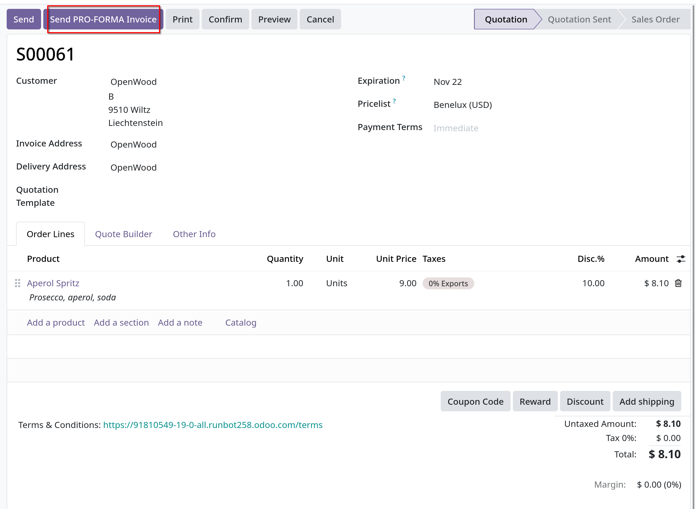
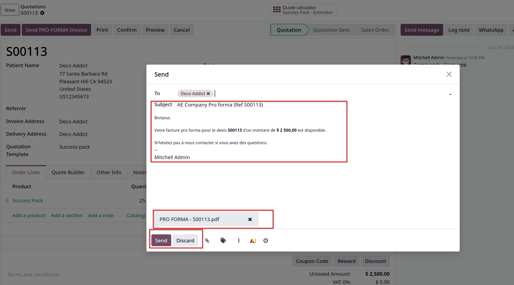

# Pro-forma invoices

- Pro-forma invoices là một hóa đơn rút gọn hoặc ước tính được gửi trước khi giao hàng. Nó ghi lại loại và số lượng hàng hóa,giá trị
  của chúng và các thông tin quan trọng khác, chẳng hạn như trọng lượng hoặc chi phí vận chuyển.

- Pro-forma invoices thường được sử dụng làm hóa đơn sơ bộ kèm theo báo giá. Chúng cũng được sử dụng trong quá trình nhập khẩu cho
  mục đích hải quan. Chúng khác với hóa đơn thông thường ở chỗ chúng không phải là một yêu cầu thanh toán.

## Configuration

- Vào `Sales -> Configuration -> Settings` tại `Quotation & Orders` chọn vào check box **Pro-forma Invoice** để active tính năng này

## Send Pro-forma invoice

- Sau khi đã active trong settings, giờ vào chi tiết quotations sẽ có button **Send PRO-FORMA Invoice**
  

- **Ghi chú**: không thể gửi pro-forma invoice cho một sales order hay quotation nếu một invoice cho một down payment đã được gửi hoặc cho gói đăng ký định kỳ
  **Send Pro-forma Invoice** button sẽ không xuất hiện. Hóa đơn pro-forma có thể được gửi cho dịch vụ, đăng ký event, khóa học, hay đăng ký gia hạn mới. Pro-forma
  không giới hạn ở hàng hóa vật lý, hàng tiêu dùng hay hàng hóa có thể lưu trữ.

- Khi click button **Send Pro-forma Invoice**, một cửa sổ gửi email sẽ xuất hiện
  

- Nếu muốn preview pro-forma invoice, click vào file pdf đính kèm trong email.
