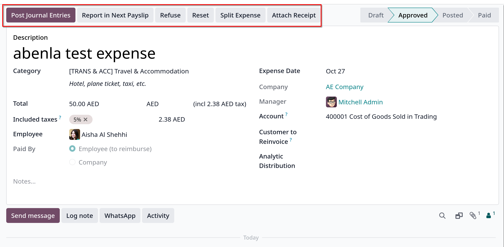

# Reinvoice expenses to customers

- Khi thực hiện dự án cho khách hàng, nhân viên thường phải tự bỏ tiền chi trả cho nhiều chi phí khác nhau.

## Expenses applicattion

- Phải cài đặt app `Expenses` trước để thực hiệp lập lại hóa đơn cho một khoản phí nào đó cho khách hàng.

## Add expenses to sales orders

- Vào `Sales -> New` tạo mới quotation hoặc click vào sales order đã confirmed
- Ở tab **Order Lines** click **Add a product** để thêm sản phẩm, sau đó click **Confirm** để chuyển thành sales order

- Vào app `Expenses`, chọn `New` để tạo mới một khoản chi phí, trong expense form

- Thêm **Description**, ở **Category** field, có các options:
  - _Communication_: bất kỳ một hình thức giao tiếp nào liên quan tới một project/sales order
  - _Meals_: mọi hình thức chi phí bữa ăn liên quan tới project/sales order
  - _Gifts_: bất kỳ hình thức chi phí quà tặng nào liên quan tới project/sales order
  - _Mileage_: bất kỳ hình thức chi phí về số dặm (nhiên liệu) liên quan tới project/sales order
  - _Travel & Accommodation_: mọi chi phí đi lại hoặc ăn ở liên quan tới project/sales order
  - _Expense_: các hình thức chi phí khác

- Ví dụ, ta chọn _Travel & Accommodation_ ở **Category**, Nhập **Total**, **Include taxes**, **Paid by** chọn **Employee (to reimburse)** để hoàn trả lại nhân viên trong bảng lương.

- Bên phải form ta có **Expense Date** và **Account** field sẽ tự động điền sau khi điền các field trên. Chọn tiếp **Customer to Reinvoice** để chọn khách hàng tái hóa đơn
  chọn sales order thích hợp mà expense này nên đính vào.

- Cuối cùng là **Analytic Distribution** và **Company** field.
- Ta có thể đính kèm biên nhận vật lý/số, submit và chia chi ở 3 buttons: _Attach Receipt_, _Submit_ và _Split Expense_

- Sau khi _Submit_, ta có thể _Approve_ để duyệt chi phí này, sau khi được duyệt, 1 hàng button sẽ xuất hiện ở form expense
  

- **Quan trọng**: field **Custom to Reinvoice** chỉ active cho các category _[TRANS & ACC]_, _[COMM]_, _[FOOD]_, _[MIL]_
  Để active reinvoicing cho tất cả các loại expenses vào `Expenses -> Configuration -> Expenses Category`, vào từng category, ở **Invoicing** menu, tick vào 3 options trong **Re-Invoice Expenses** field.

## Reinvoice expense

- Vào `Sales -> New` để tạo mới quotation, hoặc chọn sales order thích hợp để tái lập hóa đơn chi phí.
- Trong sales form, **Order Lines** tab, chọn expense đã cấu hình trước ở app `Expenses`, lưu ý cột **Delivered** được tự điền.

- **Create Invoice** và **Create Draft** để tạo hóa đơn. Sau đó click vào **Confirm** để xác nhận hóa đơn chuyển trạng thái thành **Posted**
- Tại tab **Invoice Lines**, sẽ hiển thị expenses trong product line, click **Pay** để thanh toán hóa đơn.
