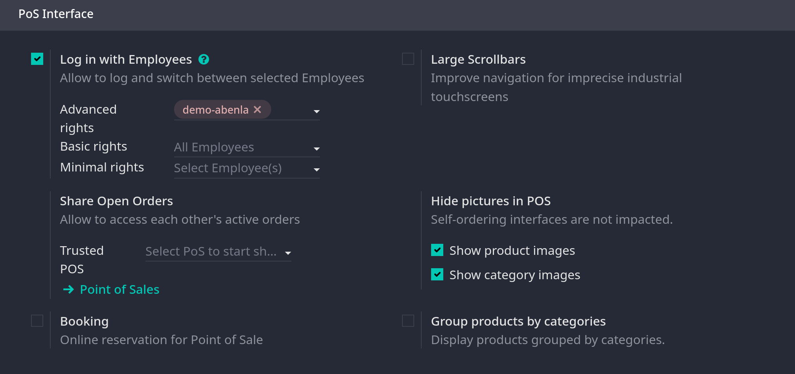

# Configuration

## Access the POS settings

- Vào `Point of Sale -> Configuration -> Settings`, mở dropdown menu trong field **Point of Sale** và chọn POS để config

- **Ghi chú**: các settings này chỉ áp dụng cho Administration access rights

## Make products available

1. Vào `Point of Sale -> Products -> Products`
2. Mở form
3. Tick **Point of Sale** ở trên top của form.

## PoS product categories

### Configuration

- Vào `Point of Sale -> Configuration -> Pos Product Categories`, chọn **New** để tạo mới một category. Có thể fill field **Parent Category** để kết hợp với category cha.

### Assign PoS product categories

- Ở `Point of Sale -> Products -> Products`, vào **Point of Sale** tab và điền field **Category** ở phần **Point of Sale**, có thể chọn một hoặc nhiều categories cho một product

### Restrict categories

- Có thể giới hạn hiển thị categories ở giao diện POS, vào `Point of Sale -> Configuration -> Settings`, mục **Product & PoS Categories**
  
  
