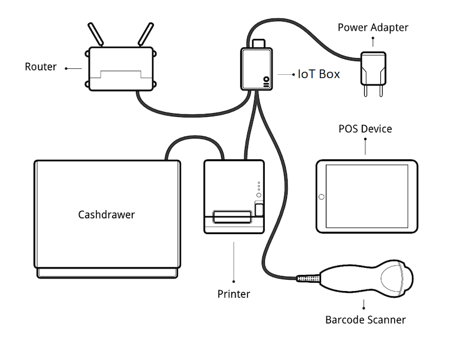

# IoT system connection

- Để kết nối POS tới một hệ thống IoT
  1. Đảm bảo POS và IoT app được cài trên cơ sở dữ liệu
  2. Cài đặt **IoT Box**
  3. Kết nối thiết bị ngoại vi tới hệ thống IoT:
  - _Printer_: kết nối máy in biên lai được hỗ trợ với cổng USB hoặc mạng
  - _Cash drawer_: ngăn đựng tiền phải được kết nối tới máy in bằng cáp RJ25
  - _Barcode scanner_: máy quét mã vạch phải kết thúc mã vạch bằng ký tự **ENTER** - mã ASCII 28
  - _Scale_: kết nối cân
  - _Customer display_: kết nối màn hình tới hệ thống IoT
  - _Payment termial_
  4. Kết nối hệ thống IoT tới database
  5. Truy cập POS settings, chọn POS, chọn vertical ellipsis và click **Edit**, kéo xuống **Connected Devices**, enable **IoT Box**, chọn thiết bị và **Save**

- Ví dụ về một mô hình kết nối
  
