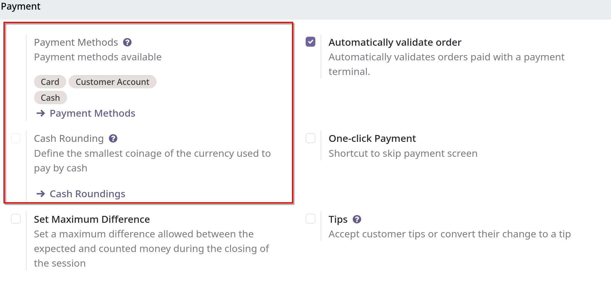
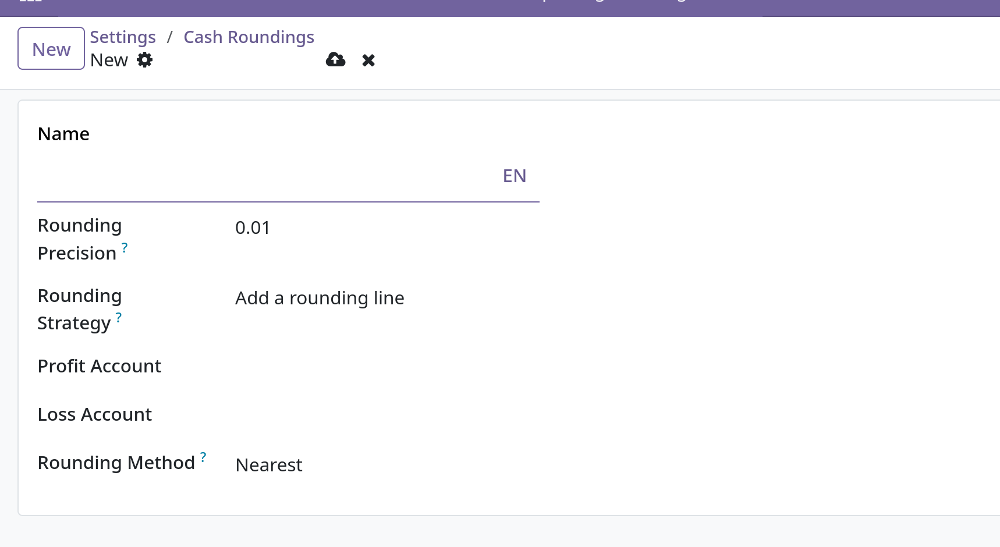

# Cash rounding

**Cash rounding** cần thiết khi mệnh giá vật lý đồng xu hoặc tiền tệ lại cao hơn đơn vị tính giá tối thiểu của đơn hàng.

## Configuration

Vào `Point of Sale -> Configuration -> Settings` enable **Cash Rounding** và **Save**

** Có thể thêm các phương thức làm tròn khác bằng cách click vào **Cash Roundings\*\*

