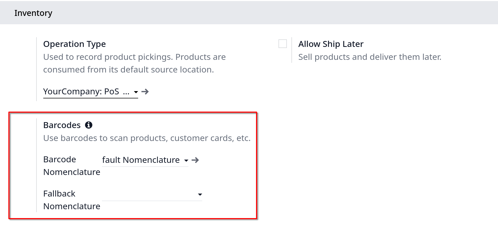

# Discount tags (barcode scanner)

**Đây là tính năng của enterprise do cần phải có súng barcode**

Nếu muốn bán sản phẩm với một mã giảm giá, chọn sản phẩm gần tới ngày hết hạn chẳng hạn, sau đó thêm thẻ giảm giá (tag). Cho phép bạn scan mã barcode giảm giá

** Ghi chú**: để sử dụng các thẻ giảm giá, bạn cần phải có barcode scanner

## Barcode Nomenclature

Để dùng discount tags, ta cần phải hiểu về danh pháp barcode. Vào trong POS setting, xuống mục **Inventory** trong **Barcodes**

## Scan the products & tags

Đầu tiên là scan mã sản phẩm, kế tiếp scan mã thẻ giảm giá
