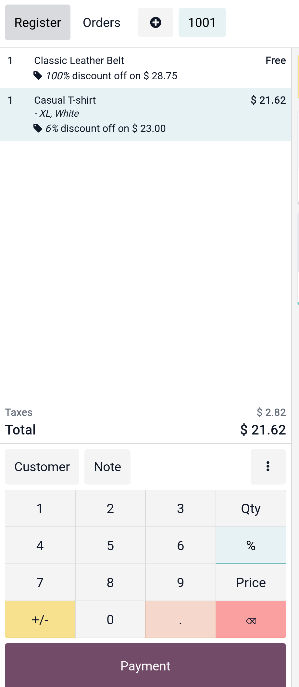
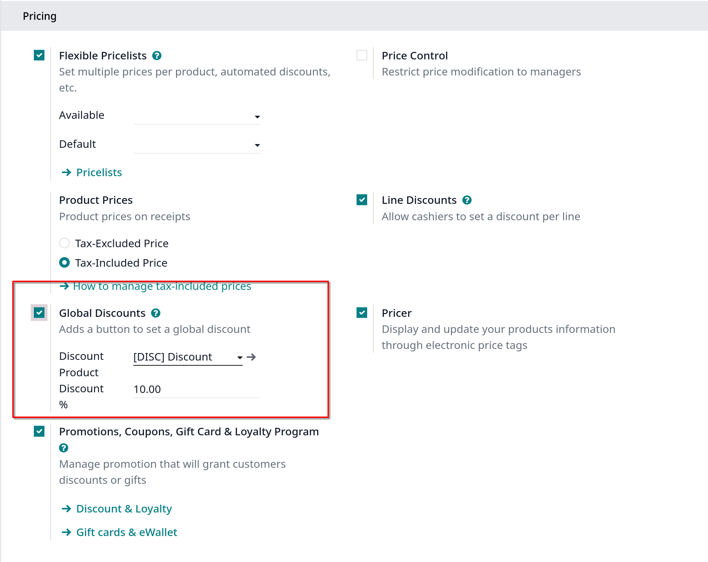
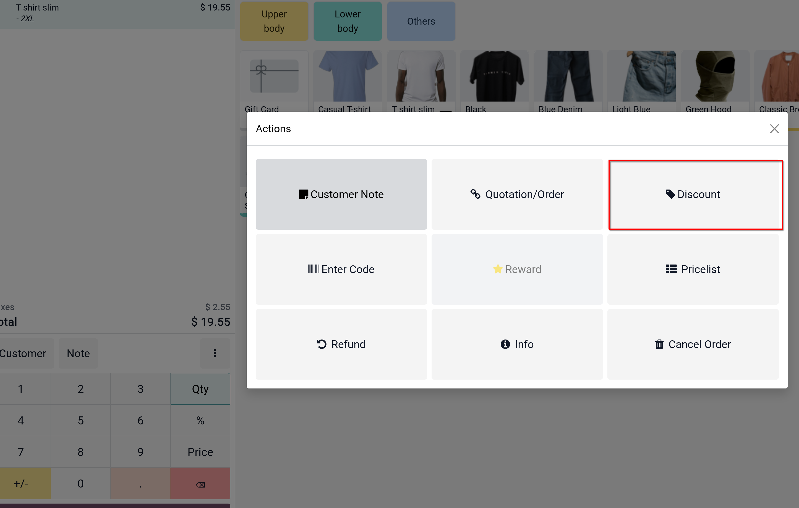
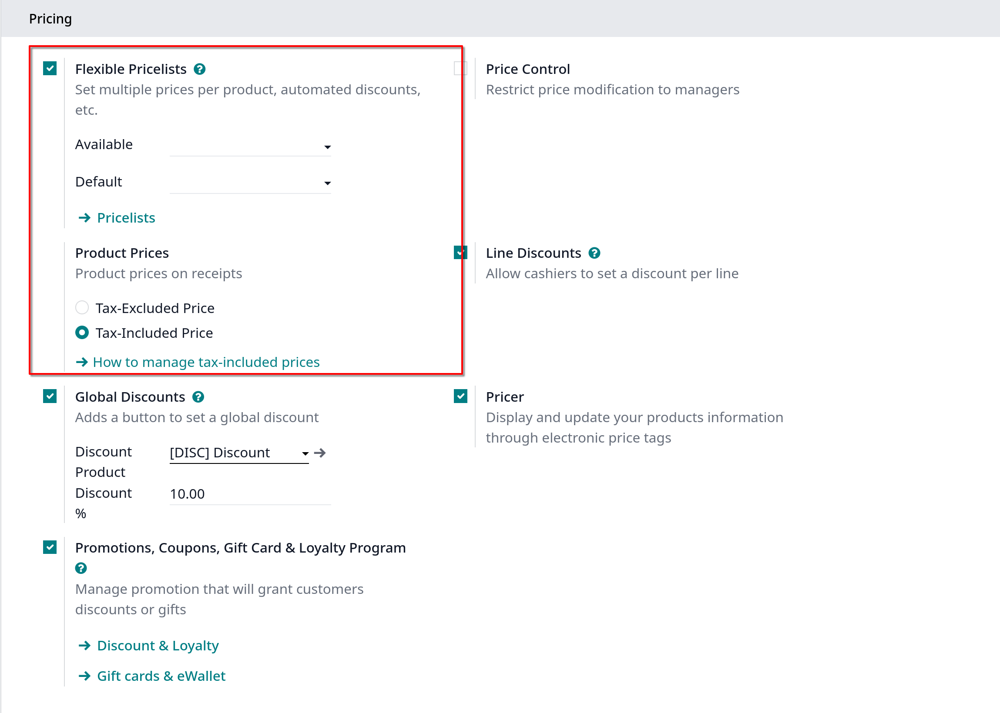
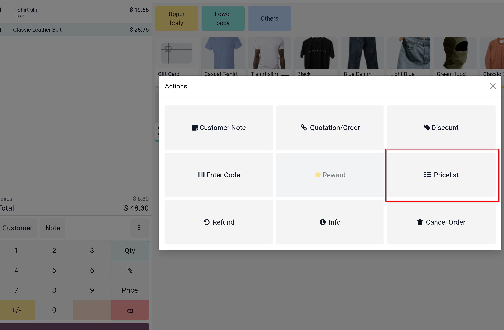

# Discounts

Thêm discounts sẽ giúp bạn lôi kéo khách hàng để tăng doanh thu của nhà hàng

## Apply manual discounts

Nếu hiếm khi bạn sử dụng discounts, việc áp dụng discounts thủ công có thể là giải pháp dễ dàng nhất cho POS của bạn

### Apply discount on a product

Từ PoS session, sử dụng button **%** để nhập giảm giá thủ công cho sản phẩm

### Apply a global discount

Để áp dụng discount trên toàn đơn hàng, vào `Point of Sale -> Configuration -> Point of Sale` chọn một POS

Sau đó chọn **Global discounts** dưới **Pricing** category

Để dùng giảm giá này ở POS session, click vào Button _Discount_ ở button vertical ellipsis

### Apply time-limited discounts

Để active time-limited discounts, bạn phải activate tính năng _Pricelists_, vào `Point of Sales -> Configuration -> Settings`, chọn POS muốn setup, kéo xuống **Price**, chọn **Flexible Pricelist**, chọn
pricelist tương ứng ở Available và Default, muốn setup thêm pricelist thì click vào **Pricelists**

#### Using a pricelist with POS interface

Trên POS interface, một button mới xuất hiện, click chọn vào nó để chọn pricelist

