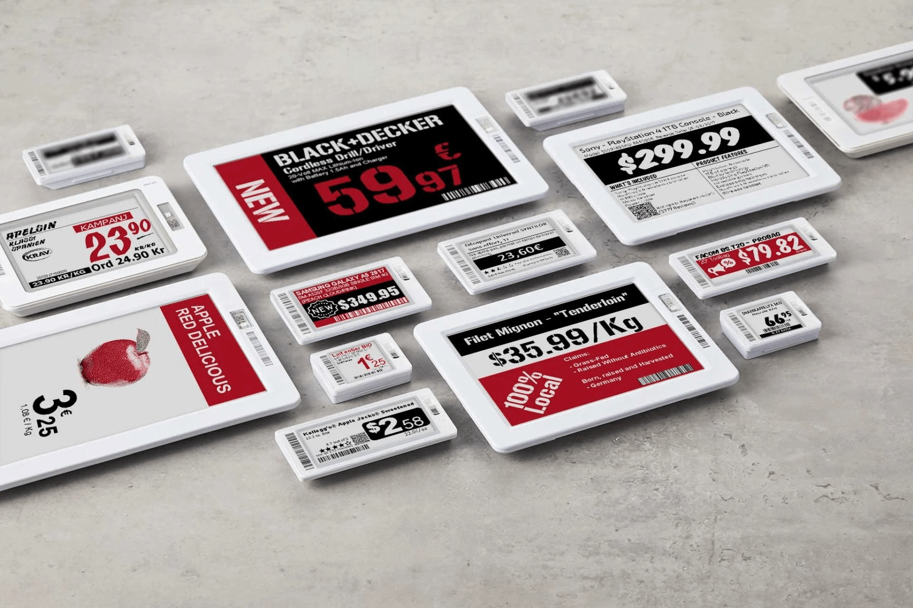

# Electronic shelf labels

Electronic shelf label cho phép bạn hiển thị thông tin sản phẩm như giá cả và mã vạch lên kệ hàng và tự đồng bộ chúng từ xa.
Việc này giúp loại bỏ nhu cầu in nhãn mới khi thông tin sản phẩm thay đổi.

## Configuration

### [Pricer setup](https://www.odoo.com/documentation/19.0/applications/sales/point_of_sale/pricing/electronic_labels.html#pricer-setup)

### Odoo setup

#### Pricer stores

Vào `Point of Sale -> Configuration -> Pricer Stores`, click `New` và điền các thông tin sau:

- Store name
- Pricer Tenant name: tên công ty mà tài khoản Pricer nằm trong đó
- Pricer Login: tên đăng nhập tài khoản Pricer
- Pricer Password: mật khẩu đăng nhập Pricer
- Pricer Store ID: ID của cửa hàng Pricer tương ứng trên cơ sở dữ liệu Pricer của bạn
  **Ghi chú**: Pricer Tags tự động cập nhật khi nhãn được linked vào sản phẩm. Last Update và Last Update Status cũng tương tự.

#### Pricer Tags

Nhãn để hiển thị thông tin sản phẩm:

1. Vào `Point of Sale -> Products -> Products`, click `New` hoặc chọn sản phẩm đã có
2. Ở **Sales** tab, kéo xuống mục **Pricer**, chọn **Pricer Store** tương ứng
3. Điền field **Pricer tags ids** bằng cách copy ID của nhãn hoặc scan barcode của nó

**Lưu ý**: Pricer tag IDs được tổng hợp từ 1 ký tự, theo sau là 16 số

### Practical application

Odoo tự gửi requests tới Pricer để đồng bộ các tags mỗi 12h nếu bạn có bất cứ thay đổi nào ở:

- product name, price, barcode, customer taxes
- currency
- pricer store được liên kết hoặc pricer tags

Để force update, vào `Point of Sale -> Configuration -> Pricer Store`:

1. chọn Pricer store
2. click Update tags để update tất cả tags bị tác động bởi thay đổi ở trên.

Nếu Pricer xử lý thành công request, cột **Last Update Status** sẽ có trạng thái **Update successfully sent to Pricer**

### Discount labels

Để hiển thị nhãn giảm giá, cần link pricelist tới các biến thể sản phẩm kết hợp với tag

1. Vào `Point of Sale -> Products -> Product Variants`
2. chọn sản phẩm

Sau đó, chọn bảng giá mong muốn

1. vào tab **General Infomation**
2. chọn bảng giá ở **Pricer Sales Pricelist** field

Sau khi bảng giá được đặt, field **On Sale Price** sẽ xuất hiện, hiển thị **Sales Price** với giảm giá được áp dụng
