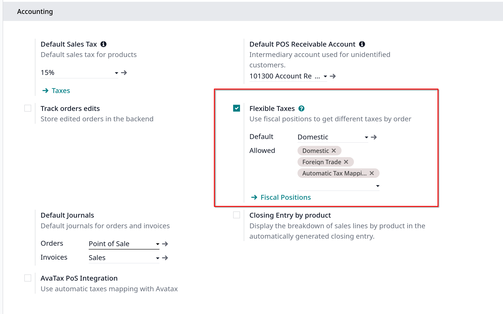
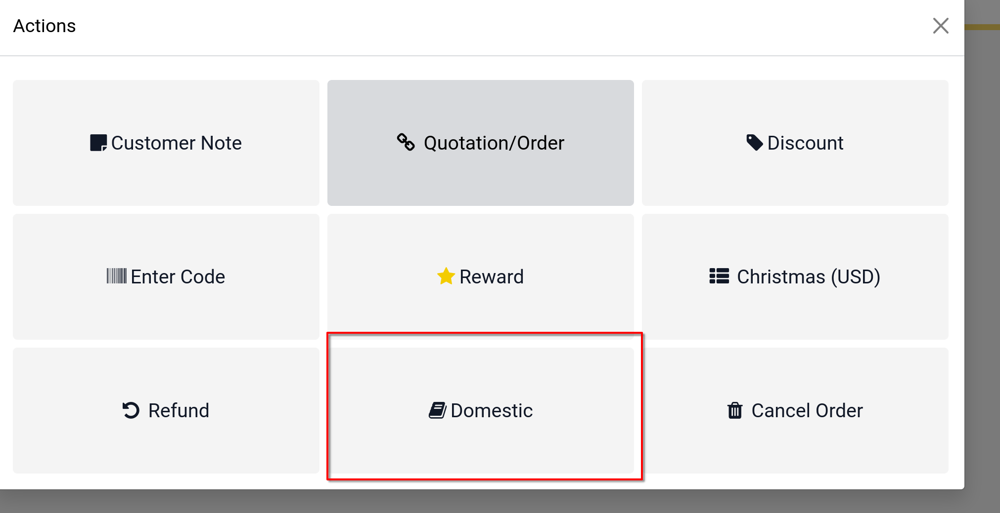

# Flexible taxes (fiscal position)

Khi điều hành một doanh nghiệp, bạn cần áp dụng các loại thuế khác nhau và ghi lại các giao dịch trên nhiều tài khoản khác nhau
dựa trên địa điểm và loại hình kinh doanh của khách hàng và nhà cung cấp của bạn

**Fiscal positions** cho phép bạn thiết lập các quy tắc tự động chọn đúng loại thuế và tài khoản được sử dụng cho mỗi giao dịch

## Configuration

Vào POS settings, kéo xuống mục **Accounting** enable **Flexible Taxes**

Sau đó chọn fiscal position mặc định bạn muốn apply tất cả doanh số bán hàng trong POS ở field **Default**. Bạn cũng có thể thêm nhiều fiscal positions trong field **Allowed**

Bạn cũng có thể thêm fiscal position trong mục **Fiscal positions**

## Use fiscal positions

Mở POS session để sử dụng các fiscal positions được phép bằng cách click vào **book-shaped** button và chọn fiscal position từ danh sách.

