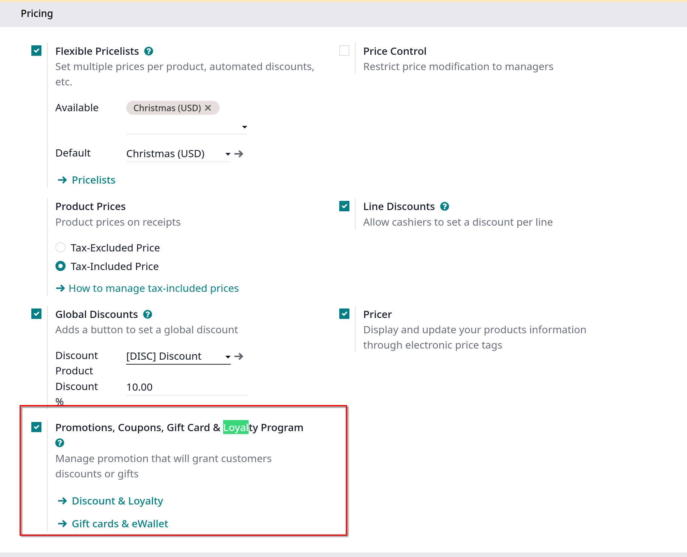
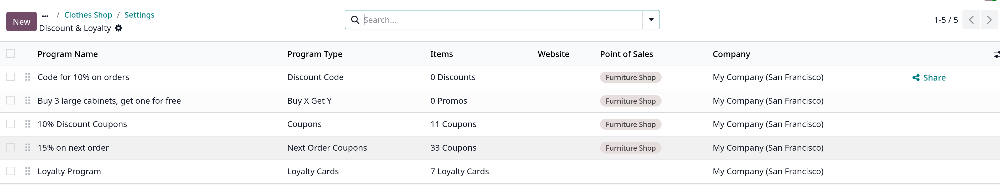
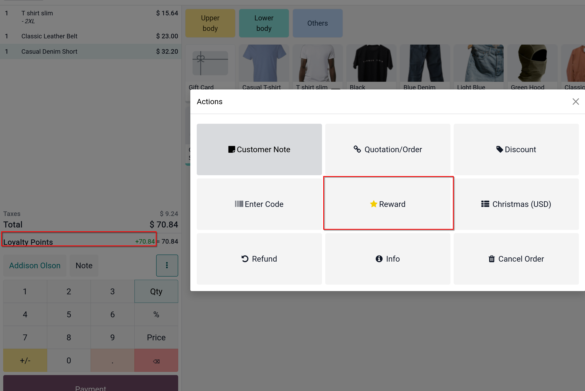

# Loyalty programs

Khuyến khích khách hàng tiếp tục mua sắm tại POS với chương trình _Loyalty program_

## Configuration

Vào `Point of Sale -> Configration -> Settings`, chọn POS, xuống mục **Pricing**, chọn vào **Promotions, Coupons, Gift Card & Loyalty Program**

Sau đó click vào _Discount & Loyalty_ để có thể tạo mới chương trình khách hàng thân thiết bạn muốn, rule setup tương tự như ở module [Sales](../../Product%20and%20prices/discount-and-loyalty-program.md)

## Use the loyalty program in your POS interface

Khi một khách hàng được chọn, bạn sẽ thấy số điểm họ sẽ nhận được sau khi giao dịch và số điểm đó sẽ được tích lũy tới lúc họ muốn chi tiêu.
Họ chi tiêu bằng cách đổi điểm loyalty ở nút Rewards khi tích đủ điểm ở chương trình

