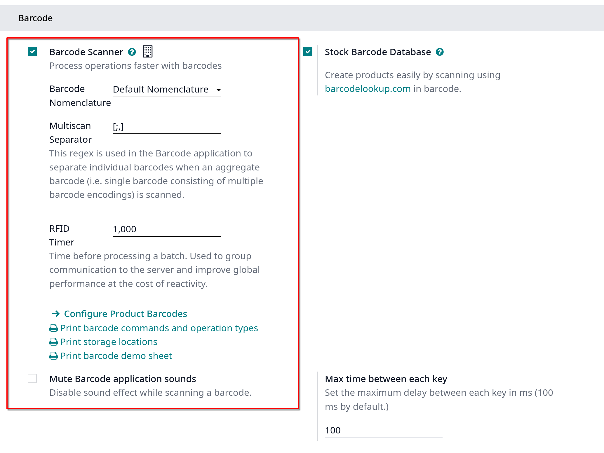

# Barcodes

- Sử dụng súng barcodes xử lý đơn hàng tại POS giúp tăng tốc độ xử lý cho khách hàng. Súng barcodes có thể được sử dụng để scan sản phẩm hoặc là
  đăng nhập nhân viên vào POS session

## Configuration

- Để sử dụng súng barcodes, vào `Inventory -> Configuration -> Settings` trong **Barcode** section, tick vào **Barcode Scanner** và **Save**
- **Lưu ý**: chỉ có bản enterprise mới hỗ trợ súng barcodes
  

## Assign barcodes

### To your products

- Để dùng tính năng này trên POS, sản phẩm của bạn phải được gắn mã barcode. Vào `Point of Sale -> Products -> Products`, mở product form
  ở **Barcode** field trong **General Information** tab

### To your employees

- Để thêm 1 số định danh cho một nhân viên, vào app `Employees`, mở employee form. Chọn một số định danh cho nhân viên của bạn, rồi điền vào field **PIN** ở **HR Settings** tab

## Use barcodes

### Scan products

- Khi quét mã barcode ở sản phẩm, sản phẩm sẽ được trực tiếp thêm vào giỏ hàng, để tăng số lượng sản phẩm, quét lại nhiều lần hoặc click vào field **Qty**, nhập số lượng bằng keypad

### Log employees

- Có thể dùng súng barcode, quét mã nhân viên để đăng nhập vào POS session
