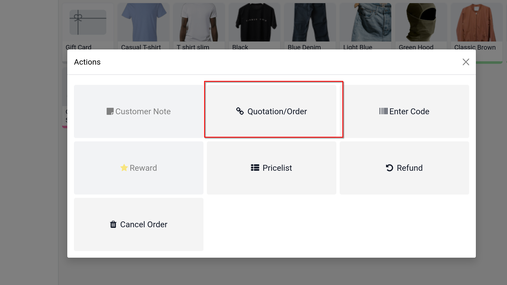
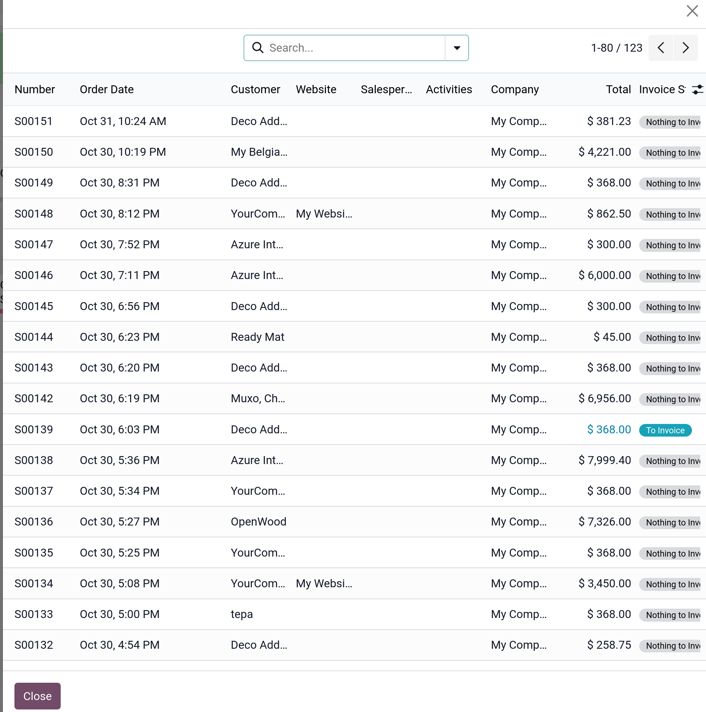

# Sales orders

- Với Odoo `Point of Sale`, ta có thể dễ dàng tạo đơn hàng và thanh toán trực tiếp tại điểm bán hàng.

## Select a sales order

- Mở POS session từ app `Point of Sale`. Chọn **Quotations/Orders** để lấy danh sách các quotations và sales orders được tạo trên ứng dụng bán hàng.
  
  

## Apply a down payment or settle the order

- Từ danh sách quotations/orders ở trên, chọn 1 quotation/order cụ thể, ta có thể:
  - Xử lý một phần đơn hàng (**partially**): sau khi click vào **Apply a down payment**, nhập % tiền đặt cọc bạn muốn khách thanh toán. Sau đó click **ok** và tiến hành đặt hàng
  - Xử lý toàn bộ đơn hàng (**completely**): click **Settle the order** để thanh toán tổng số tiền cho đơn hàng.

- **Ghi chú**: Sau khi bạn xử lý toàn bộ đơn hàng, khoản down payment được tự động khấu trừ vào tổng số tiền.
