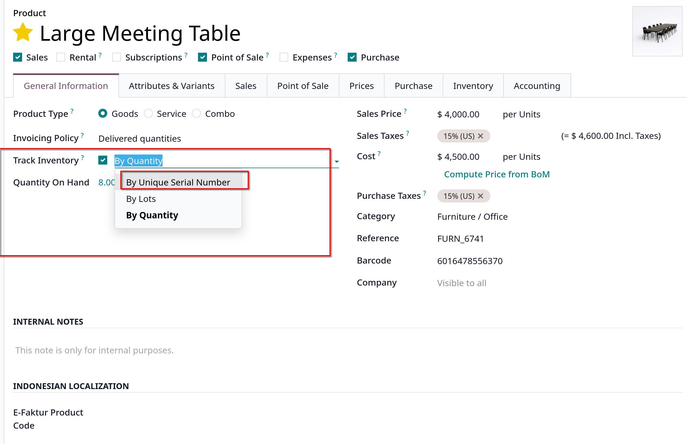
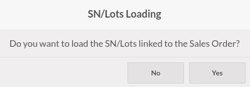
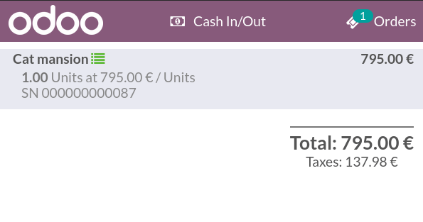

# Serial numbers and lots

- Với số serial và số lô (lots) cho phép tracking hành trình của sản phẩm. Khi sản phẩm được tracked, hệ thống sẽ xác định vị trí của chúng dựa trên chuyển động cuối cùng

- Vào `Point of Sales -> Products -> Products`, chọn một sản phẩm và check **Tracking By Unique Serial Number** hoặc **Tracking By Lots** trong tab **Inventory**
  

## Serial numbers and lots imporation

- Bạn có thể import số serial và số lots trong POS. Để làm việc này, chọn một sales order hay quotation có các sản phẩm được tracking bởi số serial hoặc lots như trên.
  Click **Yes** để đồng ý load **Lots or Serial Numbers** liên kết với sales order
  

- Sau khi import tracking numbers, số serial hoặc lots sẽ xuất hiện dưới sản phẩm được track
  

## Serial numbers and lots creation

- Nếu sản phẩm được tracked khả dụng trên POS, thêm sản phẩm vào giỏ hàng sẽ hiển thị popup bạn có thể nhập hoặc scan số serial của sản phẩm hoặc lots number.
