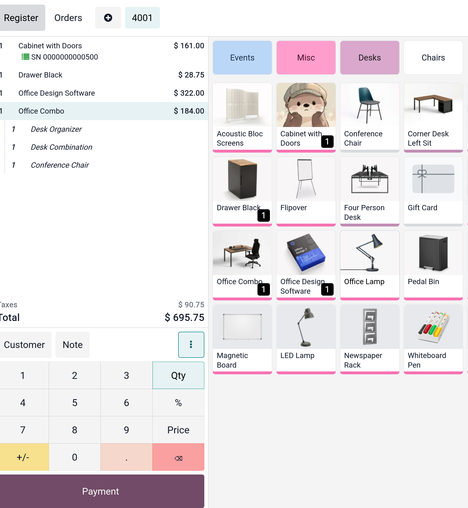
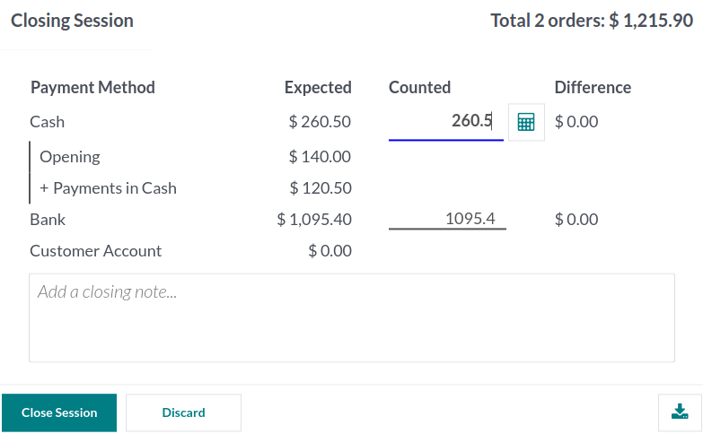

# Point of Sales

- App `Point of Sale` hay `POS` trong Odoo có thể được sử dụng dễ dàng ở bất cứ thiết bị nào có web browser ngay cả khi bạn tạm thời offline
  Việc di chuyển sản phẩm được đăng ký tự động trong kho, số liệu thống kê theo thời gian thực, và dữ liệu của bạn được tổng hợp trên tất cả các shop

## Start a session

- Từ **POS Dashboard**, chọn **New session** mở màn hình **Opening Cash Control**, click **Open Session** để bắt đầu POS session hay click **Continue Selling**
  nếu session đã được mở.

- **Ghi chú**: nhiều người có thể cùng login vào một session tại một thời điểm. Tuy nhiên, session chỉ có thể mở một lần trên cùng trình duyệt.

## Sell products

- Click vào sản phẩm để thêm chúng vào giỏ hàng, thay đổi số lượng thì click vào **Qty**. Thêm một discount hay thay đổi giá sản phẩm,
  click vào **% Disc** hay **Price** để điều chỉnh.

- Sau khi đơn hàng đã hoàn thành, tiến hành checkout bằng cách click vào **Payment**, chọn _payment method_, nhập số và click **Validate**.
  Click **New Order** để chuyển sang khách hàng tiếp theo

- **Tip**: **Cash** được mặc định chọn nếu không chọn payment method
- **Ghi chú**: hệ thống chỉ load một số giới hạn các sản phẩm để tối ưu việc mở session, click **Search More** nếu sản phẩm không được load tự động.

## Set customers

- Đăng ký khách hàng của bạn là cần thiết để thu thập điểm loyalty và cấp phần thưởng cho họ, tự động apply bảng giá hoặc tạo và in hóa đơn.

- Bạn có thể tạo khách hàng từ POS session bằng việc click vào `Customer -> Create`, điền các fields của thông tin contact. Hoặc cũng có thể tạo khách hàng ở backend
  bằng việc vào `Point of Sale -> Orders -> Customers` và click `New`. Sau đó điền thông tin và lưu

- Có thể truy cập danh sách khách hàng bằng click vào `Customer` trên giao diện POS. Hoặc cũng có thể đặt một customer ở màn hình thanh toán bằng việc click vào `Customer`

## Customer notes

- Có thể thêm **customer notes** về các sản phẩm nhất định trên một POS session mở. Chúng cũng có thể được sử dụng để theo dõi yêu cầu cụ thể của khách hàng

- Để thêm customer notes, chọn vào một sản phẩm, click **Customer Notes** trên bảng sẽ show ra một popup window để nhập nội dung notes.

- **Ghi chú**: ghi chú sản phẩm từ một sales order được imported hiển thị ngay trong giỏ hàng

- **Customer notes** xuất hiện ở biên lai và hóa đơn tương tự như việc xuất hiện ở giỏ hàng checkout

## Return and refunds products

Các bước cần thực hiện để trả hàng và hoàn tiền

1. Bắt đầu một session từ POS dashboard
2. Click vào vertical ellipsis icon, chọn **Refund** và chọn đơn hàng tương ứng
3. Chọn sản phẩm muốn trả, nhập số lượng và click **Refund**
4. Click **Payment** và chọn phương thức thanh toán hoàn tiền phù hợp
5. Click **Validate** và in biên lai nếu cần
6. Click **New Order** để xử lý khách hàng kế tiếp

- **Tip**: để lọc danh sách đơn hàng theo **Reference**, **Receipt Number**, **Date**, **Customer**, nhập giá trị trên thanh tìm kiếm và chọn filter thích hợp từ dropdown
  Khi tổng tiền âm, việc thêm thẻ quà tặng vào giỏ hàng sẽ tự điều chỉnh số dư thẻ quà tặng để khớp với số tiền đó.

- **Ghi chú**: ngoài ra, việc hoàn tiền có thể được xử lý bằng cách chọn các sản phẩm được trả lại từ một open session và đặt số lượng âm bằng số lượng mặt hàng được trả lại
- Khi khoản thanh toán hoàn trả được xác thực, Odoo sinh ra một credit note, tham chiếu đến receipt, hay invoice gốc và hủy một phần hay toàn bộ tài liệu

## Manage the cash register

- Để thêm hoặc rút tiền từ register, click vào menu icon ở góc phải và chọn **Cash In/Out** sẽ show ra popup window, chọn _Cash In_ hoặc _Cash Out_, nhập số và confirm.

## Close the POS session

- Để đóng POS session, vào menu icon ở góc phải, chọn **Close session**

- Ở màn hình popup, cần điền các thông tin:
  - số đơn hàng được thực hiện và số tiền trong phiên
  - số tiền dự kiến được nhóm theo payment method

- Trước khi đóng cửa sổ, đếm tiền mặt bằng icon máy tính, sau khi click vào, sẽ hiển thị cửa sổ tính toán tổng tiền. **Confirm** hoặc **Cancel** để đóng cửa sổ. Số tiền sẽ hiển thị
  ở cột **Counted**, chi tiết sẽ được thêm ở phần **Notes**
  

- **Ghi chú**: để quay lại POS Dashboard mà không đóng POS session, vào menu icon, chọn **Backend**. Tùy thuộc vào thiết lập của bạn mà chỉ có thể được phép đóng session nếu doanh thu
  tiền mặt dự kiến bằng số tiền được tính. Để đóng bất chấp thì nhấp vào **OK** trên màn hình **Payment Difference**

- **Tip**: nên đóng POS session mỗi cuối ngày. Để xem các sessions trước đó, vào `Point of Sale -> Orders -> Sessions`

## Analytics

- Sau khi đóng POS session, truy cập vào báo cáo toàn diện để xem lại tất cả hoạt động của sessions, bao gồm ai bắt đầu session, ai xử lý các đơn hàng cụ thể:
  1. Click veritical ellipsis icon trên POS card
  2. Click **Sessions** dưới **View** section
  3. Xem danh sách các sessions và ai bắt đầu chúng ở cột **Opened By**
  4. Chọn POS session để mở chi tiết session report
  5. Click **Orders** smart button hiển thị danh sách các đơn hàng trong session đó
  6. Ở view này, có các cột:
  - _Order Ref_
  - _Date_
  - _Point of Sale_ - nơi đơn hàng được tạo
  - _Receipt Number_
  - _Customer_
  - _Employee_
  - _Total_
  - _Status_

- Để xem tất cả đơn hàng mà không quan tâm đến sessions, click vertial ellipsis button trên POS card, chọn **Orders** từ **View** section

## Configuration

- Sau đây ta sẽ đi chi tiết cấu hình
