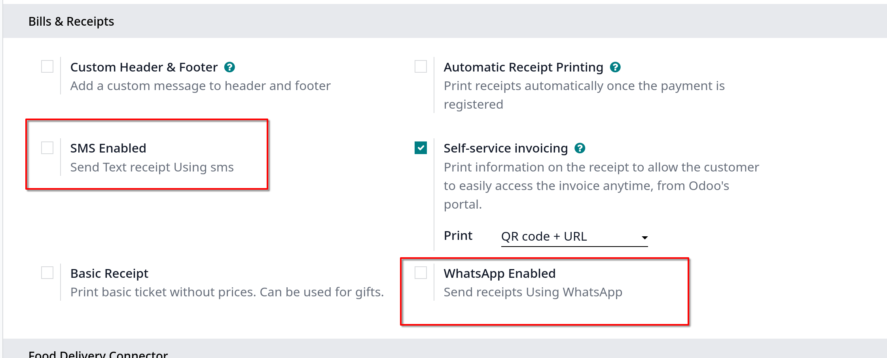
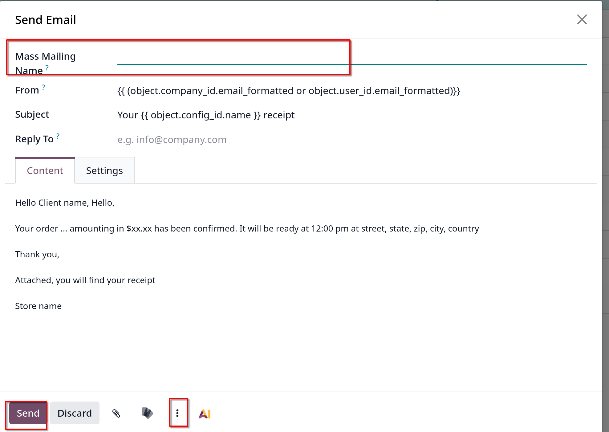

# Marketing features

Odoo cho phép sử dụng POS để tương tác với khách hàng trực tiếp bằng cách gửi cho họ các khuyến mãi thông qua email hoặc WhatsApp

## Storing contact details

Tính năng này yêu cầu thông tin chi tiết của khách hàng, bao gồm email và số điện thoại

- Email: tự động thu thập và lưu trong POS orders khi gửi biên lai qua email
- Phone numbers: lưu trữ số điện thoại để gửi biên nhận qua SMS hay WhatsApp
  1. Vào Configuration -> Settings kéo xuống **Bills & Receipts**
  2. Active **WhatsApp Enabled** hoặc **SMS Enabled**
     
     **Lưu ý**: WhatsApp chỉ dùng được ở bản enterprise

## Email marketing

Để gửi marketing emails cho khách hàng từ POS orders:

1. Vào `Point of Sale -> Orders -> Orders`
2. Chọn đơn hàng
3. Click **Actions**, chọn **Send Email** từ menu dropdown

Sau khi điền vào form compose email, chọn **Send** để gửi

**Ghi chú**: nếu muốn chọn email templates thì click vào **vertical ellipsis** ở form soạn email kế bên nút **Discard**
hoặc cũng có thể lưu lạ nội dung mail hiện tại làm template bằng cách click vào vertical ellipsis chọn Save Template
**Lưu ý**: có thể điền **Mass Mailing Name** để link tới mailing sẽ được gửi đi ở `Email Marketing` app. Nếu địa chỉ email không liên quan tới khách hàng hiện tại,
một khách hàng mới tự được tạo khi gửi email marketing

## WhatsApp marketing
